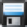

# Ikonordlista {#icon-glossary}

**Allmänna ikoner**

<table> 
 <colgroup> 
  <col> 
  <col> 
 </colgroup> 
 <tbody> 
  <tr> 
   <th>Ikon</th> 
   <th width="500px">Namn</th> 
  </tr> 
  <tr> 
   <td> 
    
 
      
    
</td> 
   <td>Mapp</td> 
  </tr> 
  <tr> 
   <td> 
    
 
      
    
</td> 
   <td>Skapa ny mapp</td> 
  </tr> 
  <tr> 
   <td> 
    
 
      
    
</td> 
   <td>Ta bort mapp</td> 
  </tr> 
  <tr> 
   <td> 
    
 
      
    
</td> 
   <td>Redigera/byt namn på mapp</td> 
  </tr> 
  <tr> 
   <td colspan="1"> 
    
 
      
    
</td> 
   <td colspan="1">Källmappen som du delade med en annan arbetsyta</td> 
  </tr> 
  <tr> 
   <td colspan="1"> 
    
 
      
    
</td> 
   <td colspan="1">Målmapp som delades från en annan arbetsyta  (hänglås anger att det inte går att redigera)</td> 
  </tr> 
  <tr> 
   <td> 
    
 
      
    
</td> 
   <td>Arkivmapp eller Konvertera till arkivmapp (kan visas för alla mappar och arkiverade program)</td> 
  </tr> 
  <tr> 
   <td> 
    
 
      
    
</td> 
   <td>Klart!(Visas ofta som slutfört program, slutförd körning eller aktiv)</td> 
  </tr> 
  <tr> 
   <td> 
    
 
      
    
</td> 
   <td>Filter, Visa, Visa alla</td> 
  </tr> 
  <tr> 
   <td colspan="1"> 
    
 
      
    
</td> 
   <td colspan="1">Utlösare</td> 
  </tr> 
  <tr> 
   <td> 
    
 
      
    
</td> 
   <td>Community</td> 
  </tr> 
  <tr> 
   <td> 
    
 
      
    
</td> 
   <td>Historik</td> 
  </tr> 
  <tr> 
   <td> 
    
 
      
    
</td> 
   <td>Hjälp</td> 
  </tr> 
  <tr> 
   <td> 
    
 
      
    
</td> 
   <td>Prenumerationsinformation</td> 
  </tr> 
  <tr> 
   <td> 
    
 
      
    
</td> 
   <td>Kundsupport</td> 
  </tr> 
  <tr> 
   <td> 
    
 
      
    
</td> 
   <td>Om Marketo</td> 
  </tr> 
 </tbody> 
</table>

## Administrationsikoner {#admin-icons}

<table> 
 <tbody> 
  <tr> 
   <th>Ikon</th> 
   <th width="500px">Namn</th> 
  </tr> 
  <tr> 
   <td> 
    
 
      
    
</td> 
   <td>Arbetsytor och partitioner</td> 
  </tr> 
  <tr> 
   <td> 
    
 
      
    
</td> 
   <td>Mitt konto</td> 
  </tr> 
  <tr> 
   <td> 
    
 
      
    
</td> 
   <td>Säkerhet/utloggning</td> 
  </tr> 
  <tr> 
   <td> 
    
 
      
    
</td> 
   <td>Användare och roller</td> 
  </tr> 
  <tr> 
   <td> 
    
 
      
    
</td> 
   <td>Inloggningsinställningar</td> 
  </tr> 
  <tr> 
   <td> 
    
 
      
    
</td> 
   <td>Plats</td> 
  </tr> 
  <tr> 
   <td> 
    
 
      
    
</td> 
   <td>Smart Campaign</td> 
  </tr> 
  <tr> 
   <td> 
    
 
      
    
</td> 
   <td>E-post</td> 
  </tr> 
  <tr> 
   <td> 
    
 
      
    
</td> 
   <td>Kommunikationsbegränsningar</td> 
  </tr> 
  <tr> 
   <td> 
    
 
      
    
</td> 
   <td>Fälthantering</td> 
  </tr> 
  <tr> 
   <td> 
    
 
      
    
</td> 
   <td>Integrering</td> 
  </tr> 
  <tr> 
   <td> 
    
 
      
    
</td> 
   <td>Salesforce (SFDC)</td> 
  </tr> 
  <tr> 
   <td> 
    
 
      
    
</td> 
   <td>Försäljningsinsikter</td> 
  </tr> 
  <tr> 
   <td> 
    
 
      
    
</td> 
   <td>Landningssidor</td> 
  </tr> 
  <tr> 
   <td> 
    
 
      
    
</td> 
   <td>Munchkin</td> 
  </tr> 
  <tr> 
   <td> 
    
 
      
    
</td> 
   <td>Webbtjänster</td> 
  </tr> 
  <tr> 
   <td> 
    
 
      
    
</td> 
   <td>LaunchPoint</td> 
  </tr> 
  <tr> 
   <td> 
    
 
      
    
</td> 
   <td>Webhooks</td> 
  </tr> 
  <tr> 
   <td> 
    
 
      
    
</td> 
   <td>Taggar - programattribut</td> 
  </tr> 
  <tr> 
   <td> 
    
 
      
    
</td> 
   <td>Analys av intäktscykler</td> 
  </tr> 
  <tr> 
   <td> 
    
 
      
    
</td> 
   <td>Treasure Chest</td> 
  </tr> 
  <tr> 
   <td> 
    
 
      
    
</td> 
   <td>Administratör</td> 
  </tr> 
  <tr> 
   <td> 
    
 
      
    
</td> 
   <td>Meddelanden - viktiga systemomfattande aviseringar</td> 
  </tr> 
 </tbody> 
</table>

### Ikoner för marknadsföringsaktiviteter {#marketing-activities-icons}

<table> 
 <tbody> 
  <tr> 
   <th>Ikon</th> 
   <th width="500px">Namn</th> 
  </tr> 
  <tr> 
   <td> 
    
 
      
    
</td> 
   <td>Event Program</td> 
  </tr> 
  <tr> 
   <td> 
    
 
      
    
</td> 
   <td>Program - standardtyp</td> 
  </tr> 
  <tr> 
   <td> 
    
 
      
    
</td> 
   <td>Importprogram</td> 
  </tr> 
  <tr> 
   <td> 
    
 
      
    
</td> 
   <td>Engagement Nurture</td> 
  </tr> 
  <tr> 
   <td> 
    
 
      
    
</td> 
   <td>Lägg till i engagemangsprogram</td> 
  </tr> 
  <tr> 
   <td> 
    
 
      
    
</td> 
   <td>Ändra aktivitetsavslutning (pausad,normal)</td> 
  </tr> 
  <tr> 
   <td> 
    
 
      
    
</td> 
   <td>Ändra engagemangsström</td> 
  </tr> 
  <tr> 
   <td> 
    
 
      
    
</td> 
   <td>Smart Campaign - aktiv och utlöst</td> 
  </tr> 
  <tr> 
   <td> 
    
 
      
    
</td> 
   <td>Smart Campaign som begärs (av Sales Insight eller Marketo Flow Action)</td> 
  </tr> 
  <tr> 
   <td> 
    
 
      
    
</td> 
   <td>Smart Campaign - batch(har körts tidigare)</td> 
  </tr> 
  <tr> 
   <td> 
    
 
      
    
</td> 
   <td>Smart Campaign - Inaktiv eller aldrig genomförd</td> 
  </tr> 
  <tr> 
   <td> 
    
 
      
    
</td> 
   <td>Ogiltiga kampanjer</td> 
  </tr> 
  <tr> 
   <td> 
    
 
      
    
</td> 
   <td>E-postprogram  (röd flagga ned = e-post har inte skickats än)</td> 
  </tr> 
  <tr> 
   <td colspan="1"> 
    
 
      
    
</td> 
   <td colspan="1">E-postprogram schemalagt med huvudstart</td> 
  </tr> 
  <tr> 
   <td> 
    
 
      
    
</td> 
   <td>Smart Campaign - schemalagd batch (bockmarkeringen anger att den har körts tidigare)</td> 
  </tr> 
  <tr> 
   <td> 
    
 
      
    
</td> 
   <td>Schemalagda gruppkampanjer</td> 
  </tr> 
  <tr> 
   <td> 
    
 
      
    
</td> 
   <td>Flödesåtgärd</td> 
  </tr> 
  <tr> 
   <td> 
    
 
      
    
</td> 
   <td>Redigera inställningar</td> 
  </tr> 
  <tr> 
   <td> 
    
 
      
    
</td> 
   <td>Formulär</td> 
  </tr> 
  <tr> 
   <td> 
    
 
      
    
</td> 
   <td>Klona formulär</td> 
  </tr> 
  <tr> 
   <td> 
    
 
      
    
</td> 
   <td>Redigera formulär</td> 
  </tr> 
  <tr> 
   <td> 
    
 
      
    
</td> 
   <td>Formuläret har godkänts</td> 
  </tr> 
  <tr> 
   <td> 
    
 
      
    
</td> 
   <td>Social</td> 
  </tr> 
  <tr> 
   <td> 
    
 
      
    
</td> 
   <td>Funktioner för sociala knappar</td> 
  </tr> 
  <tr> 
   <td> 
    
 
      
    
</td> 
   <td>Redigera utkast</td> 
  </tr> 
  <tr> 
   <td> 
    
 
      
    
</td> 
   <td>Förhandsgranska</td> 
  </tr> 
  <tr> 
   <td> 
    
 
      
    
</td> 
   <td>Klona</td> 
  </tr> 
  <tr> 
   <td> 
    
 
      
    
</td> 
   <td>Ta bort</td> 
  </tr> 
  <tr> 
   <td> 
    
 
      
    
</td> 
   <td>Bädda in kod</td> 
  </tr> 
  <tr> 
   <td> 
    
 
      
    
</td> 
   <td>Videofunktioner på YouTube</td> 
  </tr> 
  <tr> 
   <td> 
    
 
      
    
</td> 
   <td>Redigera utkast</td> 
  </tr> 
  <tr> 
   <td> 
    
 
      
    
</td> 
   <td>Förhandsgranska</td> 
  </tr> 
  <tr> 
   <td> 
    
 
      
    
</td> 
   <td>Godkänn</td> 
  </tr> 
  <tr> 
   <td> 
    
 
      
    
</td> 
   <td>Klona</td> 
  </tr> 
  <tr> 
   <td> 
    
 
      
    
</td> 
   <td>Ta bort</td> 
  </tr> 
  <tr> 
   <td> 
    
 
      
    
</td> 
   <td>Lotteriåtgärder</td> 
  </tr> 
  <tr> 
   <td> 
    
 
      
    
</td> 
   <td>Redigera utkast</td> 
  </tr> 
  <tr> 
   <td> 
    
 
      
    
</td> 
   <td>Förhandsgranska</td> 
  </tr> 
  <tr> 
   <td> 
    
 
      
    
</td> 
   <td>Godkänn</td> 
  </tr> 
  <tr> 
   <td> 
    
 
      
    
</td> 
   <td>Klona</td> 
  </tr> 
  <tr> 
   <td> 
    
 
      
    
</td> 
   <td>Ta bort</td> 
  </tr> 
  <tr> 
   <td> 
    
 
      
    
</td> 
   <td>Vinnare</td> 
  </tr> 
  <tr> 
   <td colspan="1"> 
    
 
      
    
</td> 
   <td colspan="1">Hämta HTML</td> 
  </tr> 
  <tr> 
   <td colspan="1"> 
    
 
      
    
</td> 
   <td colspan="1">Flytta</td> 
  </tr> 
  <tr> 
   <td colspan="1"> 
    
 
      
    
</td> 
   <td colspan="1">Ta bort</td> 
  </tr> 
  <tr> 
   <td colspan="1"> 
    
 
      
    
</td> 
   <td colspan="1">Klona</td> 
  </tr> 
  <tr> 
   <td colspan="1"> 
    
 
      
    
</td> 
   <td colspan="1">Ogodkänd</td> 
  </tr> 
  <tr> 
   <td colspan="1"> 
    
 
      
    
</td> 
   <td colspan="1">Skicka exempel</td> 
  </tr> 
  <tr> 
   <td colspan="1"> 
    
 
      
    
</td> 
   <td colspan="1">Förhandsgranska</td> 
  </tr> 
  <tr> 
   <td colspan="1"> 
    
 
      
    
</td> 
   <td colspan="1">Nytt test</td> 
  </tr> 
  <tr> 
   <td colspan="1"> 
    
 
      
    
</td> 
   <td colspan="1">Leveransverktyg</td> 
  </tr> 
 </tbody> 
</table>

### Design Studio-ikoner {#design-studio-icons}

<table> 
 <tbody> 
  <tr> 
   <th>Ikon</th> 
   <th width="500px">Namn</th> 
  </tr> 
  <tr> 
   <td> 
    
 
      
    
</td> 
   <td>Landningssida. Åtgärder för landningssida</td> 
  </tr> 
  <tr> 
   <td> 
    
 
      
    
</td> 
   <td>Redigera utkast</td> 
  </tr> 
  <tr> 
   <td> 
    
 
      
    
</td> 
   <td>Förhandsgranska</td> 
  </tr> 
  <tr> 
   <td> 
    
 
      
    
</td> 
   <td>Ogodkänd</td> 
  </tr> 
  <tr> 
   <td> 
    
 
      
    
</td> 
   <td>Publicera på Facebook</td> 
  </tr> 
  <tr> 
   <td> 
    
 
      
    
</td> 
   <td>Konvertera till testgrupp</td> 
  </tr> 
  <tr> 
   <td> 
    
 
      
    
</td> 
   <td>Clone Landing Page</td> 
  </tr> 
  <tr> 
   <td> 
    
 
      
    
</td> 
   <td>Ta bort landningssida</td> 
  </tr> 
  <tr> 
   <td> 
    
 
      
    
</td> 
   <td>URL Tools/URL Builder</td> 
  </tr> 
  <tr> 
   <td> 
    
 
      
    
</td> 
   <td>Flytta program</td> 
  </tr> 
  <tr> 
   <td> 
    
 
      
    
</td> 
   <td>Aktivera anpassade URL:er</td> 
  </tr> 
  <tr> 
   <td> 
    
 
      
    
</td> 
   <td>Landningssida - godkänd</td> 
  </tr> 
  <tr> 
   <td> 
    
 
      
    
</td> 
   <td>Landningssida/e-postmall - ej godkänd</td> 
  </tr> 
  <tr> 
   <td> 
    
 
      
    
</td> 
   <td>Landningssida/e-postmall - godkänd</td> 
  </tr> 
  <tr> 
   <td> 
    
 
      
    
</td> 
   <td>E-post - ej godkänt eller utkast</td> 
  </tr> 
  <tr> 
   <td> 
    
 
      
    
</td> 
   <td>E-post godkänd</td> 
  </tr> 
  <tr> 
   <td> 
    
 
      
    
</td> 
   <td>Forms - ej godkänt</td> 
  </tr> 
  <tr> 
   <td> 
    
 
      
    
</td> 
   <td>Mall - godkänd med utkast</td> 
  </tr> 
  <tr> 
   <td> 
    
 
      
    
</td> 
   <td>Utkast till en godkänd resurs (inte direkt förrän utkast har godkänts)</td> 
  </tr> 
  <tr> 
   <td> 
    
 
      
    
</td> 
   <td>Bilder och filer</td> 
  </tr> 
  <tr> 
   <td> 
    
 
      
    
</td> 
   <td>Fragment - ej godkänt eller utkast</td> 
  </tr> 
  <tr> 
   <td> 
    
 
      
    
</td> 
   <td>Fragment - Godkänt</td> 
  </tr> 
  <tr> 
   <td colspan="1"> 
    
 
      
    
</td> 
   <td colspan="1">Nytt</td> 
  </tr> 
  <tr> 
   <td colspan="1"> 
    
 
      
    
</td> 
   <td colspan="1">Hämta bilder från webben</td> 
  </tr> 
  <tr> 
   <td colspan="1"> 
    
 
      
    
</td> 
   <td colspan="1">Överför bild eller fil</td> 
  </tr> 
 </tbody> 
</table>

### Analysikoner {#analytics-icons}

<table> 
 <tbody> 
  <tr> 
   <th>Ikon</th> 
   <th width="500px">Namn</th> 
  </tr> 
  <tr> 
   <td> 
    
 
      
    
</td> 
   <td>Intäktscykelmodell</td> 
  </tr> 
  <tr> 
   <td> 
    
 
      
    
</td> 
   <td>RCM (Revenue Cycle Model) - ej godkänd</td> 
  </tr> 
  <tr> 
   <td> 
    
 
      
    
</td> 
   <td>RCM (Revenue Cycle Model) - godkänd</td> 
  </tr> 
  <tr> 
   <td> 
    
 
      
    
</td> 
   <td>RCM (Revenue Cycle Model) - godkänt med utkast</td> 
  </tr> 
  <tr> 
   <td> 
    
 
      
    
</td> 
   <td>Rapportåtgärder</td> 
  </tr> 
  <tr> 
   <td> 
    
 
      
    
</td> 
   <td>Rapport</td> 
  </tr> 
  <tr> 
   <td> 
    
 
      
    
</td> 
   <td>Ny rapportprenumeration</td> 
  </tr> 
  <tr> 
   <td> 
    
 
      
    
</td> 
   <td>Ta bort rapport</td> 
  </tr> 
  <tr> 
   <td> 
    
 
      
    
</td> 
   <td>Visa kvalificerad lead</td> 
  </tr> 
  <tr> 
   <td> 
    
 
      
    
</td> 
   <td>Översikt över intressanta stunder</td> 
  </tr> 
  <tr> 
   <td> 
    
 
      
    
</td> 
   <td>Expandera alla</td> 
  </tr> 
  <tr> 
   <td> 
    
 
      
    
</td> 
   <td>Komprimera alla</td> 
  </tr> 
  <tr> 
   <td> 
    
 
      
    
</td> 
   <td>Gruppera leads efter</td> 
  </tr> 
  <tr> 
   <td> 
    
 
      
    
</td> 
   <td>Egna kolumner</td> 
  </tr> 
 </tbody> 
</table>

### Mina tokenikoner {#my-tokens-icons}

<table> 
 <tbody> 
  <tr> 
   <th>Ikon</th> 
   <th width="500px">Namn</th> 
  </tr> 
  <tr> 
   <td> 
    
 
      
    
</td> 
   <td>Kalender-ICS - iCalendars, (inbyggda kalendrar)</td> 
  </tr> 
  <tr> 
   <td> 
    
 
      
    
</td> 
   <td>RTF (not a Landing Page)</td> 
  </tr> 
  <tr> 
   <td> 
    
 
      
    
</td> 
   <td>Nummer</td> 
  </tr> 
  <tr> 
   <td> 
    
 
      
    
</td> 
   <td>Salesforce (även för alla SFDC-relaterade objekt)</td> 
  </tr> 
  <tr> 
   <td> 
    
 
      
    
</td> 
   <td>Schemalägg den smarta kampanjen så att den körs en gång</td> 
  </tr> 
  <tr> 
   <td> 
    
 
      
    
</td> 
   <td>Redigera inställningar</td> 
  </tr> 
  <tr> 
   <td> 
    
 
      
    
</td> 
   <td>Uppdatera (vanligtvis Antal, Rapport, Smart List)</td> 
  </tr> 
  <tr> 
   <td> 
    
 
      
    
</td> 
   <td>Visa smarta medlemmar (tidigare kvalificerade och aktuella)</td> 
  </tr> 
 </tbody> 
</table>

### Kampanjmenyer {#campaign-menus}

<table> 
 <tbody> 
  <tr> 
   <th>Ikon</th> 
   <th width="500px">Namn</th> 
  </tr> 
  <tr> 
   <td> 
    
 
      
    
</td> 
   <td>Schemalägg återkommande kampanj (flera körningar)</td> 
  </tr> 
  <tr> 
   <td> 
    
 
      
    
</td> 
   <td>Avbryt körning, åtgärd eller borttagning</td> 
  </tr> 
  <tr> 
   <td> 
    
 
      
    
</td> 
   <td>Redigera kvalificeringsregler</td> 
  </tr> 
  <tr> 
   <td> 
    
 
      
    
</td> 
   <td>Salesforce (även för alla SFDC-relaterade objekt)</td> 
  </tr> 
  <tr> 
   <td> 
    
 
      
    
</td> 
   <td>Endast text</td> 
  </tr> 
  <tr> 
   <td> 
    
 
      
    
</td> 
   <td>Relativ bakgrundsmusik (visas även för alla åtgärder för poängsättningsflödet)</td> 
  </tr> 
  <tr> 
   <td> 
    
 
      
    
</td> 
   <td>Relativ brådskande situation</td> 
  </tr> 
  <tr> 
   <td> 
    
 
      
    
</td> 
   <td>E-postskript (endast för snabbhet)</td> 
  </tr> 
  <tr> 
   <td> 
    
 
      
    
</td> 
   <td>Datum - formaterat som MM-DD-ÅÅÅ</td> 
  </tr> 
 </tbody> 
</table>

### Databasikoner {#database-icons}

<table> 
 <tbody> 
  <tr> 
   <th>Ikon</th> 
   <th width="500px">Namn</th> 
  </tr> 
  <tr> 
   <td> 
    
 
      
    
</td> 
   <td>Smart List</td> 
  </tr> 
  <tr> 
   <td> 
    
 
      
    
</td> 
   <td>Smart List - cachelagrad</td> 
  </tr> 
  <tr> 
   <td> 
    
 
      
    
</td> 
   <td>Segmentering eller segment - ej godkänt</td> 
  </tr> 
  <tr> 
   <td> 
    
 
      
    
</td> 
   <td>Segmentering eller segment - godkänt eller utkast</td> 
  </tr> 
  <tr> 
   <td> 
    
 
      
    
</td> 
   <td>Segmentering eller segment - godkänt</td> 
  </tr> 
  <tr> 
   <td> 
    
 
      
    
</td> 
   <td>Sorteraren i fält</td> 
  </tr> 
  <tr> 
   <td> 
    
 
      
    
</td> 
   <td>E-postskript (endast för snabbhet)</td> 
  </tr> 
  <tr> 
   <td> 
    
 
      
    
</td> 
   <td>Statisk lista</td> 
  </tr> 
  <tr> 
   <td colspan="1"> 
    
 
      
    
</td> 
   <td colspan="1">Nytt</td> 
  </tr> 
  <tr> 
   <td colspan="1"> 
    
 
      
    
</td> 
   <td colspan="1">Ny segmentering</td> 
  </tr> 
  <tr> 
   <td colspan="1"> 
    
 
      
    
</td> 
   <td colspan="1">Importera</td> 
  </tr> 
 </tbody> 
</table>

