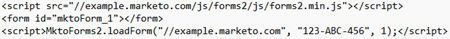

# Ärvd instans: Design Studio Checklist {#inherited-instance-design-studio-checklist}

Genom att strukturera mallar och skapa globala formulär, kodfragment och bilder och filer kan du minimera datafel och effektivisera arbetsflödet i programbygget. Kom ihåg att [hämta checklistorna](/help/marketo/getting-started/inheriting-a-marketo-engage-instance/assets/adobe-marketo-engage-inherited-instance-admin-checklist.xlsx) och spåra dina framsteg.

## Landningssidor {#landing-pages}

<table style="table-layout:auto">
 <tbody>
  <tr>
   <th style="width:20%">Område</th>
   <th>Granska fokus</th>
  </tr>
  <tr>
   <td>Globala landningssidor</td>
   <td><li>Hur många globala <a href="/help/marketo/product-docs/demand-generation/landing-pages/understanding-landing-pages/understanding-free-form-vs-guided-landing-pages.md" target="_blank">landningssidor</a> finns det? Används de av program?</li>
   <li>Har du konfigurerat en <a href="https://experienceleague.adobe.com/docs/marketo-learn/tutorials/lead-and-data-management/subscription-center-learn.html" target="_blank">prenumerationscentral</a>?
         Om inte kan du skapa en.</li></td>
  </tr>
  <tr>
   <td>Mallar</td>
   <td><li>Hur många <a href="/help/marketo/product-docs/demand-generation/landing-pages/landing-page-templates/edit-a-marketo-landing-page-template.md" target="_blank">startsidmallar</a> finns det? Blås de?</li></td>
  </tr>
  <tr>
   <td>Testgrupper</td>
   <td><li>Hur många <a href="/help/marketo/product-docs/demand-generation/landing-pages/understanding-landing-pages/landing-page-test-groups.md" target="_blank">Landing Page-testgrupper</a> är de? Är de fortfarande relevanta?</li></td>
  </tr>
   <tr>
   <td>Sekretess och efterlevnad</td>
   <td><li>Har alla dina landningssidor rätt sidfot?</li></td>
  </tr>
 </tbody>
</table>

## Bilder och filer {#images-and-files}

<table style="table-layout:auto">
 <tbody>
  <tr>
   <th style="width:20%">Område</th>
   <th>Granska fokus</th>
  </tr>
  <tr>
   <td>Namnkonventioner</td>
   <td><li>Har <a href="/help/marketo/product-docs/demand-generation/images-and-files/add-images-and-files-to-marketo.md" target="_blank">bilder och filer</a> konsekventa namnkonventioner?</li></td>
  </tr>
  <tr>
   <td>Mappstruktur</td>
   <td><li>Ordnas bilder och filer <a href="/help/marketo/product-docs/demand-generation/images-and-files/organize-your-images-and-files-using-folders.md" target="_blank">korrekt</a> och är enkla att söka i?</li></td>
  </tr>
  <tr>
   <td>Bilder och filer</td>
   <td><li>Behöver bilder eller filer <a href="/help/marketo/product-docs/demand-generation/images-and-files/find-the-url-of-an-uploaded-image-or-file.md" target="_blank">som refereras på webbsidor</a> uppdateras?
   
Exempel: Den hårdkodade URL-strukturen <a href="https://nation.marketo.com/t5/product-documents/upcoming-changes-to-design-studio-urls/ta-p/306632#_Toc54870361" target="_blank">kan behöva uppdateras</a>, till exempel <code>http://na-sj01.marketo.com/rs/123-ABC-456/images/puppy.png</code>.
   
Kontakta din webbutvecklare för att få reda på var du kan behöva göra uppdateringar.</li></td>
  </tr>
 </tbody>
</table>

## Forms {#forms}

<table style="table-layout:auto">
 <tbody>
  <tr>
   <th style="width:20%">Område</th>
   <th>Granska fokus</th>
  </tr>
  <tr>
   <td>Global Forms</td>
   <td><li>Hur många globala <a href="/help/marketo/product-docs/demand-generation/forms/creating-a-form/create-a-form.md" target="_blank">formulär</a> finns det?</li>
<li>Använder de flesta program globala eller lokala formulär?</li>
<li>Samlar alla formulär in rätt data för marknadsföring och försäljning?</li>
<li>Används dolda värden korrekt?</li>
<li>Används några Marketo Engage-formulär på landningssidor som inte kommer från Marketo Engage? Hur refereras de?</li>

TIPS: Uppdatera sidor där du bäddar in Marketo Engage-formulär med den nya inbäddningskoden som introducerats (kräver säkra landningssidor).

</td>
  </tr>
  <tr>
   <td>Datainsamling</td>
   <td><li>Är dina <a href="/help/marketo/product-docs/demand-generation/forms/form-fields/add-a-fieldset-to-a-form.md" target="_blank">formulärfält</a> i första hand plocklistor eller öppna textfält?</li>

TIPS: Om de är öppna textfält bör du överväga att växla dem till plocklistor för att förhindra röriga data.</td>
  </tr>
  <tr>
   <td>Sekretess och efterlevnad</td>
   <td><li>Anpassar er formulärstrategi er efter företagets datasekretess och krav på deltagande?
         Överväg <a href="https://business.adobe.com/resources/ebooks/the-gdpr-and-the-marketer.html" target="_blank"> General Data Protection Regulation (GDPR)</a>, Canada's Anti-Spam Law (CASL), The Controlling the Assault of Non-Solicited Pornography and Marketing Act of 2003 (CAN-SPAM), California Consumer Privacy Act (CCPA), osv., för efterlevnad av regler.</li>

TIPS: Kom ihåg att alltid rådfråga ditt juridiska team om dessa frågor. Fråga teamet om tidigare initiativ för att upprätthålla regelefterlevnaden innan du gör några ändringar.</td>
  </tr>
 </tbody>
</table>

## E-post {#emails}

<table style="table-layout:auto">
 <tbody>
  <tr>
   <th style="width:20%">Område</th>
   <th>Granska fokus</th>
  </tr>
  <tr>
   <td>Globala e-postmeddelanden</td>
   <td><li>Hur många globala <a href="/help/marketo/product-docs/email-marketing/general/creating-an-email/create-an-email.md" target="_blank">e-postmeddelanden</a> finns det? Används de av program?</li></td>
  </tr>
  <tr>
   <td>Mallar</td>
   <td><li>Hur många <a href="/help/marketo/product-docs/email-marketing/general/email-editor-2/create-an-email-template.md" target="_blank">e-postmallar</a> finns det? Blås de?</li></td>
  </tr>
  <tr>
   <td>E-posttestning</td>
   <td><li>Hur använder du <a href="/help/marketo/product-docs/email-marketing/email-programs/email-program-actions/email-test-a-b-test/understanding-email-testing-options.md" target="_blank">e-posttestning</a>? Gäller metoden fortfarande?</li></td>
  </tr>
  </tr>
  <tr>
   <td>Sekretess och efterlevnad</td>
   <td><li>Har alla era e-postmeddelanden rätt sidfot? Överväg GDPR, CASL, CAN-SPAM, CCPA osv. för regelefterlevnad.</li>

TIPS: Kom ihåg att alltid rådfråga ditt juridiska team om dessa efterlevnadsfrågor. Fråga teamet om tidigare initiativ för att upprätthålla regelefterlevnaden innan du gör några ändringar.</td>
  </tr>
 </tbody>
</table>

## Fragment {#snippets}

<table style="table-layout:auto">
 <tbody>
  <tr>
   <th style="width:20%">Område</th>
   <th>Granska fokus</th>
  </tr>
  <tr>
   <td>Fragment</td>
   <td><li>Hur många <a href="/help/marketo/product-docs/personalization/segmentation-and-snippets/snippets/create-a-snippet.md" target="_blank">fragment</a> finns det? Används de?
         Om de inte gör det kan du använda dem för sidfotsinnehåll, logotyper och annat <a href="/help/marketo/product-docs/email-marketing/general/functions-in-the-editor/add-a-snippet-to-an-email.md" target="_blank"> e-post </a> och <a href="/help/marketo/product-docs/demand-generation/landing-pages/personalizing-landing-pages/add-a-snippet-to-a-landing-page.md" target="_blank"> landningssida </a> .</li></td>
  </tr>
 </tbody>
</table>

## Alla Assets {#all-assets}

<table style="table-layout:auto">
 <tbody>
  <tr>
   <th style="width:20%">Område</th>
   <th>Granska fokus</th>
  </tr>
  <tr>
   <td>Resursstatus</td>
   <td><li>Hur många resurser finns i <i>Utkast</i> och <i>Godkänd med status Utkast</i> (t.ex. <a href="/help/marketo/product-docs/email-marketing/general/creating-an-email/approve-an-email.md" target="_blank">E-post</a>, <a href="/help/marketo/product-docs/demand-generation/landing-pages/understanding-landing-pages/approve-unapprove-or-delete-a-landing-page.md#approve-a-landing-page" target="_blank">Landing Pages</a>, <a href="/help/marketo/product-docs/demand-generation/forms/creating-a-form/approve-a-form.md" target="_blank">forms</a>, <a href="/help/marketo/product-docs/personalization/segmentation-and-snippets/snippets/approve-a-snippet.md" target="_blank">snippets</a>)?
         Om det finns många kan du ta bort eller godkänna dem.</li></td>
  </tr>
  <tr>
   <td>Resursdelning</td>
   <td><li>Vilka resurser <a href="/help/marketo/product-docs/administration/workspaces-and-person-partitions/understanding-workspaces-and-person-partitions.md#sharing-across-workspaces" target="_blank">delas mellan arbetsytorna</a>?</li>
   
 Obs! Det är viktigt att veta att åtgärder som vidtas i en Workspace kan leda till en otillgänglig resurs i en annan Workspace för en annan användare.</td>
  </tr>
 </tbody>
</table>
