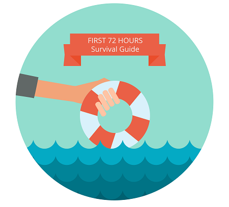

# Hjälp mig! Jag har ärvt en befintlig Marketo-instans

**Är du en ny användare som just ärvt en befintlig Marketo-instans och inte vet var de ska börja?**

I så fall är den här guiden avsedd för dig.

Det tar faktiskt inte 72 timmar att gå igenom det, och det kommer inte att svara på varje fråga. Men det kan hjälpa er att få ut mesta möjliga av era första dagar med Marketo genom att peka er i rätt riktning för att få det ni behöver.

Ta en titt på din favoritdryck.

**Innehållsförteckning**

* [Objekt som ska checkas ut](/help/marketo/getting-started/inheriting-a-marketo-instance/items-to-check-off.md)
* [Saker att granska: Kärnfärdigheter](/help/marketo/getting-started/inheriting-a-marketo-instance/things-to-review-core-skills.md)
* [Sätt att få hjälp](/help/marketo/getting-started/inheriting-a-marketo-instance/ways-to-get-help.md)

Om du redan känner till hur du använder Marketo och känner dig bekväm med dina centrala koncept kan du ta en titt på Marketo Product Docs eller besöka [Marketing Nation](https://nation.marketo.com/) online-communityn för att se vad andra marknadsföringsanvändare säger.
