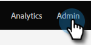

# Installationssteg {#setup-steps}

**Välkommen till Adobe Marketo Engage!**

Innan du går in finns det några steg som du behöver utföra.

De här stegen omfattar:

* Varumärkning av era URL-adresser för landningssidor och e-postlänkar för att förbättra tillförlitligheten och leveransmöjligheterna
* Konfigurera protokoll för Marketo Engage
* Synkroniserar CRM
* Lägga till spårningskod på företagets webbplats

>[!NOTE]
>
>Du behöver bara göra de här stegen om ditt företag är **nytt för Marketo**. Om så inte är fallet kan installationen redan vara klar.

Vissa steg kräver hjälp från IT-avdelningen.

## Säkerställ e-postleverans {#ensure-email-deliverability}

>[!NOTE]
>
>Är du kund i Launch Pack? Du kan hoppa över det här steget. Din konsult kommer att ge dig ett dokument med instruktioner för IT-konfiguration under samtalet.

Du kan vidta flera åtgärder för att se till att e-postmeddelandena når så många av dina medarbetare som möjligt.

* **Förse spårningslänkarna**. Du kan välja en CNAME att använda din egen domän (i stället för Marketo) i de länkar som du inkluderar i e-postmeddelanden från Marketo. Detta stärker er domänprofilering och ökar förtroendet och leveransförmågan hos era mottagare.
* **Lägg till Marketo i företagets e-post tillåtelselista**. Det är en vanlig god praxis att skicka testmeddelanden till testkonton innan e-post skickas till verkliga personer. Genom att tillåtslista Marketo kan du förhindra att testmeddelanden blockeras eller flaggas som skräppost.
* **Konfigurera SPF och DKIM**. Dessa tekniker säkerställer att dina e-postmeddelanden från Marketo inte är skräppost. Följ de här stegen för att [Konfigurera en SPF och DKIM för din e-postleverans](/help/marketo/product-docs/email-marketing/deliverability/set-up-spf-and-dkim-for-your-email-deliverability.md) så att du inte kan avvisa dina Marketo-e-postmeddelanden från skräppostfilter.
* **Konfigurera en MX-post för din domän.** Med en MX-post kan du ta emot e-post till domänen som du skickar e-post från för att bearbeta svar och automatiska svar. Om du skickar från din företagsdomän har du förmodligen redan konfigurerat detta. Annars kan du vanligtvis konfigurera så att den mappar till företagets domäns MX-post.
* **Rekommenderade inställningar för Från adress.** Du måste använda en giltig, befintlig och fungerande e-postdomän i Från adress i alla e-postkampanjer. Det kan vara bra att konfigurera en underdomän till företagsdomänen i stället för att skicka från företagsdomänen. Detta säkerställer att problem från företagets e-postström inte påverkar Marketo mailstream och vice versa. Om du skickar e-post från `something@nonexistentdomain.com` filtreras eller blockeras e-postmeddelandet. Alla domäner som används i avsändarens Från-adress måste ha ett giltigt och fungerande postmaster@- och missbruk@-konto.

Om du använder Google Apps för att lagra din företagsmejl kan du inte skapa missbruk@- eller postmaster@-e-post under din domän. För att komma runt detta måste du skapa grupper som heter &quot;missbruk&quot; och &quot;postmaster&quot;. Användare som är medlemmar i dessa grupper får e-postmeddelanden som skickas till dessa adresser (t.ex. postmaster@domain.com). Detaljerade instruktioner för hur du skapar grupper finns [här](https://support.google.com/a/answer/33343#adminconsole){target="_blank"}.

Välj en CNAME för e-postspårningslänkar (välj en som är _annorlunda_ från landningssidan CNAME som du valde i steg 3). Några exempel:

* go2.[CompanyDomain].com
* Jag.[CompanyDomain].com
* wow.[CompanyDomain].com

Den första delen är e-postspårningen CNAME, `[EmailTrackingCNAME]`. Du måste ge den till IT-avdelningen.

>[!CAUTION]
>
>CNAME-filer för e-post och landningssida måste vara olika. Undvik också CNAME-filer som&quot;track&quot; eller&quot;link&quot;. Den flaggas ofta som skräppost

Om du vill hitta spårningslänken för Marketo går du till **[!UICONTROL Admin]**-området.

Klicka på **[!UICONTROL Email]**.

Kopiera [!UICONTROL Tracking Link] från e-postinställningarna.

[!UICONTROL Tracking Link] har följande format: `mkto-[a-z][4 digits].com`.

Detta är din `[MktoTrackingLink]`. Spara den. Du måste ge den till IT i steg 5.

Samla in Från-domäner. Gör en lista över alla Från-domäner (som i, `[Sender]@[FromDomain].com`) som du tänker använda för att skicka e-post från Marketo. För de flesta finns det bara en.

Exempel: marketo.com, info.marketo.com. Dessa är `[FromDomain1]`,`[FromDomain2]` osv. Spara dem. Du måste ge dem till IT i steg 5.

Nu har du all information du behöver för att skicka din förfrågan till IT!

## Anpassa URL:er för landningssidor med en CNAME {#customize-your-landing-page-urls-with-a-cname}

>[!NOTE]
>
>Är du kund i Launch Pack? Du kan hoppa över det här steget. Din konsult kommer att ge dig ett dokument med instruktioner för IT-konfiguration under samtalet.

>[!NOTE]
>
>**Administratörsbehörigheter krävs**

Välj en CNAME för dina landningssidor. Några exempel:

    * **go**.[CompanyDomain].com
    * **www2**.[CompanyDomain].com
    * **lp**.[CompanyDomain].com

>[!TIP]
>
>Håll det kort! Kortare URL:er är enklare att komma ihåg. Vi föreslår &quot;gå&quot; som domän.

Den första delen (i fet stil) är `[LandingPageCNAME]`. Du behöver det i steg 5.

Om du vill hämta det Munchkin-ID som du ska ersätta med landningssidan CNAME går du till området **Admin**.

Klicka på **Mitt konto**.

Kopiera [!UICONTROL Account String] från inställningarna för landningssidan.

Det här är `[Munchkin ID]`. Spara den. Du måste ge den till IT i steg 5.

Konfigurera domäninställningarna så att landningssidorna använder företagets domän i stället för Marketo (där de finns).

## Be IT att konfigurera protokoll {#ask-it-to-configure-protocols}

>[!NOTE]
>
>Är du kund i Launch Pack? Du kan hoppa över det här steget. Din konsult kommer att ge dig ett dokument med instruktioner för IT-konfiguration under samtalet.

När du har samlat in all nödvändig information är du redo att skicka en förfrågan till IT. Du kan använda texten nedan som en mall och ersätta den feta texten med din egen information.

[Ta med en länk till den här artikeln](/help/marketo/getting-started/initial-setup/configure-protocols-for-marketo.md).

Klistra in den här texten i e-postmeddelandet och ersätt platshållarna med formatinformation:

>[!NOTE]
>
>Se steg 3 och 4 ovan för att bestämma vilken text som ska ersätta platshållarna. Kom ihåg att `[LandingPageCNAME]` och `[EmailTrackingCNAME]` måste vara olika.

`----------------------------------------------`

Bästa IT-administratör!

Vårt marknadsföringsteam använder nu Marketo-plattformen för att kommunicera med våra medarbetare. För att e-postleveransen ska bli så bra som möjligt måste vi göra följande ändringar:

`1)` Lägg till en DNS-post (CNAME) för **[LandingPageCNAME]** för våra landningssidor.**[CompanyDomain]**.com, som pekar på **[Munchkin ID]**.mktoweb.com.

`2)` Lägg till en DNS-post (CNAME) för **[EmailTrackingCNAME]** för våra spårningslänkar i e-post.**[CompanyDomain]**.com, pekar på **[MktoTrackingLink]**.

`3)` Tillåtslista Marketo.

    * Om vi använder IP-adresser i e-postadressen Tillåtelselista lägger du till de IP-adresser som anges nedan:
    199.15.212.0/22
    
    192.28.144.0/20
    
    192.28.160.0/19
    
    185.28.196.0/22
    
    130.248.172.0/24
    
    130.248.173.0/24
    
    103.237.104.0/22
    
    94.236.119.0/26

>[!NOTE]
>
>Kontakta Marketo Support om du vill ha en förkortad lista över IP-adresser som kan tillåtslista specifikt för just din miljö.

    * Om vårt antispam-system använder från domäner lägger du till följande:

**`[FromDomain1]`**
**`[FromDomain2]`**

`4)` Vi måste konfigurera SPF och DKIM så att Marketo har behörighet att skicka signerade e-postmeddelanden för vår räkning.

`a.` Om du vill konfigurera SPF lägger du till följande rad i våra DNS-poster:

IN TXT **[From Domain]**: v=spf1 mx ip4:**[Företags-IP]**
 include: mktomail.com ~all

Om det redan finns en SPF-post i vår DNS-post lägger du bara till följande:

include:mktomail.com

`[`Ersätt **från domän** med din e-postadress från domän (t.ex. company.com) och **CorpIP** med IP-adressen för företagets e-postserver (t.ex. 255.255.255.255).  Om du ska skicka e-post från flera domäner via Marketo bör din IT-personal lägga till den här raden för varje domän (på en rad).`]`

`b.` För DKIM skapar du DNS-resursposter för varje domän som vi vill konfigurera. Nedan visas värdposter och TXT-värden för varje domän som vi ska signera för:

**`[DKIMDomain1]`**: Värdposten är **`[HostRecord1]`** och TXT-värdet är **[TXTValue1]**.

**`[DKIMDomain2]`**: Värdposten är **`[HostRecord2]`** och TXT-värdet är **`[TXTValue2]`**.

`[`Kopiera **HostRecord** och **TXTValue** för varje **DKIMDomain** som du har konfigurerat efter att ha följt [instruktionerna här](/help/marketo/product-docs/email-marketing/deliverability/set-up-a-custom-dkim-signature.md). Glöm inte att verifiera varje domän i **Admin > E-post > DKIM** när din IT-personal har slutfört det här steget.`]`

`5)` Vi måste se till att det finns en giltig MX-post för våra FROM-domäner **[FromDomain1]**, **[FromDomain2]** osv. Kan du bekräfta? Om inte, konfigurera så att du mappar till företagets domänpost för MX. Detta säkerställer att vi kan behandla svar/autosvarare på våra Marketo-utskick.

Meddela mig när du har utfört dessa steg så att jag kan slutföra installationsprocessen med Marketo.

Tack! Du är bäst!

Med vänlig hälsning

**`[Your Name]`**

`----------------------------------------------`

Skicka e-postmeddelandet till IT. Vi förstår att det kan ta lite tid för IT-avdelningen att utföra dessa uppgifter. Du kan fortsätta till nästa steg, men kom ihåg att du måste gå tillbaka till det här steget för att slutföra konfigurationen av Marketo Engage.

## Slutför Marketo-installationen när IT-avdelningen är klar {#complete-your-marketo-setup-after-it-finishes}

När IT-avdelningen har slutfört sina uppgifter följer du de här stegen för att lägga till landningssidan och e-posta CNAME:er samt för att aktivera DKIM-signering.

Gå till området **[!UICONTROL Admin]** för att lägga till CNAME för landningssidan

Välj Landningssidor och klicka på **[!UICONTROL Edit]** i området [!UICONTROL Settings].

Ange ditt nya domännamn i fältet **[!UICONTROL Domain Name for Landing Pages]**. Den ska ha följande format:

`[LandingPageCNAME].[CompanyDomain].com`

I sidfältet **[!UICONTROL Fallback]** anger du den URL som du vill att personer ska gå till om en landningssida inte är tillgänglig. Du kan använda företagets hemsida om du inte har någon reservsida. Ange din företagswebbplats i fältet **[!UICONTROL Homepage]**.

I området [!UICONTROL Admin] väljer du **[!UICONTROL Email]** för att lägga till din e-post-CNAME

Bläddra ned till [!UICONTROL Branding Domains]. Välj din domän och klicka på **[!UICONTROL Edit]**.

Ange din e-postspårningsdomän i fältet Domän. Den ska ha följande format:

`[EmailTrackingCNAME].[CompanyDomain].com`. Klicka på **[!UICONTROL Save]**.

## Integrera CRM {#integrate-your-crm}

Det här är antagligen den mest spännande delen av din konfiguration. Det är dags att fylla i Marketo med alla leads och kontakter som du har sparat i CRM!

Välj något av följande, beroende på vilken CRM ditt företag använder.

* [Integrera Marketo Engage med  [!DNL Salesforce.com]](/help/marketo/product-docs/crm-sync/salesforce-sync/understanding-the-salesforce-sync.md)
* [Integrera Marketo Engage med  [!DNL Microsoft Dynamics]](/help/marketo/product-docs/crm-sync/microsoft-dynamics-sync/understanding-the-microsoft-dynamics-sync.md)

  >[!NOTE]
  >
  >Du behöver hjälp av företagets CRM-administratör för att kunna utföra dessa steg.

## Lägg till spårningskod på din webbplats {#add-tracking-code-to-your-website}

>[!NOTE]
>
>Är du en [!DNL Launch Pack]-kund? Du kan hoppa över det här steget. Din konsult kommer att ge dig [!DNL Munchkin] kodinstruktioner i dokumentet med IT-installationsanvisningar.

Marketo Engage har en anpassad spårningsfunktion (JavaScript) (kallas [!DNL Munchkin]) som du kan använda för att spåra personaktiviteter på en webbsida. [!DNL Munchkin] krävs för att integrera din webbplats i Marketo. Följ de här stegen för att [lägga till [!DNL Munchkin] spårningskod på din webbplats](/help/marketo/product-docs/administration/additional-integrations/add-munchkin-tracking-code-to-your-website.md){target="_blank"}.

>[!NOTE]
>
>Du måste ha erfarenhet av HTML för att kunna lägga till spårningskoden.

## Prestandaförväntningar {#performance-expectations}

Vad kan du förvänta dig när det gäller prestanda från Marketo? Den kan variera beroende på hur stora och komplexa era marknadsföringskampanjer är. Men du kan förvänta dig prestandanivåer som är jämförbara med vad som beskrivs i standardkolumnen i flera av tabellerna i [produktbeskrivningen för Marketo Engage](https://helpx.adobe.com/legal/product-descriptions/adobe-marketo-engage---product-description.html){target="_blank"}. Kolumnerna&quot;Prestanda&quot; och&quot;Prestanda plus&quot; hänvisar till prestandanivåpaket som ger [högre prestandanivåer](https://nation.marketo.com/t5/product-documents/marketo-engage-performance-tiers/ta-p/328835){target="_blank"}.

>[!MORELIKETHIS]
>
>* [Konfigurera protokoll för Marketo Engage](/help/marketo/getting-started/initial-setup/configure-protocols-for-marketo.md)
>
>* [Användarinställningar](/help/marketo/getting-started/initial-setup/user-setup.md)
