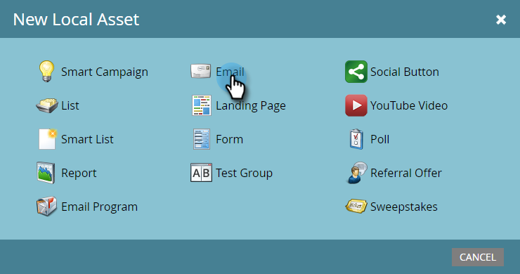
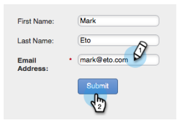

# Avisera säljaren {#alert-the-sales-rep}

## Uppdrag: Meddela säljaren när en person fyller i ett formulär på din webbplats {#mission-alert-the-sales-rep-when-a-person-fills-out-a-form-on-your-web-site}

Om du automatiskt vill skicka varningsmeddelanden till säljarna behöver du bara ett varningsmeddelande och en e-postkampanj. Så här gör du.

>[!PREREQUISITES]
>
>[Landningssida med ett formulär](/help/marketo/getting-started/quick-wins/landing-page-with-a-form.md)

## Steg 1: Skapa ett varningsmeddelande {#step-create-an-alert-email}

1. Gå till **Marknadsföringsaktiviteter**.

   

1. Välj **Mitt program** som du skapade på [landningssidan med ett snabbfönster i formatet](/help/marketo/getting-started/quick-wins/landing-page-with-a-form.md) och klicka sedan på **Nytt** på **Ny lokal resurs**.

   

1. Klicka på **E-post**.

   

1. **Ange e-** postnamnet&quot;Min e-postavisering&quot;, välj en mall och klicka på  **Skapa**.

   

1. Ange **Från namn**, **Från e-post**, **Svar till** och **Ämne** som du vill att ditt säljteam ska se.

   

1. Dubbelklicka om du vill redigera e-posttexten.

   

1. Skriv e-postinnehållet.

   

1. Placera markören där du vill infoga personens kontaktinformation och klicka på ikonen **Infoga token**.

   

1. Sök efter och välj `{{SP_Send_Alert_Info}}` **Token** och klicka på **Infoga**.

   

   >[!NOTE]
   >
   >{{SP_Send_Alert_Info}} är en speciell token för varningsmeddelanden. Mer information finns i [Använd Skicka aviseringsinformationstoken](/help/marketo/product-docs/email-marketing/general/using-tokens/use-the-send-alert-info-token.md).

1. Klicka på **Spara**.

   

1. Stäng fliken/fönstret för e-postredigeraren.

   

1. Under **E-poståtgärder** klickar du på **Godkänn**.

   

## Steg 2: Skapa en varningsutlösarkampanj {#step-create-an-alert-trigger-campaign}

1. Välj **Mitt program** som har skapats tidigare och klicka sedan på **Ny smart kampanj** under &lt;a2/>Ny **på &lt;a4/>Ny smart kampanj**.

   

1. **Ge** kampanjen namnet&quot;Min aviseringskampanj&quot; och klicka på  **Skapa**.

   

1. Under fliken **Smart List** letar du upp och drar utlösaren **Fyll i formulär** till arbetsytan.

   

1. Markera formuläret som vi skapade tidigare.

   

1. Under fliken **Flöde** söker du efter och drar flödesåtgärden **Skicka varning** till arbetsytan.

   

1. Välj **Min aviseringse-postadress** som skapades tidigare och lämna **Skicka till** som **Säljare**.

   

1. Skriv din e-postadress i fältet **Till andra e-postmeddelanden**.

   

1. Gå till fliken **Schema** och klicka på knappen **Aktivera**.

   

   >[!TIP]
   >
   >Ange **kvalificeringsreglerna** till **varje gång** (genom att redigera Smart Campaign) så att samma person kan utlösa varningar flera gånger.

1. Klicka på **Aktivera** på bekräftelseskärmen.

   

## Steg 3: Testa det! {#step-test-it-out}

1. Välj landningssida och klicka på **Visa godkänd sida**.

   

   >[!NOTE]
   >
   >Glöm inte att godkänna landningssidor. de lever inte förrän de godkänts.

1. Fyll i formuläret och klicka på **Skicka**.

   

1. Du bör få ditt e-postmeddelande inom kort. När du har verifierat att allt fungerar som det ska tar du bort din e-postadress från sändningsaviseringsflödet (se steg 2.7 ovan).

   >[!NOTE]
   >
   >Klicka på fliken **Personinformation** i Markför att se kontaktinformationen.

## Uppdraget är klart! {#mission-complete}

  

[◄ uppdrag 7: Anpassa ett e-postmeddelande](personalize-an-email.md)

[Uppdrag 9: Uppdatera lead-data ►](update-person-data.md)
