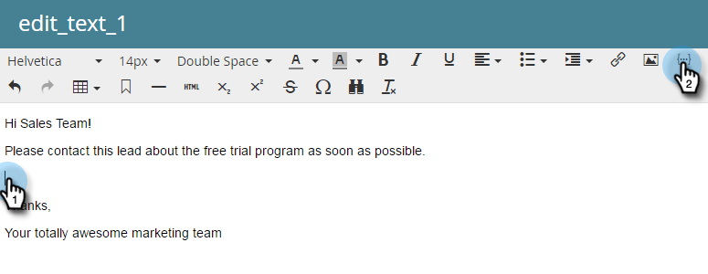
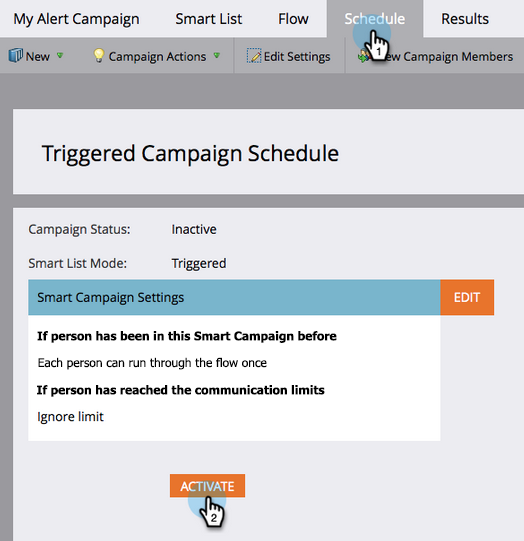

# Meddela säljaren {#alert-the-sales-rep}

## Uppdrag: Meddela säljaren när en person fyller i ett formulär på din webbplats {#mission-alert-the-sales-rep-when-a-person-fills-out-a-form-on-your-web-site}

Om du automatiskt vill skicka varningsmeddelanden till säljarna behöver du bara ett varningsmeddelande och en e-postkampanj. Så här gör du.

>[!PREREQUISITES]
>
>[Landningssida med ett formulär](/help/marketo/getting-started/quick-wins/landing-page-with-a-form.md){target="_blank"}

## Steg 1: Skapa ett e-postmeddelande {#step-create-an-alert-email}

1. Gå till **[!UICONTROL Marketing Activities]** område.

   

1. Välj **Mitt program** som du skapade i [Landningssida med ett formulär](/help/marketo/getting-started/quick-wins/landing-page-with-a-form.md){target="_blank"} snabbvinn, sedan under **[!UICONTROL New]** klicka **[!UICONTROL New Local Asset]**.

   

1. Klicka på **[!UICONTROL Email]**.

   

1. **Namn** e-postmeddelandet&quot;Min e-postavisering&quot; väljer du en mall och klickar på **[!UICONTROL Create]**.

   

1. Ange **Från namn**, **Från e-post**, **[!UICONTROL Reply-to]** och **[!UICONTROL Subject]** som du vill att ditt säljteam ska se.

   

1. Dubbelklicka om du vill redigera e-posttexten.

   

1. Skriv e-postinnehållet.

   

1. Placera markören där du vill infoga personens kontaktinformation och klicka på **Infoga token** ikon.

   

1. Sök och välj `{{SP_Send_Alert_Info}}` **[!UICONTROL Token]** och klicka **[!UICONTROL Insert]**.

   

   >[!NOTE]
   >
   >{{SP_Send_Alert_Info}} är en särskild token för varningsmeddelanden. Se [Använda Skicka aviseringsinformationstoken](/help/marketo/product-docs/email-marketing/general/using-tokens/use-the-send-alert-info-token.md){target="_blank"}{target="_blank"} om du vill veta mer.

1. Klicka på **[!UICONTROL Save]**.

   

1. Klicka på **[!UICONTROL Email Actions]** nedrullningsbar meny och välj **[!UICONTROL Approve and Close]**.

   

## Steg 2: Skapa en aviseringsutlösarkampanj {#step-create-an-alert-trigger-campaign}

1. Välj **Mitt program** tidigare skapat, sedan under **[!UICONTROL New]** klicka **[!UICONTROL New Smart Campaign]**.

   

1. **Namn** kampanjen&quot;My Alert Campaign&quot; och klicka på **[!UICONTROL Create]**.

   

1. Under **[!UICONTROL Smart List]** -fliken, söka efter och dra **[!UICONTROL Fills Out Form]** till arbetsytan.

   

1. Markera formuläret som vi skapade tidigare.

   

1. Under **[!UICONTROL Flow]** -fliken, söka efter och dra **[!UICONTROL Send Alert]** flödesåtgärd till arbetsytan.

   

1. Välj **[!UICONTROL My Alert Email]** skapade tidigare och lämnade **[!UICONTROL Send To]** as **[!UICONTROL Sales Owner]**.

   

1. Skriv din e-postadress i **[!UICONTROL To Other Emails]** fält.

   

1. Gå till **[!UICONTROL Schedule]** och klicka på **[!UICONTROL Activate]** -knappen.

   

   >[!TIP]
   >
   >Ange **[!UICONTROL Qualification Rules]** till **[!UICONTROL every time]** (genom att redigera Smart Campaign) så att samma person kan utlösa varningar flera gånger.

1. Klicka **[!UICONTROL Activate]** på bekräftelseskärmen.

   

## Steg 3: Testa det! {#step-test-it-out}

1. Välj landningssida och klicka på **[!UICONTROL View Approved Page]**.

   

   >[!NOTE]
   >
   >Glöm inte att godkänna landningssidor. de lever inte förrän de godkänts.

1. Fyll i formuläret och klicka **[!UICONTROL Submit]**.

   

1. Du bör få ditt e-postmeddelande inom kort. När du har verifierat att allt fungerar som det ska tar du bort din e-postadress från sändningsaviseringsflödet (se steg 2.7 ovan).

   >[!NOTE]
   >
   >Klicka på **[!UICONTROL Person Info]** i Marketo för att se kontaktinformationen.

## Uppdraget är klart! {#mission-complete}

  

[◄ uppdrag 7: Anpassa ett e-postmeddelande](/help/marketo/getting-started/quick-wins/personalize-an-email.md)

[Uppdrag 9: Uppdatera persondata ►](/help/marketo/getting-started/quick-wins/update-person-data.md)
