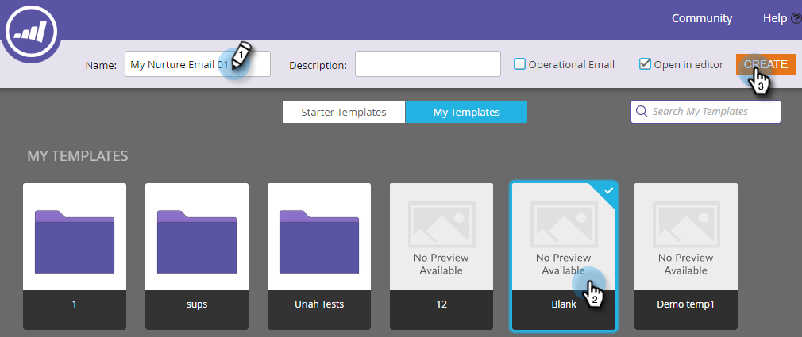
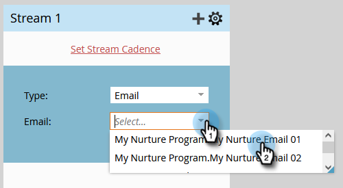
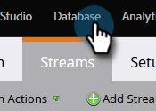

# Drip, Drift, Struktur {#drip-drip-nurture}

## Uppdrag: Ge de personer som deltog i ditt senaste mässor en chans {#mission-nurture-the-people-who-attended-your-recent-tradeshow}

Du kan enkelt skapa ett avancerat och sofistikerat vårdsystem i Marketo. Så här gör du!

>[!PREREQUISITES]
>
>* [Konfigurera och lägga till en person](/help/marketo/getting-started/quick-wins/get-set-up-and-add-a-person.md){target="_blank"}
>* [Importera en lista med personer](/help/marketo/getting-started/quick-wins/import-a-list-of-people.md){target="_blank"}

## Steg 1: Skapa ett engagerande program {#step-create-an-engagement-program}

1. Gå till **[!UICONTROL Marketing Activities]** område.

   

1. Välj **Utbildning** klickar du på **[!UICONTROL New]** nedrullningsbar meny och välj **[!UICONTROL New Program]**.

   

1. Ange **[!UICONTROL Name]** och markera **[!UICONTROL Engagement]** för **[!UICONTROL Program Type]**.

   

1. Se till att **[!UICONTROL Channel]** fältet är **[!UICONTROL Nurture]** och klicka **[!UICONTROL Create]**.

   

   Du har nu skapat ett engagemangsprogram.

## Steg 2: Skapa ett e-postmeddelande {#step-create-an-email}

1. Välj engagemangsprogram, klicka **[!UICONTROL New]** och markera **[!UICONTROL New Local Asset]**.

   

1. Klicka på **[!UICONTROL Email]**.

   

1. Ange **[!UICONTROL Name]** väljer du **[!UICONTROL Template]** du vill använda och klicka på **[!UICONTROL Create]**.

   

   >[!NOTE]
   >
   >Ser du inte e-postredigeraren? Webbläsaren har antagligen blockerat fönstret. Aktivera popup-fönster från `app.marketo.com` i webbläsaren och klicka **[!UICONTROL Edit Draft]** i den övre menyraden.

1. Ange ett ämne.

   

1. Markera det område i e-postmeddelandet som du vill redigera, klicka på kugghjulsikonen och välj **[!UICONTROL Edit]**.

   

1. Redigera din e-post och klicka på **[!UICONTROL Save]**.

   

1. Under **[!UICONTROL Email Actions]**, klicka **[!UICONTROL Approve and Close]**.

   

   >[!NOTE]
   >
   >Kom ihåg att godkänna dina e-postmeddelanden, annars kan du inte aktivera dem senare.

1. Skapa nu ett nytt e-postmeddelande genom att upprepa åtgärderna i steg 2-7.

   

## Steg 3: Lägg till innehåll i strömmen {#step-add-content-to-your-stream}

Nu är det dags att skapa en ström av innehåll för engagemangsprogrammet med hjälp av de e-postmeddelanden du skapat.

1. Välj engagemangsprogram och klicka på **[!UICONTROL Streams]** -fliken.

   

1. Klicka på **[!UICONTROL Add Content]** i flödet.

   

   >[!TIP]
   >
   >Du kan också använda **+** ikon.

1. Låt e-posttypen vara markerad. Hitta och välj de två e-postmeddelandena du skapade.

   

## Steg 4: Aktivera ströminnehåll {#step-activate-stream-content}

1. Aktivera allt innehåll samtidigt genom att klicka på strömmens kugghjulsikon och sedan klicka på **[!UICONTROL Activate all content]**.

   

   >[!NOTE]
   >
   >Du kan inte aktivera innehåll utan att godkänna det först.

   Bra jobbat! Ett steg till så är engagemangsprogrammet klart.

## Steg 5: Ange strömbrytaren {#step-set-the-stream-cadence}

1. Klicka på **[!UICONTROL Set Stream Cadence]**.

   

1. Redigera inställningarna så att de matchar det schema du vill ha och klicka på **[!UICONTROL Save]**.

   

   Ditt engagemangsprogram är klart. Nu ska vi lägga till en testperson i programmet.

   >[!NOTE]
   >
   >Testpersonen är den person som kontrollerar ditt engagemangsprogram för att testa att det är korrekt innan det skickas till kunderna.

## Steg 6: Lägg till en testperson i ditt engagemangsprogram {#step-add-a-test-person-to-your-engagement-program}

1. Gå till **[!UICONTROL Database]** område.

   

1. Sök efter din testperson.

   

   >[!NOTE]
   >
   >Kontrollera att testpersonen har en giltig e-postadress så att du kan bekräfta att du fått e-postmeddelanden när du testar.

1. Högerklicka på personen och klicka sedan på **[!UICONTROL Programs]** och **[!UICONTROL Add to Engagement Program...]**.

   

1. Välj **[!UICONTROL Program]** och **[!UICONTROL Stream]** och sedan klicka **[!UICONTROL Run Now]**.

   

1. Uppdraget är klart!

1. Du bör få e-post vid den tidpunkt och vid den tidpunkt som du angav.

   >[!NOTE]
   >
   >Läs mer om [Engagement Programs](/help/marketo/product-docs/email-marketing/drip-nurturing/creating-an-engagement-program/understanding-engagement-programs.md){target="_blank"}.

## Uppdraget är klart! {#mission-complete}

  

[◄ 5: Importera en lista med personer](/help/marketo/getting-started/quick-wins/import-a-list-of-people.md)

[Uppdrag 7: Anpassa ett e-postmeddelande ►](/help/marketo/getting-started/quick-wins/personalize-an-email.md)
