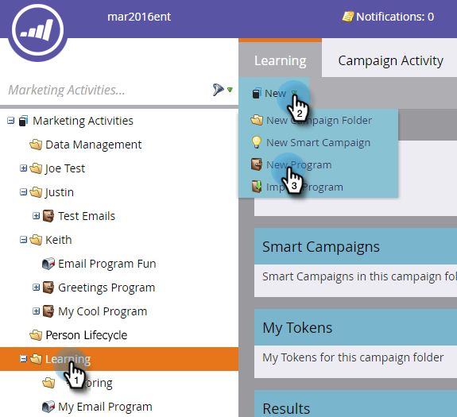
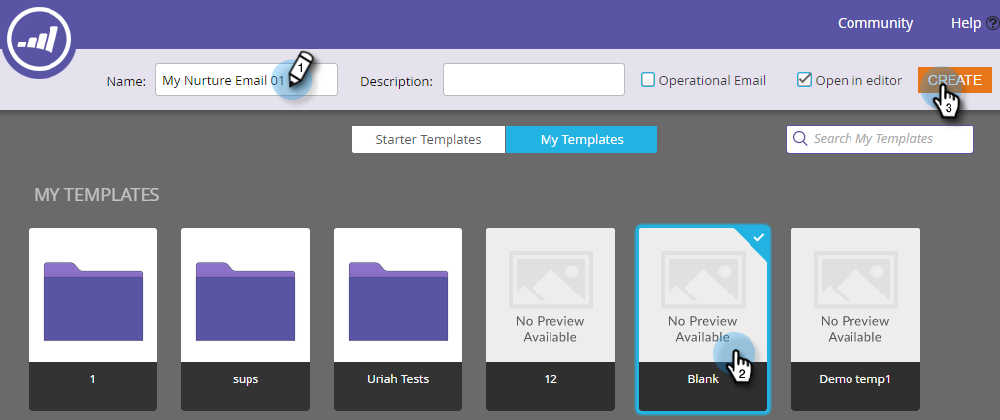
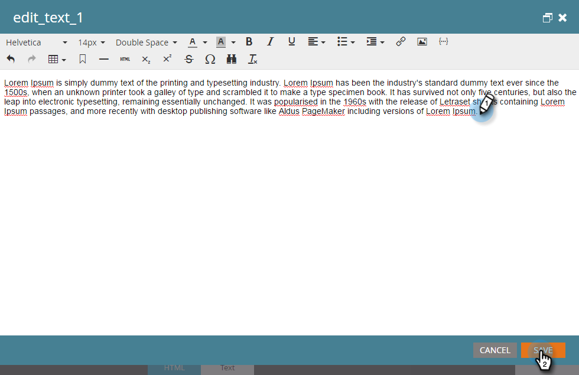
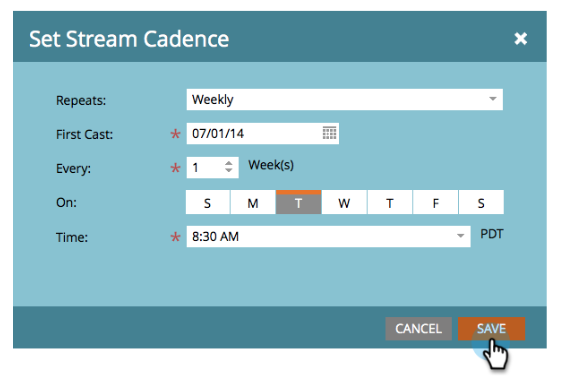

# Drip, Drip, Struktur {#drip-drip-nurture}

## Uppdrag: Ge de personer som deltog i ditt senaste varumärke {#mission-nurture-the-people-who-attended-your-recent-tradeshow}

Du kan enkelt skapa ett avancerat och sofistikerat vårdsystem i Marketo. Så här gör du!

>[!PREREQUISITES]
>
>* [Konfigurera och lägga till en person](/help/marketo/getting-started/quick-wins/get-set-up-and-add-a-person.md)
>* [Importera en lista med personer](/help/marketo/getting-started/quick-wins/import-a-list-of-people.md)

## Steg 1: Skapa ett engagemangsprogram {#step-create-an-engagement-program}

1. Gå till **Marknadsföringsaktiviteter**.

   

1. Välj mappen **Learning**, klicka på listrutan **Nytt** och välj **Nytt program**.

   

1. Ange ett **namn** och välj **engagemang** som **programtyp**.

   

1. Kontrollera att fältet **Kanal** är **Struktur** och klicka på **Skapa**.

   

   Du har nu skapat ett engagemangsprogram.

## Steg 2: Skapa ett e-postmeddelande {#step-create-an-email}

1. Välj engagemangsprogram, klicka sedan på **Nytt** och välj **Ny lokal resurs**.

   

1. Klicka på **E-post**.

   

1. Ange ett **namn**, välj den **mall** som du vill använda och klicka på **Skapa**.

   

   >[!NOTE]
   >
   >Ser du inte e-postredigeraren? Webbläsaren har antagligen blockerat fönstret. Aktivera popup-fönster från [app.marketo.com](https://app.marketo.com) i webbläsaren och klicka på **Redigera utkast** i den övre menyraden.

1. Ange ett ämne.

   

1. Markera det område i e-postmeddelandet som du vill redigera, klicka på kugghjulsikonen och välj **Redigera**.

   

1. Redigera e-postmeddelandet och klicka på **Spara**.

   

1. Stäng fliken/fönstret för e-postredigeraren.

   

1. Klicka på **Godkänn** under **E-poståtgärder**.

   

   >[!NOTE]
   >
   >Glöm inte att godkänna dina e-postmeddelanden, annars kan du inte aktivera dem senare.

1. Skapa nu ett nytt e-postmeddelande genom att upprepa åtgärderna i steg 2.

   

## Steg 3: Lägg till innehåll i strömmen {#step-add-content-to-your-stream}

1. Nu är det dags att skapa en ström av innehåll för engagemangsprogrammet med hjälp av de e-postmeddelanden du skapat.

1. Välj ditt engagemangsprogram och klicka på fliken **Streams**.

   

1. Dra de två e-postmeddelandena du skapade till höger på arbetsytan.

   

   >[!TIP]
   >
   >Du kan också använda knappen **Lägg till innehåll** eller direktuppspelningsikonen **+**.

## Steg 4: Aktivera ströminnehåll {#step-activate-stream-content}

1. Aktivera allt innehåll på en gång genom att klicka på kugghjulsikonen och sedan på **Aktivera allt innehåll**.

   

   >[!NOTE]
   >
   >Du kan inte aktivera innehåll utan att godkänna det först.

   Bra jobbat! Ett steg till så är engagemangsprogrammet klart.

## Steg 5: Ange Stream Cadence {#step-set-the-stream-cadence}

1. Klicka på **Ange strömavslut**.

   

1. Redigera inställningarna så att de matchar det schema du vill ha och klicka på **Spara**.

   

   Ditt engagemangsprogram är klart. Nu ska vi lägga till en testperson i programmet.

   >[!NOTE]
   >
   >Testpersonen är den person som kontrollerar ditt engagemangsprogram för att testa att det är korrekt innan det skickas till kunderna.

## Steg 6: Lägg till en testperson i ditt engagemangsprogram {#step-add-a-test-person-to-your-engagement-program}

1. Gå till området **Databas**.

   

1. Sök efter din testperson.

   

   >[!NOTE]
   >
   >Kontrollera att testpersonen har en giltig e-postadress så att du kan bekräfta att du fått e-postmeddelanden när du testar.

1. Högerklicka på personen, klicka sedan på Program och Lägg till i engagemangsprogram.

   

1. Välj ditt **program** och **direktuppspelning** och klicka sedan på **Kör nu**.

   

1. Uppdraget är klart!

1. Du bör få e-post vid den tidpunkt och vid den tidpunkt som du angav.

   >[!NOTE]
   >
   >Läs mer om [Engagement Programs](/help/marketo/product-docs/email-marketing/drip-nurturing/creating-an-engagement-program/understanding-engagement-programs.md).

  

[◄ 5: Importera en lista med leads](/help/marketo/getting-started/quick-wins/import-a-list-of-people.md)

[Uppdrag 7: Anpassa ett e-postmeddelande ►](/help/marketo/getting-started/quick-wins/personalize-an-email.md)
