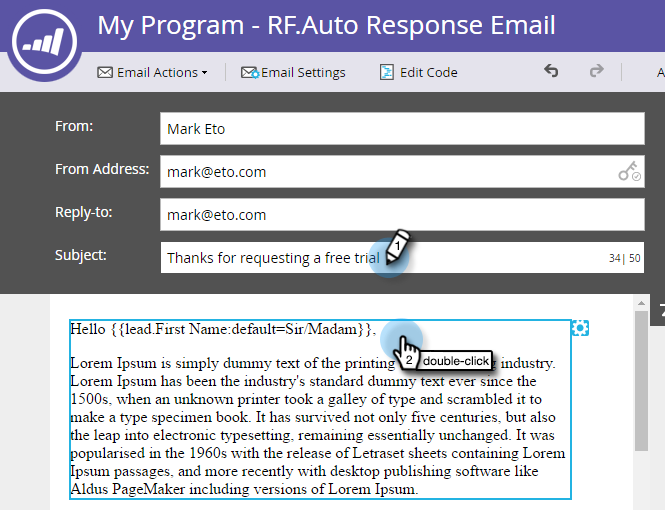

# Automatiskt svar för e-post {#email-auto-response}

## Uppdrag: Skicka ett tackmeddelande när en person fyller i ett formulär {#mission-send-out-a-thank-you-email-when-a-person-fills-out-a-form}

>[!PREREQUISITES]
>
>* [Konfigurera och lägga till en person](/help/marketo/getting-started/quick-wins/get-set-up-and-add-a-person.md){target=&quot;_blank&quot;}
>* [Landningssida med ett formulär](/help/marketo/getting-started/quick-wins/landing-page-with-a-form.md){target=&quot;_blank&quot;}

## Steg 1: Skapa ett e-postmeddelande {#step-create-an-email}

1. Gå till området Marknadsföringsaktiviteter.

   

1. Välj program i den vänstra menyn och klicka på **Nytt** och markera **Ny lokal resurs**.

   

1. Välj **E-post**.

   

1. Namnge e-postmeddelandet&quot;Automatiskt svar e-post&quot;, välj en mall och klicka på **Skapa**.

   

   En e-postredigerare öppnas i ett nytt fönster eller på en ny flik. Om popup-fönster är blockerade klickar du på **Redigera utkast** på resurssammanfattningssidan för att komma åt e-postmeddelandet.

1. Ange en ämnesrad och dubbelklicka sedan på det redigerbara området i e-postmeddelandet.

   

   _En textredigerare öppnas ovanpå e-postredigeraren._

1. Markera befintligt e-postinnehåll.

   

1. Skriv ditt e-postinnehåll och klicka på **Spara**.

   

1. Klicka på **E-poståtgärder** nedrullningsbar meny och välj **Godkänn och stäng**.

   

## Steg 2: Skapa en smart kampanj {#step-create-a-smart-campaign}

1. Välj program och klicka på **Nytt** nedrullningsbar meny och välj **Ny smart kampanj**.

   

1. **Namn** den smarta kampanjen&quot;Auto Response Campaign&quot; och klicka på **Skapa**.

   

1. Gå till **Smart List** -fliken.

   

   Vi konfigurerar kampanjen så att den körs när en person fyller i formuläret som du skapade i [**Landningssida med ett formulär**](/help/marketo/getting-started/quick-wins/landing-page-with-a-form.md){target=&quot;_blank&quot;}.

1. Sök och dra **Fyller i formulär** till arbetsytan.

   

1. Välj **Mitt formulär** i listrutan. Klicka sedan på **Flöde** -fliken.

   

1. Dra **Skicka e-post** flödesåtgärd till vänster arbetsyta.

   

1. Välj **E-post för automatiskt svar**. Klicka sedan på **Schema** -fliken.

   

1. Klicka **Redigera**.

   

1. Välj **Varje gång** och klicka **Spara**.

   

1. Klicka **Aktivera**.

   

1. Klicka **Aktivera** på bekräftelseskärmen.

   

>[!NOTE]
>
>När kampanjen är aktiv körs den varje gång en person fyller i det angivna formuläret. Kampanjen fortsätter att löpa tills den har inaktiverats.

## Steg 3: Fyll i formuläret {#step-fill-out-the-form}

1. Välj **Min sida** (detta skapades i [Landningssida med ett formulär](/help/marketo/getting-started/quick-wins/landing-page-with-a-form.md){target=&quot;_blank&quot;} snabbwin) och klicka på **Förhandsgranska**.

   

   _Landningssidan&quot;Prova utan kostnad&quot; öppnas på en ny flik._

1. Fyll i formuläret med ditt förnamn, efternamn och e-postadress och klicka sedan på **Skicka**.

   

>[!NOTE]
>
>Se till att du använder din faktiska e-postadress så att du kan få e-postmeddelandet.

## Uppdraget är slutfört {#mission-complete}

Inom bara några minuter visas e-postmeddelandet om automatiskt svar i din inkorg. Bra jobbat!

  

[◄ 3: Enkel poängsättning](/help/marketo/getting-started/quick-wins/simple-scoring.md)

[Uppdrag 5: Importera en lista med personer ►](/help/marketo/getting-started/quick-wins/import-a-list-of-people.md)
