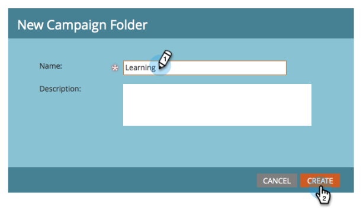

# Konfigurera och lägg till en person {#get-set-up-and-add-a-person}

Det finns några saker att göra innan du börjar uppdraget.

## Steg 1: Logga in på Marketo {#step-log-in-to-marketo}

1. [Logga in på Marketo](https://app.marketo.com){target="_blank"} med de inloggningsuppgifter som du fick via e-post.

   

## Steg 2: Skapa en utbildningsmapp {#step-create-a-learning-folder}

Låt oss skapa en mapp som innehåller allt du kommer att göra i uppdragen.

1. Gå till området **[!UICONTROL Marketing Activities]**.

   

1. Klicka på listrutan **[!UICONTROL New]** och välj **[!UICONTROL New Campaign Folder]**.

   

1. Namnge mappen Learning och klicka på **[!UICONTROL Create]**.

   

1. Den nya utbildningsmappen visas i den vänstra menyn.

   

## Steg 3: Lägg till dig själv som person {#step-add-yourself-as-a-person}

Lägg till dig själv som person i Marketo så att du kan skicka ut testmeddelanden till dig själv senare.

1. Gå till området **[!UICONTROL Database]**.

   

1. Klicka på listrutan **[!UICONTROL New]** och välj **[!UICONTROL New Person]**.

   

1. Ange för- och efternamn, e-postadress och företagsnamn och klicka sedan på **[!UICONTROL Create]** för att lägga till dig själv som person.

   

   >[!CAUTION]
   >
   >Marketo stöder **inte** e-postadresser som innehåller känslolägesikoner.

1. Om du vill visa dina personer öppnar du [!UICONTROL System Smart Lists] på den vänstra menyn och klickar sedan på **[!UICONTROL All People]**.

   

1. Klicka på fliken **[!UICONTROL People]**. Du borde se dig själv i databasen.

   

## Konfigurationen är klar {#set-up-complete}

Du är redo att börja ditt första uppdrag!

  

[Uppgift 1: Skicka en e-postutsändning ►](/help/marketo/getting-started/quick-wins/send-an-email.md)
