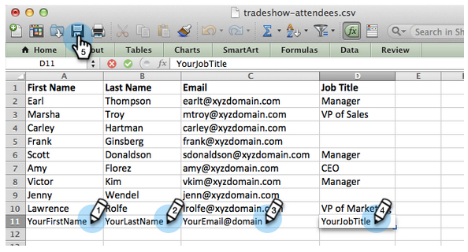
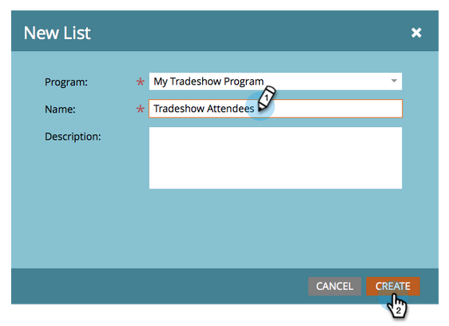

# Importera en lista med personer {#import-a-list-of-people}

## Uppdrag: Importera en kalkylbladslista med deltagande i affärsprogram till databasen {#mission-import-a-spreadsheet-list-of-trade-show-attendees-into-your-database}

>[!NOTE]
>
>**FYI**
>
>Marketo standardiserar nu språk för alla prenumerationer, så du kan se lead/leads i din prenumeration och person/personer på docs.marketo.com. Dessa termer betyder samma sak. det påverkar inte artikelinstruktionerna. Det finns andra förändringar också. [Läs mer](http://docs.marketo.com/display/DOCS/Updates+to+Marketo+Terminology).

>[!NOTE]
>
>**Förutsättningar**
>
>* [Konfigurera och lägga till en person](get-set-up-and-add-a-person.md)

>

`   
`  I den här självstudiekursen får du lära dig att importera personer från en kalkylbladsfil till Marketo.

## Steg 1: Hämta och redigera ett kalkylblad {#step-download-and-edit-a-spreadsheet}

1. Till att börja med laddar du ned övningsfilen för kalkylblad (** [tradeshow-Attendees.csv](http://docs.marketo.com/display/docs/assets/tradeshow-attendees.csv)**) till datorn.

   

   >[!NOTE]
   >
   >**Påminnelse**
   >
   >
   >Använd följande format när du importerar ett datum: **15/921** (månad/dag/år).

   >[!NOTE]
   >
   >Alla datum-/tidfält som importeras behandlas som centraltid. Om du har datum-/tidsfält i en annan tidszon kan du använda en Excel-formel för att omvandla den till Central Time (USA/Chicago).

1. Lägg till ditt eget förnamn, efternamn, e-postadress och jobbtitel och spara sedan filen på datorn.

   

>[!NOTE]
>
>Ange din riktiga e-postadress i CSV-filen så att du kan ta emot de närliggande e-postmeddelanden du skickar i nästa uppdrag.

## Steg 2: Skapa ett program {#step-create-a-program}

1. Gå till området **Marknadsföringsaktiviteter** .

   

1. Välj din **utbildningsmapp** och klicka sedan på **Nytt program** under **Nytt**.

   

1. **Ge** programmet namnet&quot;My Tradeshow Program&quot; och välj&quot;Event&quot; som **programtyp.**

   

1. Välj **VARUMÄRKE** för **kanalen** och klicka på **Skapa**.

   

>[!NOTE]
>
>**Djupdykning**
>
>Händelseprogram inträffar vid specifika datum. Läs mer om [**evenemang**](http://docs.marketo.com/display/docs/events).

## Steg 3: Importera ditt kalkylblad till Marketo {#step-import-your-spreadsheet-into-marketo}

1. Klicka på **Nytt** i **Mitt program** för varumärkesprofilering och välj **Ny lokal resurs**.

   

1. Klicka på **Lista**.

   

1. **Namnge** listan&quot;Varumärkesdeltagare&quot; och klicka på **Skapa**.

   

1. Klicka på **Visa åtgärder** i listan **Deltagare** i ditt varumärke och välj **Importera lista**.

   

   >[!CAUTION]
   >
   >Om du använder en egen CSV-fil måste du se till att den är kodad UTF-8, UTF-16, Shift-JIS eller EUC-JP.

   >[!NOTE]
   >
   >Storleksgränsen för CSV-filer är 100 MB.

1. **Bläddra** till **kalkylbladsfilen tradeshow-Attendees.csv** på datorn och klicka på **Nästa**.

   

   >[!NOTE]
   >
   >Om du väljer **Hoppa över nya personer och uppdateringar** i läget Listimport påverkas inte befintliga personposter och du loggar inga aktiviteter. Använd det här läget om du vill ha en snabb, förfiltrerad statisk lista över befintliga personer som kan användas i dina marknadsföringsaktiviteter. Om du väljer det här läget:
   >
   >    
   >    
   >    * Hoppa över skapande av ny person
   >    * Hoppa över uppdateringar av personfält
   >    * Hoppa över aktivitetsloggning

1. Koppla listkolumnsfälten till deras respektive Marketo-fält och klicka på **Nästa**.

   

   >[!TIP]
   >
   >Kolumnrubrikerna ska alltid matcha fältet exakt (skiftlägeskänsligt) för att uppnå bästa resultat för automatisk mappning. Om du använder anpassade fält och inte ser dem i listrutan går du tillbaka och [skapar dem](http://docs.marketo.com/display/DOCS/Create+a+Custom+Field+in+Marketo) så att de kan bli alternativ.

   >[!NOTE]
   >
   >Om det finns fält som du inte vill importera väljer du **Ignorera** i listrutan Marketinfält.

1. Välj **Mitt** utbildningsprogram för **förvärvsprogrammet** och klicka sedan på **Importera**.

   

1. Vänta tills dina personer har importerats och stäng sedan popup-fönstret för importförloppet.

   

1. Gå tillbaka till **My Tradeshow Program** och klicka på fliken **Members** . Du kommer att se alla de personer du just importerat.

   

>[!NOTE]
>
>**Djupdykning**
>
>Du kan analysera hur ditt program fungerar genom att spåra programmedlemskap. Läs mer om [**Program**](http://docs.marketo.com/display/docs/programs).

## Uppdraget är slutfört {#mission-complete}

Nu är deltagarna i ditt varumärke medlemmar i ditt Marketo-program!

  

[◄ 4: E-postautosvar](email-auto-response.md) [uppdrag 6: Drip, Drip, Sköldhet ►](drip-drip-nurture.md)