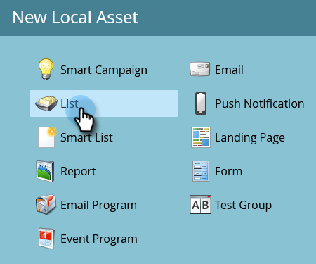

# Importera en lista med personer {#import-a-list-of-people}

## Uppdrag: Importera en kalkylbladslista med deltagande i affärsprogram till din databas {#mission-import-a-spreadsheet-list-of-trade-show-attendees-into-your-database}

>[!PREREQUISITES]
>
>[Konfigurera och lägg till en person](/help/marketo/getting-started/quick-wins/get-set-up-and-add-a-person.md){target="_blank"}

I den här självstudiekursen får du lära dig hur du importerar personer från en kalkylbladsfil till Marketo.

## Steg 1: Hämta och redigera ett kalkylblad {#step-download-and-edit-a-spreadsheet}

1. Börja med att ladda ned vår övningskalkylbladsfil ([**tradeshow-Attendees.csv**](/help/marketo/getting-started/assets/tradeshow-attendees.csv){target="_blank"}) till datorn.

   

   >[!NOTE]
   >
   >Använd följande format när du importerar ett datum: **9/21/20** (månad/dag/år).

   >[!NOTE]
   >
   >Alla datum-/tidfält som importeras behandlas som centraltid. Om du har datum-/tidsfält i en annan tidszon kan du använda en Excel-formel för att omvandla den till Central Time (USA/Chicago).

1. Lägg till ditt eget förnamn, efternamn, faktisk e-postadress (så att du kan ta emot de närliggande e-postmeddelanden du skickar i nästa uppdrag) och befattning. Spara filen på datorn.

   

   >[!CAUTION]
   >
   >* Kontrollera att e-postadresser endast innehåller ASCII-tecken.
   >
   >* Marketo stöder **inte** e-postadresser som innehåller känslolägesikoner.
   >
   >* Om du importerar `NULL` värden via CSV kan det generera ett&quot;Ändra datavärde&quot; för numeriska fält i en persons [aktivitetslogg](/help/marketo/product-docs/core-marketo-concepts/smart-lists-and-static-lists/managing-people-in-smart-lists/locate-the-activity-log-for-a-person.md){target="_blank"}, _även om fälten redan är tomma_. Om du har [smarta kampanjer](/help/marketo/product-docs/core-marketo-concepts/smart-campaigns/understanding-smart-campaigns.md){target="_blank"} som använder filtret&quot;Datavärdet har ändrats&quot; eller utlösaren&quot;Ändringar av datavärde&quot; kan det göra att andra kan kvalificera sig för kampanjer, även om data inte ändras. Du kan använda [begränsningar](/help/marketo/product-docs/core-marketo-concepts/smart-lists-and-static-lists/using-smart-lists/add-a-constraint-to-a-smart-list-filter.md){target="_blank"} för att se till att ingen kvalificerar sig för kampanjer vid import.

## Steg 2: Skapa ett program {#step-create-a-program}

1. Gå till området **[!UICONTROL Marketing Activities]**.

   

1. Välj mappen **Learning** och klicka sedan under **[!UICONTROL New]** på **[!UICONTROL New Program]**.

   

1. **Namn** på programmet&quot;My Tradeshow Program&quot; och välj&quot;Event&quot; för **[!UICONTROL Program Type]**.

   

1. Välj **[!UICONTROL Tradeshow]** för **[!UICONTROL Channel]** och klicka på **[!UICONTROL Create]**.

   

>[!NOTE]
>
>Händelseprogram inträffar vid specifika datum. Läs mer om [**händelser**](/help/marketo/product-docs/demand-generation/events/understanding-events/understanding-event-programs.md){target="_blank"}.

## Steg 3: Importera ditt kalkylblad till Marketo {#step-import-your-spreadsheet-into-marketo}

1. Klicka på **och välj** i **[!UICONTROL New]** My Tradeshow Program **[!UICONTROL New Local Asset]**.

   

1. Välj **[!UICONTROL List]**.

   

1. **Namnge** listan&quot;Deltagare i mässa&quot; och klicka på **[!UICONTROL Create]**.

   

1. Klicka på **[!UICONTROL Tradeshow Attendees]** i listan **[!UICONTROL List Actions]** och välj **[!UICONTROL Import List]**.

   

   >[!CAUTION]
   >
   >Om du använder en egen CSV-fil måste du se till att den är kodad UTF-8, UTF-16, Shift-JIS eller EUC-JP.

   >[!NOTE]
   >
   >Storleksgränsen för CSV-filer är 100 MB.

1. **[!UICONTROL Browse]** till kalkylbladsfilen **tradeshow-Attendees.csv** på datorn och klicka på **[!UICONTROL Next]**.

   

   >[!NOTE]
   >
   >Om du väljer **[!UICONTROL Skip new people and updates]** i läget Listimport påverkas inte befintliga personposter eller loggar några aktiviteter. Använd det här läget om du vill ha en snabb, förfiltrerad statisk lista över befintliga personer som kan användas i dina marknadsföringsaktiviteter. Om du väljer det här läget kommer du att:
   >
   > * Hoppa över skapande av ny person
   > * Hoppa över uppdateringar av personfält
   > * Hoppa över aktivitetsloggning

1. Mappa dina [!UICONTROL List Column]-fält till deras respektive Marketo-fält och klicka på **[!UICONTROL Next]**.

   

   >[!TIP]
   >
   >Kolumnrubrikerna ska alltid matcha fältet exakt (skiftlägeskänsligt) för att uppnå bästa resultat för automatisk mappning. Om du använder anpassade fält och inte ser dem i listrutan går du tillbaka och [skapar dem](/help/marketo/product-docs/administration/field-management/create-a-custom-field-in-marketo.md){target="_blank"} så att de kan bli alternativ.

   >[!NOTE]
   >
   >Om det finns fält som du inte vill importera väljer du **Ignorera** i listrutan Marketo-fält.

1. Välj **My Tradeshow Program** för **[!UICONTROL Acquisition Program]** och klicka sedan på **[!UICONTROL Import]**.

   

1. Vänta tills dina personer har importerats och stäng sedan popup-fönstret för importförloppet.

   

1. Gå tillbaka till **My Tradeshow Program** och klicka på fliken **[!UICONTROL Members]**. Du ser alla personer som du just importerat.

   

>[!NOTE]
>
>Du kan analysera hur ditt program fungerar genom att spåra programmedlemskap. Läs mer om [**Program**](/help/marketo/product-docs/core-marketo-concepts/programs/creating-programs/understanding-programs.md){target="_blank"}.

## Uppdraget är slutfört {#mission-complete}

Deltagarna i ditt varumärke är nu medlemmar i ditt Marketo-program!

  

[◄ Mission 4: Automatiskt svar via e-post](/help/marketo/getting-started/quick-wins/email-auto-response.md)

[Uppdrag 6: Dripp, Dripp, Struktur ►](/help/marketo/getting-started/quick-wins/drip-drip-nurture.md)
