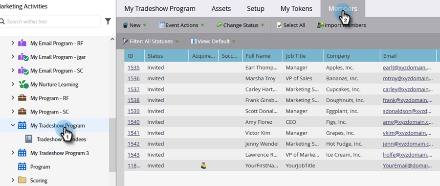

# Importera en lista med personer {#import-a-list-of-people}

## Uppdrag: Importera en kalkylbladslista med deltagande i affärsprogram till databasen {#mission-import-a-spreadsheet-list-of-trade-show-attendees-into-your-database}

>[!PREREQUISITES]
>
>[Konfigurera och lägga till en person](/help/marketo/getting-started/quick-wins/get-set-up-and-add-a-person.md){target=&quot;_blank&quot;}

I den här självstudiekursen får du lära dig hur du importerar personer från en kalkylbladsfil till Marketo.

## Steg 1: Hämta och redigera ett kalkylblad {#step-download-and-edit-a-spreadsheet}

1. Börja med att ladda ned en övningsfil ([**tradeshow-Attendees.csv**](/help/marketo/getting-started/assets/tradeshow-attendees.csv){target=&quot;_blank&quot;}) till datorn.

   

   >[!NOTE]
   >
   >Använd följande format när du importerar ett datum: **9/21/20** (månad/dag/år).

   >[!NOTE]
   >
   >Alla datum-/tidfält som importeras behandlas som centraltid. Om du har datum-/tidsfält i en annan tidszon kan du använda en Excel-formel för att omvandla den till Central Time (USA/Chicago).

1. Lägg till ditt eget förnamn, efternamn, faktisk e-postadress (så att du kan ta emot de närliggande e-postmeddelanden du skickar i nästa uppdrag) och befattning. Spara filen på datorn.

   

   >[!CAUTION]
   >
   >Marketo gör det **not** har stöd för e-postadresser som innehåller känslolägesikoner.

## Steg 2: Skapa ett program {#step-create-a-program}

1. Gå till **Marknadsföringsaktiviteter** område.

   

1. Välj **Utbildning** mapp, sedan under **Nytt** klicka **Nytt program**.

   

1. **Namn** Programmet&quot;My Tradeshow Program&quot; och välj&quot;Event&quot; för **Programtyp**.

   

1. Välj **Varumärke** för **Kanal** och klicka **Skapa**.

   

>[!NOTE]
>
>Händelseprogram inträffar vid specifika datum. Läs mer om [**Händelser**](/help/marketo/product-docs/demand-generation/events/understanding-events/understanding-event-programs.md){target=&quot;_blank&quot;}.

## Steg 3: Importera kalkylblad till Marketo {#step-import-your-spreadsheet-into-marketo}

1. I **Mitt Tradeshow Program**, klicka **Nytt** och markera **Ny lokal resurs**.

   

1. Välj **Lista**.

   

1. **Namn** i listan&quot;Tradeshow Attendees&quot; och klickar på **Skapa**.

   

1. I **Deltagare i mässor** lista, klicka på **Liståtgärder** och markera **Importera lista**.

   

   >[!CAUTION]
   >
   >Om du använder en egen CSV-fil måste du se till att den är kodad UTF-8, UTF-16, Shift-JIS eller EUC-JP.

   >[!NOTE]
   >
   >Storleksgränsen för CSV-filer är 100 MB.

1. **Bläddra** till **tradeshow-Attendees.csv** kalkylbladsfil på datorn och klicka på **Nästa**.

   

   >[!NOTE]
   >
   >I listimportläge väljer du **Hoppa över nya personer och uppdateringar** innebär att du inte kommer att påverka befintliga personposter eller logga några aktiviteter. Använd det här läget om du vill ha en snabb, förfiltrerad statisk lista över befintliga personer som kan användas i dina marknadsföringsaktiviteter. Om du väljer det här läget:
   >
   > * Hoppa över skapande av ny person
   > * Hoppa över uppdateringar av personfält
   > * Hoppa över aktivitetsloggning

1. Mappa listkolumnfälten till deras respektive Marketo-fält och klicka på **Nästa**.

   

   >[!TIP]
   >
   >Kolumnrubrikerna ska alltid matcha fältet exakt (skiftlägeskänsligt) för att uppnå bästa resultat för automatisk mappning. Om du använder anpassade fält och inte ser dem i listrutan går du tillbaka och [skapa dem](/help/marketo/product-docs/administration/field-management/create-a-custom-field-in-marketo.md){target=&quot;_blank&quot;} så att de kan bli alternativ.

   >[!NOTE]
   >
   >Om det finns fält som du inte vill importera väljer du **Ignorera** i listrutan Marketo Field.

1. Välj **Mitt Tradeshow Program** för **Anskaffningsprogram** och sedan klicka **Importera**.

   

1. Vänta tills dina personer har importerats och stäng sedan popup-fönstret för importförloppet.

   

1. Tillbaka in **Mitt Tradeshow Program** klickar du på **Medlemmar** -fliken. Du kommer att se alla de personer du just importerat.

   

>[!NOTE]
>
>Du kan analysera hur ditt program fungerar genom att spåra programmedlemskap. Läs mer om [**Program**](/help/marketo/product-docs/core-marketo-concepts/programs/creating-programs/understanding-programs.md){target=&quot;_blank&quot;}.

## Uppdraget är slutfört {#mission-complete}

Deltagarna i ditt varumärke är nu medlemmar i ditt Marketo-program!

  

[◄ 4: Automatiskt svar för e-post](/help/marketo/getting-started/quick-wins/email-auto-response.md)

[Uppdrag 6: Drip, Drip, Sköldhet ►](/help/marketo/getting-started/quick-wins/drip-drip-nurture.md)
