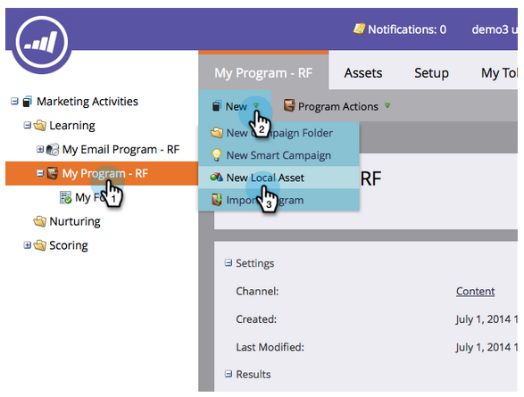
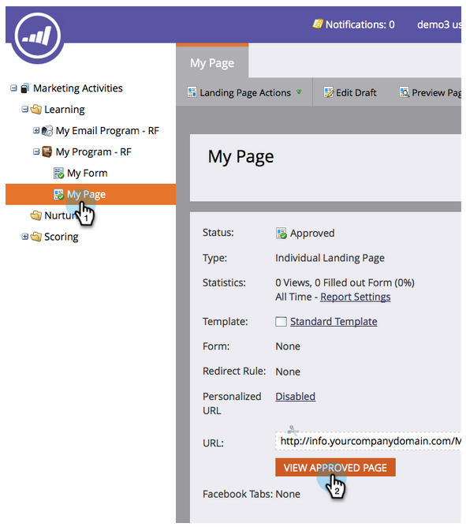
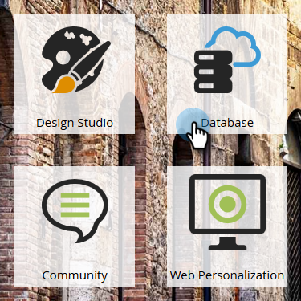

# Landningssida med ett formulär {#landing-page-with-a-form}

## Uppdrag: Skapa en landningssida med en blankett för att skaffa nya personer. {#mission-create-a-landing-page-with-a-form-to-acquire-new-people}

>[!NOTE]
>
>**FYI**
>
>Marketo standardiserar nu språk för alla prenumerationer, så du kan se lead/leads i din prenumeration och person/personer på docs.marketo.com. Dessa termer betyder samma sak. det påverkar inte artikelinstruktionerna. Det finns andra förändringar också. [Läs mer](http://docs.marketo.com/display/DOCS/Updates+to+Marketo+Terminology).

>[!PREREQUISITES]
>
>* [Konfigurera och lägga till en person](get-set-up-and-add-a-person.md)

## STEG 1: Skapa ett program {#step-create-a-program}

1. Gå till området **Marknadsföringsaktiviteter** .

   

1. Välj mappen** Learning** som skapades i [föregående snabbwin](send-an-email.md).

   

1. Klicka på **Nytt program under** Nytt ****.

   

1. Ange ett **programnamn**, välj en**-kanal** och klicka på** Skapa**.

   >[!NOTE]
   >
   >**Påminnelse**
   >
   >
   >Inkludera dina initialer i slutet av programmet Namn för att göra det unikt.

   

   >[!NOTE]
   >
   >**Definition**
   >
   >
   >Ett program är ett specifikt marknadsföringsinitiativ. **Kanalen** är avsedd att fungera som leveransmekanism, t.ex. webbinarium, Sponsorship eller Online Ad. Du kan se olika kanalalternativ i listrutan, beroende på vad som är tillgängligt i din egen instans. Du kan också [skapa en egen kanal.](../../product-docs/administration/tags/create-a-program-channel.md)

   

Snyggt gjort! Nu när vi har skapat ett program går vi vidare och skapar lite innehåll.

## STEG 2: Skapa ett formulär {#step-create-a-form}

1. När programmet är valt klickar du på **Nytt** och sedan** Ny lokal resurs**.

   

1. Välj **Formulär**.

   

1. Ange ett **formulärnamn** och klicka på **Skapa**.

   

   >[!NOTE]
   >
   >Kontrollera att rutan **Öppna i redigerare** är markerad. Om det inte är det måste du klicka på **fliken****Redigera formulär.**

   >[!TIP]
   >
   >Ser du inte formulärredigeraren? Webbläsaren har antagligen blockerat fönstret. Aktivera popup-fönster från [app.marketo.com](http://app.marketo.com/) i webbläsaren och klicka på Redigera utkast i den övre menyraden.

1. Markera fältet** E-postadress** och markera Är **obligatoriskt**.

   

1. Klicka på **Nästa**.

   

1. Klicka på pilarna för att bläddra igenom temana. Välj en.

   

1. Klicka** Nästa**.

   

1. Under sidan Tack väljer du **Extern URL** för **uppföljning med**.

   

1. Ange URL-adressen.

   

   >[!NOTE]
   >
   >**Definition**
   >
   >På uppföljningssidan omdirigeras besökaren när formuläret har fyllts i. Extern URL är ett alternativ, men det finns fler. Se [Ställa in en tacksida](../../product-docs/demand-generation/forms/creating-a-form/set-a-form-thank-you-page.md)för ett formulär.

1. Klicka på **Slutför**.

   

1. Klicka på **Godkänn och stäng**.

   

   Suverän! Nu har du ett program med ett formulär. Vi går vidare och skapar en sida.

   

## STEG 3: Skapa en landningssida och lägg till formuläret {#step-create-a-landing-page-and-add-your-form}

1. När programmet är valt klickar du på **Nytt** och sedan på **Ny lokal resurs**.

   

1. Välj **landningssida**.

   

1. Ange en sida** Namn**, välj en mall och klicka på **Skapa**.

   >[!NOTE]
   >
   >Du kanske har en annan mall än den som visas på skärmbilden, det är okej, välj bara en och fortsätt.

   

1. När landningssidans redigerare öppnas drar du formulärelementet till arbetsytan.

   

1. Leta reda på och markera formuläret och klicka på **Infoga**.

   

1. Dra formuläret till önskad plats.

   

1. Alla ändringar sparas automatiskt. Stäng fliken/fönstret för formulärredigeraren.

   

   Bra jobbat! Nu finns det en landningssida med ett formulär. Låt oss godkänna sidan för att göra den offentlig.

## STEG 4: Godkänn landningssidan {#step-approve-your-landing-page}

1. Välj landningssida och klicka på **Godkänn under Åtgärder för** landningssida ****.

   >[!NOTE]
   >
   >**Definition**
   >
   >
   >Genom att godkänna landningssidan kommer den att vara tillgänglig för åtkomst via internet.

   

   Perfekt! Ser du den gröna bockmarkeringen?

   

## STEG 5: Testa formuläret {#step-test-your-form}

1. Välj landningssida och klicka på** Visa godkänd sida**.

   

1. Fyll i formuläret med information som du vet är unik och klicka på **Skicka**.

   

1. Gå till området **Databas** .

   

1. Sök efter den unika e-postadressen som du använde när du fyllde i formuläret.

   

   Där är den! Du skapade en ny landningssida med ett formulär och använde den för att skapa en ny person.

   

## Uppdraget är klart! {#mission-complete}

  

[◄ Skicka e-postutfall](send-an-email.md) med [enkel poängsättning ►](simple-scoring.md)