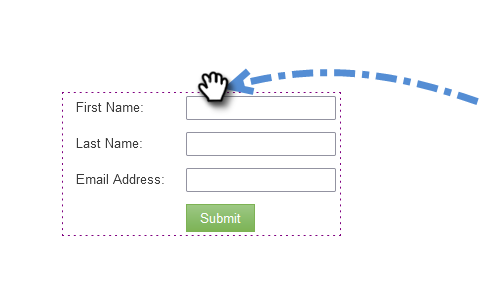

# Landningssida med ett formulär {#landing-page-with-a-form}

## Uppdrag: Skapa en landningssida med en blankett för att skaffa nya personer. {#mission-create-a-landing-page-with-a-form-to-acquire-new-people}

>[!PREREQUISITES]
>
>[Konfigurera och lägga till en person](/help/marketo/getting-started/quick-wins/get-set-up-and-add-a-person.md)

## STEG 1: Skapa ett program {#step-create-a-program}

1. Gå till **Marknadsföringsaktiviteter** område.

   

1. Välj **Utbildning** mapp som skapats i [föregående snabbvinst](/help/marketo/getting-started/quick-wins/send-an-email.md){target=&quot;_blank&quot;}. Under **Nytt**, klicka **Nytt program**.

   

1. Ange ett program **Namn** väljer du en **Kanal** och klicka **Skapa**.

   

   >[!TIP]
   >
   >Inkludera dina initialer i slutet av programnamnet för att göra det unikt.

   >[!NOTE]
   >
   >Ett program är ett specifikt marknadsföringsinitiativ. The **kanal** är avsett att vara leveransmekanism, som webbinarium, sponsring eller online-annons. Du kan se olika kanalalternativ i listrutan, beroende på vad som är tillgängligt i din egen instans. Du kan också [skapa en egen kanal](/help/marketo/product-docs/administration/tags/create-a-program-channel.md){target=&quot;_blank&quot;}.

Snyggt gjort! Nu när vi har skapat ett program går vi vidare och skapar lite innehåll.

## STEG 2: Skapa ett formulär {#step-create-a-form}

1. När programmet är valt klickar du på **Nytt** nedrullningsbar meny och välj **Ny lokal resurs**.

   

1. Välj **Formulär**.

   

1. Ange ett formulär **Namn** och klicka **Skapa**.

   

   >[!NOTE]
   >
   >Se till att **Öppna i redigeraren** är markerad. Om det inte är det måste du klicka på **Redigera formulär** -fliken.

   >[!TIP]
   >
   >Ser du inte formulärredigeraren? Webbläsaren har antagligen blockerat fönstret. Aktivera popup-fönster från `app.marketo.com` i webbläsaren och klicka på Redigera utkast i den övre menyraden.

1. Välj **E-postadress** fält och kontroll **Är obligatoriskt**.

   

1. Klicka **Nästa**.

   

1. Klicka på pilarna för att bläddra igenom temana. Välj en.

   

1. Klicka **Nästa**.

   

1. Under sidan Tack väljer du **Extern URL** for **Följ upp med**.

   

1. Ange URL-adressen.

   

   >[!NOTE]
   >
   >På uppföljningssidan omdirigeras besökaren när formuläret har fyllts i. Extern URL är ett alternativ, men det finns fler. Se [Ange en tacksida för formuläret](/help/marketo/product-docs/demand-generation/forms/creating-a-form/set-a-form-thank-you-page.md){target=&quot;_blank&quot;}.

1. Klicka **Slutför**.

   

1. Klicka **Godkänn och stäng**.

   

   Bra! Nu har du ett program med ett formulär. Vi går vidare och skapar en sida.

## STEG 3: Skapa en landningssida och lägg till formuläret {#step-create-a-landing-page-and-add-your-form}

1. När programmet är valt klickar du på **Nytt** och sedan **Ny lokal resurs**.

   

1. Välj **Landningssida**.

   

1. Ange en sida **Namn**, välj en mall och klicka på **Skapa**.

   >[!NOTE]
   >
   >Du kan ha en annan mall än den som visas på skärmbilden. Det är okej, välj bara en och fortsätt.

   

1. När landningssidans redigerare öppnas drar du formulärelementet till arbetsytan.

   

1. Hitta och markera formuläret och klicka på **Infoga**.

   

1. Dra formuläret till önskad plats.

   

1. Alla ändringar sparas automatiskt. Stäng fliken/fönstret för formulärredigeraren.

   

   Bra jobbat! Nu finns det en landningssida med ett formulär. Låt oss godkänna sidan för att göra den offentlig.

## STEG 4: Godkänn landningssidan {#step-approve-your-landing-page}

1. Välj landningssida och klicka på **Godkänn utkast**.

   

   >[!NOTE]
   >
   >Genom att godkänna landningssidan kommer den att vara tillgänglig och publiceras på internet.

   Perfekt! Ser du den gröna bockmarkeringen?

   

## STEG 5: Testa formuläret {#step-test-your-form}

1. Välj landningssida och klicka på **Visa godkänd sida**.

   

1. Fyll i formuläret med information som du vet är unik och klicka **Skicka**.

   

1. Gå till **Databas** område.

   

1. Sök efter den unika e-postadressen som du använde när du fyllde i formuläret.

   

   Där är den! Du skapade en ny landningssida med ett formulär och använde den för att skapa en ny person.

   

## Uppdraget är klart! {#mission-complete}

  

[◄ uppdrag 1: Skicka ett e-postutdrag](/help/marketo/getting-started/quick-wins/send-an-email.md)

[Uppdrag 3: Enkel poängsättning ►](/help/marketo/getting-started/quick-wins/simple-scoring.md)
