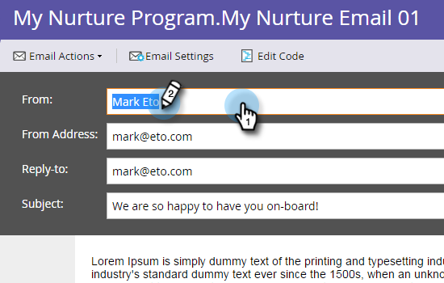

# Anpassa ett e-postmeddelande {#personalize-an-email}

## Uppdrag: Gör dina e-postmeddelanden personliga genom att lägga till datatoken {#mission-make-your-emails-personal-by-adding-data-tokens}

>[!PREREQUISITES]
>
>* [Konfigurera och lägga till en person](/help/marketo/getting-started/quick-wins/get-set-up-and-add-a-person.md){target=&quot;_blank&quot;}
>* [Skicka ett e-postutdrag](/help/marketo/getting-started/quick-wins/send-an-email.md){target=&quot;_blank&quot;}
>* [Drip, Drift, Struktur](/help/marketo/getting-started/quick-wins/drip-drip-nurture.md){target=&quot;_blank&quot;}

## Steg 1: Välj en e-postadress att anpassa {#step-select-an-email-to-personalize}

1. Välj en av de e-postmeddelanden som har skapats i dialogrutan [föregående snabbvinst](/help/marketo/getting-started/quick-wins/drip-drip-nurture.md){target=&quot;_blank&quot;} och klicka på **Skapa utkast**.

   

   >[!NOTE]
   >
   >Detta skapar en kopia av e-postmeddelandet som ett utkast. Kom ihåg att godkänna utkastet för att ändringarna ska börja gälla.

Om du inte har aktiverat en popup-blockerare öppnas e-postredigeraren i ett nytt flik/fönster. I annat fall klickar du på **Skapa utkast** två gånger.

## Steg 2: Gör säljaren till avsändaren {#step-make-the-salesperson-the-sender}

1. Välj **Från** fält, markera och **delete** det aktuella namnet.

   

1. Klicka på **Token** ikonen till höger om **Från** fält.

   

1. Sök och välj **`{{lead.Lead Owner First Name}}`** token.

   

1. Ange ditt företagsnamn och ett tankstreck för **Standardvärde** för att säkerställa att något visas om säljarens förnamn inte är tillgängligt. Klicka **Infoga**.

   

1. Tryck på blankstegstangenten i **Från** ska du se till att markören blinkar ett blanksteg efter den variabel du just infogade. Klicka sedan på **Token** ikonen igen.

   

1. Sök och välj **`{{lead.Lead Owner Last Name}}`** token.

   

1. Skriv&quot;Försäljning&quot; för **Standardvärde** och klicka **Infoga**.

   

## Steg 3: Lägg till leadens namn i e-postmeddelandet {#step-add-the-leads-name-to-the-email}

1. Markera det övre redigerbara avsnittet, klicka på kugghjulsikonen och välj **Redigera**.

   

1. Lägg till ett blanksteg efter &quot;Hello&quot; och placera markören framför kommatecknet och klicka sedan på **Infoga token** ikon.

   

1. Sök och välj **`{{lead.First Name}}`** token.

   

1. Ange &quot;Kompis&quot; (eller någon annan etikett du vill ha) i dialogrutan **Standardvärde** fält och klicka **Infoga**.

   

   >[!TIP]
   >
   >Inkludera alltid ett standardvärde för token; Detta garanterar att standardvärdet visas i e-postmeddelandet om en del av den personliga informationen saknas.

1. Klicka **Spara**.

   

1. Under **E-poståtgärder** och markera **Godkänn och stäng**.

   

>[!TIP]
>
>Behöver du en snabb uppdatering av hur du skickar e-postmeddelandet till dig själv? Se [Skicka ett e-postutdrag](/help/marketo/getting-started/quick-wins/send-an-email.md){target=&quot;_blank&quot;}.

### Uppdraget är slutfört {#mission-complete}

Grattis, du har personaliserat din e-post!

  

[◄ 6: Drip, Drift, Struktur](/help/marketo/getting-started/quick-wins/drip-drip-nurture.md)

[Uppdrag 8: Meddela säljaren ►](/help/marketo/getting-started/quick-wins/alert-the-sales-rep.md)
