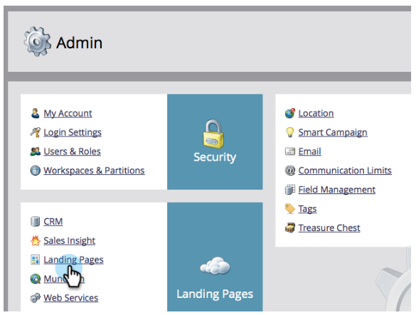
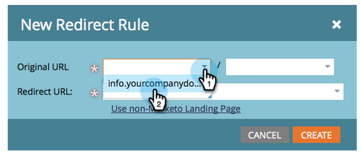
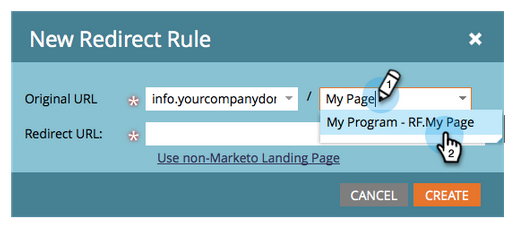
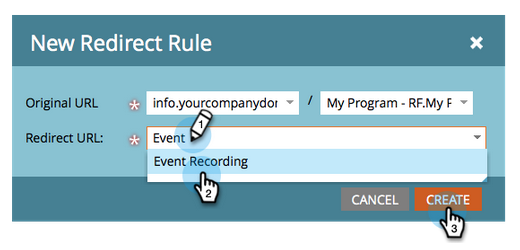

# Omdirigera en landningssida {#redirect-a-landing-page}

## Uppdrag: Omdirigera en landningssida till en annan webbsida {#mission-redirect-a-landing-page-to-a-different-web-page}

>[!NOTE]
>
>**Administratörsbehörigheter krävs**

>[!NOTE]
>
>**Förutsättningar**
>
>* [Konfigurera och lägga till en person](get-set-up-and-add-a-person.md)
>* [Landningssida med ett formulär](landing-page-with-a-form.md)
>* [Anpassa landningssidans URL med en CNAME](../../product-docs/demand-generation/landing-pages/landing-page-actions/customize-your-landing-page-urls-with-a-cname.md)

>

## Steg 1: Starta en ny omdirigeringsregel {#step-start-a-new-redirect-rule}

1. Gå till området **Admin** .

   

1. Gå till** landningssidor**.

   

1. Klicka på fliken **Regler** och sedan på **Ny** och **ny omdirigeringsregel**.

   

## Steg 2: Definiera omdirigeringsregeln {#step-define-the-redirect-rule}

1. Klicka på den första listrutan **Original URL ** och välj Marketo CNAME.

   

   >[!NOTE]
   >
   >**Påminnelse**
   >
   >
   >Kom ihåg att du bara kan dirigera om landningssidor som börjar med Marketo [CNAME](../../product-docs/demand-generation/landing-pages/landing-page-actions/customize-your-landing-page-urls-with-a-cname.md).

1. Klicka på den andra **Ursprunglig URL-adressen **och välj den startsida som du vill omdirigera.

   

1. Under **Omdirigerings-URL** väljer du den sida som du vill omdirigera till och klickar på **SKAPA**.

   

## Uppdraget är slutfört {#mission-complete}

Grattis! Du har omdirigerat en landningssida.

  

[◄ 9: Uppdatera lead-data](update-person-data.md)