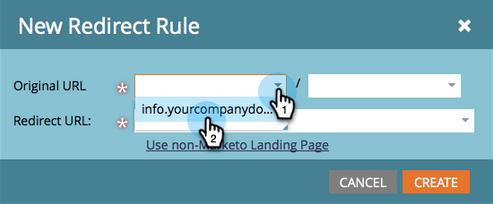

# Omdirigera en landningssida {#redirect-a-landing-page}

## Uppdrag: Omdirigera en landningssida till en annan webbsida {#mission-redirect-a-landing-page-to-a-different-web-page}

>[!NOTE]
>
>**Administratörsbehörigheter krävs**

>[!PREREQUISITES]
>
>* [Landningssida med ett formulär](/help/marketo/getting-started/quick-wins/landing-page-with-a-form.md){target="_blank"}
>* [Anpassa URL:en till landningssidan med en CNAME](/help/marketo/product-docs/demand-generation/landing-pages/landing-page-actions/customize-your-landing-page-urls-with-a-cname.md){target="_blank"}

## Steg 1: Starta en ny omdirigeringsregel {#step-start-a-new-redirect-rule}

1. Gå till **[!UICONTROL Admin]** område.

   

1. Gå till **[!UICONTROL Landing Pages]**.

   

1. Klicka på **[!UICONTROL Rules]** tabbtangenten och sedan klicka **[!UICONTROL New]** och **[!UICONTROL New Redirect Rule]**.

   

## Steg 2: Definiera omdirigeringsregeln {#step-define-the-redirect-rule}

1. Klicka på den första **[!UICONTROL Original URL]** och välja Marketo CNAME.

   

   >[!NOTE]
   >
   >Kom ihåg att du bara kan dirigera om landningssidor som börjar med din Marketo [CNAME](/help/marketo/product-docs/demand-generation/landing-pages/landing-page-actions/customize-your-landing-page-urls-with-a-cname.md){target="_blank"}.

1. Klicka på den andra **[!UICONTROL Original URL]** och välj den landningssida som du vill omdirigera.

   

1. För **[!UICONTROL Redirect URL]** markera sidan som du vill omdirigera till och klicka på **[!UICONTROL Create]**.

   

## Uppdraget är slutfört {#mission-complete}

Grattis! Du har omdirigerat en landningssida.

  

[◄ 9: Uppdatera lead-data](/help/marketo/getting-started/quick-wins/update-person-data.md)
