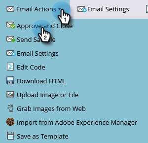

# Skicka ett e-postmeddelande {#send-an-email}

Det är det första alla vill göra. Vi skickar ett mejl från Marketo!

>[!PREREQUISITES]
>
>[Konfigurera och lägga till en person](/help/marketo/getting-started/quick-wins/get-set-up-and-add-a-person.md){target="_blank"}

## Skapa ett e-postprogram {#create-an-email-program}

1. Gå till **[!UICONTROL Marketing Activities]** område.

   

1. Välj **[!UICONTROL Learning]** mapp. Klicka på **[!UICONTROL New]** nedrullningsbar meny och välj **[!UICONTROL New Program]**.

   

1. Ange **[!UICONTROL Name]** och markera **[!UICONTROL Email]** for **[!UICONTROL Program Type]**.

   >[!TIP]
   >
   >Lägg till dina initialer i slutet av programnamnet för att göra det unikt.

   

1. Under **[!UICONTROL Channel]**, markera **[!UICONTROL Email Send]** och klicka **[!UICONTROL Create]**.

   

## Definiera er målgrupp {#define-your-audience}

1. Klicka **[!UICONTROL Edit Smart List]** under [!UICONTROL Audience] platta.

   

1. Sök och dra [!UICONTROL Email Address] filter på arbetsytan.

   

   >[!TIP]
   >
   >Använd **[!UICONTROL Search]** för att enklare hitta filter.

1. Hitta och välj din e-postadress.

   

   >[!NOTE]
   >
   >Om e-postmeddelandet inte fylls i automatiskt kan du ha glömt att [Kom igång och lägg till en lead.](/help/marketo/getting-started/quick-wins/get-set-up-and-add-a-person.md){target="_blank"}

   >[!NOTE]
   >
   >I det här exemplet ska du bara skicka e-postmeddelandet till dig själv, men du kan anpassa målgruppen som du vill.

1. Gå tillbaka till huvudprogramfliken och klicka på uppdateringsikonen för **[!UICONTROL Person]**.

   

   Du borde se antalet personer gå upp till 1. Det är du!

## Skapa ett e-postmeddelande {#create-an-email}

1. Klicka under rutan E-post **[!UICONTROL New Email]**.

   

1. Ange **[!UICONTROL Name]** väljer du en **Mall** och klicka **[!UICONTROL Create]**.

   

1. E-postredigeringsfönstret öppnas. Ange ett ämne som innehåller högst 50 tecken (rekommenderas).

   

   >[!NOTE]
   >
   >Om du har en popup-blockerare klickar du på **[!UICONTROL Edit Draft]** för att ange e-postredigeraren.

1. Markera området som du vill redigera, klicka på kugghjulsikonen till höger och välj sedan **[!UICONTROL Edit]** (du kan också dubbelklicka på det redigerbara avsnittet som du vill redigera).

   

1. Ange önskat innehåll och klicka på **[!UICONTROL Save]**.

   

1. Klicka på **[!UICONTROL Email Actions]** nedrullningsbar meny och välj **[!UICONTROL Approve and Close]**.

   

   >[!TIP]
   >
   >Vill du skicka dig ett snabbt exempel för att se hur din e-post ser ut innan den startas? Välj **[!UICONTROL Send Sample]** på menyn ovan eller klicka **[!UICONTROL Email Actions]** sedan [**[!UICONTROL Send Sample]**](/help/marketo/product-docs/email-marketing/general/creating-an-email/send-a-sample-email.md){target="_blank"}.

1. Välj E-postprogrammet i det vänstra trädet.

   

1. Under [!UICONTROL Schedule] ange startdag för e-postmeddelandet till **[!UICONTROL Today]**.

   

   >[!NOTE]
   >
   >Läs mer om [Mottagarens tidszon](/help/marketo/product-docs/email-marketing/email-programs/email-program-actions/scheduling-with-recipient-time-zone/schedule-email-programs-with-recipient-time-zone.md){target="_blank"} and [Head Start](/help/marketo/product-docs/email-marketing/email-programs/email-program-actions/head-start-for-email-programs.md){target="_blank"}.

1. Välj en tid som är minst 15 minuter i framtiden.

   

   >[!TIP]
   >
   >Är inte standardtidszonen din? Lär dig hur [uppdatera här](/help/marketo/product-docs/administration/settings/select-your-language-locale-and-time-zone.md){target="_blank"}.

1. Klicka **[!UICONTROL Approve Program]** under [!UICONTROL Approval] så är du klar!

   

Du bör få e-postmeddelandet kort efter den schemalagda dagen/tiden.

## Uppdraget är klart! {#mission-complete}

  

[◄ Konfigurera och lägg till en person](/help/marketo/getting-started/quick-wins/get-set-up-and-add-a-person.md)

[Uppdrag 2: Landningssida med ett formulär ►](/help/marketo/getting-started/quick-wins/landing-page-with-a-form.md)
