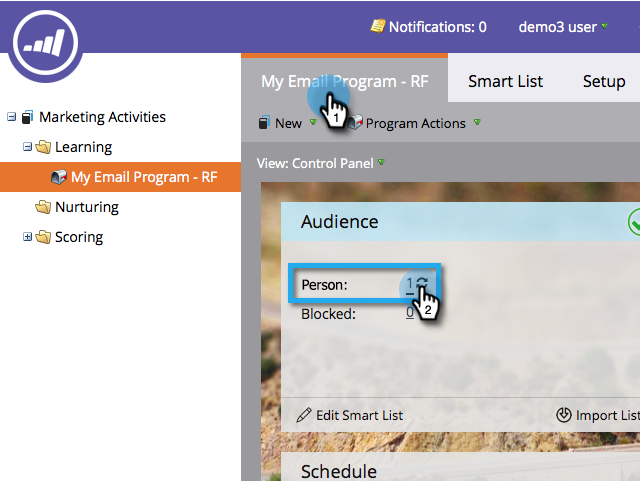
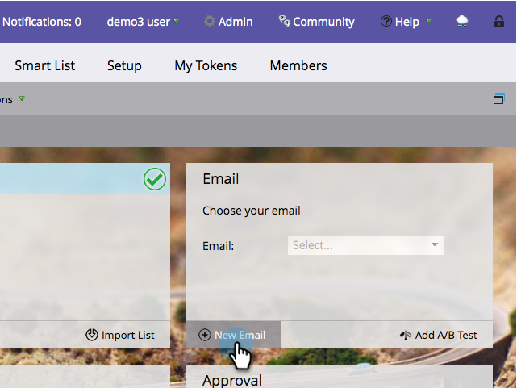

# Skicka ett e-postmeddelande {#send-an-email}

Det är det första alla vill göra. Låt oss skicka ett e-postmeddelande från Marketo!

>[!PREREQUISITES]
>
>[Konfigurera och lägga till en person](/help/marketo/getting-started/quick-wins/get-set-up-and-add-a-person.md)

## Skapa ett e-postprogram {#create-an-email-program}

1. Gå till **Marknadsföringsaktiviteter**.

   

1. Välj mappen **Learning**. Klicka på listrutan **Nytt** och välj **Nytt program**.

   

1. Ange ett **namn** och välj **E-post** för **Programtyp.**

   >[!TIP]
   >
   >Lägg till dina initialer i slutet av programnamnet för att göra det unikt.

   

1. Under **Kanal** väljer du **Skicka via e-post** och klickar på **Skapa**.

   

## Definiera målgrupp {#define-your-audience}

1. Klicka på **Redigera smart lista** under rutan Målgrupp.

   

1. Hitta och dra e-postadressfiltret till arbetsytan.

   

   >[!TIP]
   >
   >Använd **Sök** högst upp i filterlistan för att enklare hitta filtret.

1. Hitta och välj din e-postadress.

   

   >[!NOTE]
   >
   >Om e-postmeddelandet inte fylls i automatiskt kan du ha glömt att [Kom igång och lägga till en lead.](/help/marketo/getting-started/quick-wins/get-set-up-and-add-a-person.md)

   >[!NOTE]
   >
   >I det här exemplet ska du bara skicka e-postmeddelandet till dig själv, men du kan anpassa målgruppen som du vill.

1. Gå tillbaka till huvudprogramfliken och klicka på uppdateringsikonen för **person**.

   

   Du borde se antalet personer gå upp till 1. Det är du!

## Skapa ett e-postmeddelande {#create-an-email}

1. Klicka på **Ny e-post** under rutan E-post.

   

1. Ange ett **namn**, välj en **mall** och klicka på **Skapa**.

   

1. E-postredigeringsfönstret öppnas. Ange ett ämne som består av högst 50 tecken (rekommenderas).

   

   >[!NOTE]
   >
   >Om du har en blockerare klickar du på **Redigera utkast** för att öppna e-postredigeraren.

1. Markera området som du vill redigera, klicka på kugghjulsikonen till höger och välj sedan **Redigera** (du kan också dubbelklicka på det redigerbara området som du vill redigera).

   

1. Ange önskat innehåll och klicka på **Spara**.

   

1. Ändringarna sparas automatiskt. Stäng fliken/fönstret i redigeraren.

   

1. Klicka på listrutan **E-poståtgärder** och välj **Godkänn**.

   

   >[!TIP]
   >
   >Vill du skicka dig ett snabbt exempel för att se hur din e-post ser ut innan den startas? Välj **Skicka exempel** på menyn ovan eller klicka på **E-poståtgärder** och sedan [**Skicka exempel**](/help/marketo/product-docs/email-marketing/general/creating-an-email/send-a-sample-email.md).

1. Välj E-postprogrammet i det vänstra trädet.

   

1. Ange startdagen för e-postmeddelandet till **Idag under rutan Schema.**

   

1. Välj en tid som är minst 15 minuter i framtiden.

   

   >[!TIP]
   >
   >Är inte standardtidszonen din? Lär dig hur du [uppdaterar det här](/help/marketo/product-docs/administration/settings/select-your-language-locale-and-time-zone.md).

1. Klicka **Godkänn program** under rutan Godkännande. Klart!

   

Du bör få e-postmeddelandet kort efter den schemalagda dagen/tiden.

  

[◄ Konfigurera och lägg till en lead](/help/marketo/getting-started/quick-wins/get-set-up-and-add-a-person.md)

[Landningssida med ett formulär ►](/help/marketo/getting-started/quick-wins/landing-page-with-a-form.md)
