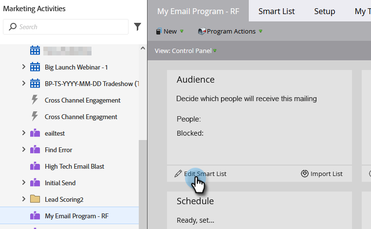

# Skicka e-post {#send-an-email}

Det är det första alla vill göra. Vi skickar ett e-postmeddelande från Marketo!

>[!PREREQUISITES]
>
>[Konfigurera och lägg till en person](/help/marketo/getting-started/quick-wins/get-set-up-and-add-a-person.md){target="_blank"}

## Skapa ett e-postprogram {#create-an-email-program}

1. Gå till området **[!UICONTROL Marketing Activities]**.

   

1. Välj din **[!UICONTROL Learning]**-mapp. Klicka på listrutan **[!UICONTROL New]** och välj **[!UICONTROL New Program]**.

   

1. Ange **[!UICONTROL Name]** och välj **[!UICONTROL Email]** för **[!UICONTROL Program Type]**.

   >[!TIP]
   >
   >Lägg till dina initialer i slutet av programnamnet för att göra det unikt.

   

1. Under **[!UICONTROL Channel]** väljer du **[!UICONTROL Email Send]** och klickar på **[!UICONTROL Create]**.

   

## Definiera er målgrupp {#define-your-audience}

1. Klicka på **[!UICONTROL Edit Smart List]** under rutan [!UICONTROL Audience].

   

1. Hitta och dra filtret [!UICONTROL Email Address] till arbetsytan.

   

   >[!TIP]
   >
   >Använd funktionen **[!UICONTROL Search]** för att enklare hitta filter.

1. Hitta och välj din e-postadress.

   

   >[!NOTE]
   >
   >Om e-postmeddelandet inte fylls i automatiskt kan du ha glömt att [Konfigurera och lägga till en lead.](/help/marketo/getting-started/quick-wins/get-set-up-and-add-a-person.md){target="_blank"}

   >[!NOTE]
   >
   >I det här exemplet ska du bara skicka e-postmeddelandet till dig själv, men du kan anpassa målgruppen som du vill.

1. Gå tillbaka till huvudprogramfliken och klicka på uppdateringsikonen för **[!UICONTROL Person]**.

   

   Du borde se antalet personer gå upp till 1. Det är du!

## Skapa ett e-postmeddelande {#create-an-email}

1. Klicka på **[!UICONTROL New Email]** under rutan E-post.

   

1. Ange en **[!UICONTROL Name]**, markera en **mall** och klicka på **[!UICONTROL Create]**.

   

1. E-postredigeringsfönstret öppnas. Ange ett ämne som består av högst 50 tecken (rekommenderas).

   

   >[!NOTE]
   >
   >Om du har en popup-blockerare klickar du på **[!UICONTROL Edit Draft]** för att öppna e-postredigeraren.

1. Markera området som du vill redigera, klicka på kugghjulsikonen till höger och välj sedan **[!UICONTROL Edit]** (du kan också dubbelklicka på det redigerbara området som du vill redigera).

   

1. Ange önskat innehåll och klicka på **[!UICONTROL Save]**.

   

1. Klicka på listrutan **[!UICONTROL Email Actions]** och välj **[!UICONTROL Approve and Close]**.

   

   >[!TIP]
   >
   >Vill du skicka dig ett snabbt exempel för att se hur din e-post ser ut innan den startas? Välj **[!UICONTROL Send Sample]** på menyn ovan eller klicka på **[!UICONTROL Email Actions]** och sedan [**[!UICONTROL Send Sample]**](/help/marketo/product-docs/email-marketing/general/creating-an-email/send-a-sample-email.md){target="_blank"}.

1. Välj E-postprogrammet i det vänstra trädet.

   

1. Under rutan [!UICONTROL Schedule] anger du startdagen för e-postmeddelandet till **[!UICONTROL Today]**.

   

   >[!NOTE]
   >
   >Läs mer om [Mottagarens tidszon](/help/marketo/product-docs/email-marketing/email-programs/email-program-actions/scheduling-with-recipient-time-zone/schedule-email-programs-with-recipient-time-zone.md){target="_blank"} och [Huvudstart](/help/marketo/product-docs/email-marketing/email-programs/email-program-actions/head-start-for-email-programs.md){target="_blank"}.

1. Välj en tid som är minst 15 minuter i framtiden.

   

   >[!TIP]
   >
   >Är inte standardtidszonen din? Lär dig hur du [uppdaterar det här](/help/marketo/product-docs/administration/settings/select-your-language-locale-and-time-zone.md){target="_blank"}.

1. Klicka **[!UICONTROL Approve Program]** under rutan [!UICONTROL Approval] så är du klar!

   

Du bör få e-postmeddelandet kort efter den schemalagda dagen/tiden.

## Uppdraget är klart! {#mission-complete}

  

[◄ Konfigurera och lägg till en person](/help/marketo/getting-started/quick-wins/get-set-up-and-add-a-person.md)

[Uppgift 2: Landningssida med formulär ►](/help/marketo/getting-started/quick-wins/landing-page-with-a-form.md)
