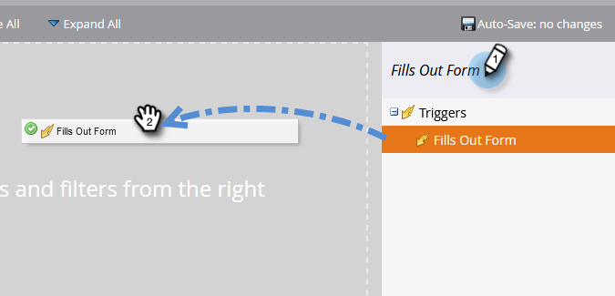

# Enkel poängsättning {#simple-scoring}

>[!PREREQUISITES]
>
>* [Konfigurera och lägga till en person](/help/marketo/getting-started/quick-wins/get-set-up-and-add-a-person.md){target=&quot;_blank&quot;}
>* [Landningssida med ett formulär](/help/marketo/getting-started/quick-wins/landing-page-with-a-form.md){target=&quot;_blank&quot;}

## Steg 1: Skapa en resultatkampanj {#step-create-a-scoring-campaign}

1. Gå till **Marknadsföringsaktiviteter** område.

   

1. Högerklicka på **Utbildning** mapp och klicka på **Ny kampanjmapp**.

   

1. Namnge kampanjmappen Scoring och klicka på **Skapa**.

   

   >[!NOTE]
   >
   >Om du redan har en bedömningsmapp ger du den ett annat namn, till exempel Betygsättning 1. Mappnamn måste vara unika.

1. Högerklicka på **Poäng** mapp och markera **Ny smart kampanj**.

   

1. Namnge kampanjen&quot;Change Score&quot; och klicka på **Skapa**.

   

1. Klicka på **Smart List** -fliken.

   

   Vi vill att den här kampanjen ska köras när en person fyller i din **Formulär för testbegäran**.

1. Sök och dra **Fyller i formulär** till vänster på arbetsytan.

   

1. Välj **Mitt formulär**.

   

   >[!NOTE]
   >
   >Om du har slutfört [Landningssida med ett formulär](/help/marketo/getting-started/quick-wins/landing-page-with-a-form.md){target=&quot;_blank&quot;} quick win bör du ha formuläret. Om du har använt ett annat namn för formuläret väljer du det.

1. Klicka på **Flöde** -fliken.

   

1. Dra **Ändra poäng** flöda åtgärd till den vänstra arbetsytan.

   

1. Du kan skriva vilket värde som helst som ska läggas till i personens poäng. Vi skriver &quot;+5&quot; i **Ändra** fält.

   

   >[!TIP]
   >
   >Bra poängsättningskampanjer är avgörande för att leverera högkvalitativa säljare. Läs [**The Definitive Guide to Lead Scoring**](https://www.marketo.com/definitive-guides/lead-scoring/){target=&quot;_blank&quot;}.

1. Klicka på **Schema** -fliken och **Aktivera** -knappen.

   

1. Klicka **Aktivera** på bekräftelseskärmen.

   

>[!NOTE]
>
>När kampanjen är aktiv körs den varje gång en person fyller i formuläret. Kampanjen fortsätter att löpa tills den har inaktiverats.

## Steg 2: Fyll i formuläret {#step-fill-out-the-form}

1. Välj den landningssida du skapade i dialogrutan [Landningssida med ett formulär](/help/marketo/getting-started/quick-wins/landing-page-with-a-form.md){target=&quot;_blank&quot;} snabb vinst.

   

1. Klicka **Förhandsgranska**. Landningssidan öppnas på en ny flik.

   

1. Fyll i formuläret med ditt förnamn, efternamn och e-postadress och klicka sedan på **Skicka**.

   

   >[!NOTE]
   >
   >Använd samma namn och e-postadress som du använde när du först angav dig själv som en person för att tillämpa poängökningen &quot;+5&quot;.

## Steg 3: Visa personinformation {#step-view-the-person-info}

1. Gå till området Databas.

   

1. Sök efter den e-postadress som du använde när du fyllde i formuläret.

   

1. Dubbelklicka på personen.

   

Personuppgifterna öppnas på en ny flik eller i ett nytt fönster. Se hur poängen ökade med 5 poäng för att fylla i blanketten?

## Uppdraget är klart! {#mission-complete}

  

[◄ uppdrag 2: Landningssida med ett formulär](/help/marketo/getting-started/quick-wins/landing-page-with-a-form.md)

[Uppdrag 4: Automatiskt svar via e-post ►](/help/marketo/getting-started/quick-wins/email-auto-response.md)
