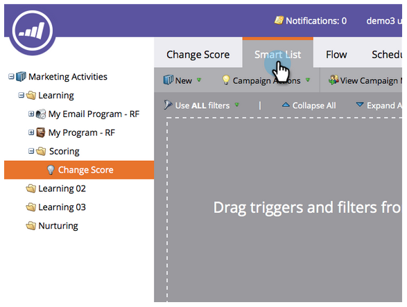

# Enkel poängsättning {#simple-scoring}

>[!NOTE]
>
>**FYI**
>
>Marketo standardiserar nu språk för alla prenumerationer, så du kan se lead/leads i din prenumeration och person/personer på docs.marketo.com. Dessa termer betyder samma sak. det påverkar inte artikelinstruktionerna. Det finns andra förändringar också. [Läs mer](http://docs.marketo.com/display/DOCS/Updates+to+Marketo+Terminology).

>[!PREREQUISITES]
>
>* [Konfigurera och lägga till en person](get-set-up-and-add-a-person.md)
>* [Landningssida med ett formulär](landing-page-with-a-form.md)

>

## Steg 1: Skapa en resultatkampanj {#step-create-a-scoring-campaign}

1. Gå till området **Marknadsföringsaktiviteter** .

   

1. Högerklicka på mappen **Learning** och klicka på **New Campaign Folder**.

   

1. Namnge kampanjmappen Scoring.

   

   >[!NOTE]
   >
   >Om du redan har en bedömningsmapp ger du den ett annat namn, till exempel Betygsättning 1. Mappnamn måste vara unika.

1. Högerklicka sedan på den nya **bedömningsmappen** och välj **Ny smart kampanj**.

   

1. **Namnge** kampanjen&quot;Change Score&quot; och klicka på **Create**.

   

1. Klicka på fliken **Smart lista** .

   

   Vi vill att den här kampanjen ska köras när en person fyller i ditt formulär **för** testbegäran.

1. Hitta och dra utlösaren för **Fyll i formulär** till den vänstra arbetsytan.

   

1. Välj **Mitt formulär**.

   >[!NOTE]
   >
   >Om du har slutfört [landningssidan med en snabbsida i form](landing-page-with-a-form.md) bör du ha formuläret. Om du har använt ett annat namn för formuläret väljer du det.

   

1. Klicka på fliken **Flow **.

   

1. Dra åtgärden **Ändra bakgrundsmusik** till den vänstra arbetsytan.

   

1. Du kan skriva vilket värde som helst som ska läggas till i personens poäng. Vi skriver &quot;+5&quot; i fältet **Ändra** .

   

   >[!TIP]
   >
   >Bra poängsättningskampanjer är avgörande för att leverera högkvalitativa säljare. Läs [**The Definitive Guide to Lead Scoring**](http://www.marketo.com/definitive-guides/lead-scoring/).

1. Klicka på fliken **Schema** och på knappen **Aktivera** .

   

1. Klicka på **Aktivera** på bekräftelseskärmen.

   

>[!NOTE]
>
>När kampanjen är aktiv körs den varje gång en person fyller i formuläret. Kampanjen fortsätter att löpa tills den har inaktiverats.

## Steg 2: Fyll i formuläret {#step-fill-out-the-form}

1. Välj landningssidan som du skapade på [landningssidan med ett snabbt utbyte av ett formulär](landing-page-with-a-form.md) .

   

1. Klicka på **Visa godkänd sida**. Landningssidan öppnas på en ny flik.

   

1. Fyll i formuläret med ditt förnamn, efternamn och e-postadress och klicka sedan på **Skicka** .

   

   >[!NOTE]
   >
   >Använd samma namn och e-postadress som du använde när du först angav dig själv som en person för att tillämpa poängökningen &quot;+5&quot;.

## Steg 3: Visa personinformation {#step-view-the-person-info}

1. Gå till området Databas.

   

1. Sök efter den e-postadress som du använde när du fyllde i formuläret.

   

1. Dubbelklicka på personen.

   

Personuppgifterna öppnas på en ny flik eller i ett nytt fönster. Se hur poängen ökade med 5 poäng för att fylla i formuläret!

**Grattis!** Du har skapat en poängsättningskampanj.
[◄ uppdrag 2: Landningssida med](landing-page-with-a-form.md) formulärets [uppdrag 4: Automatiskt svar via e-post ►](email-auto-response.md)