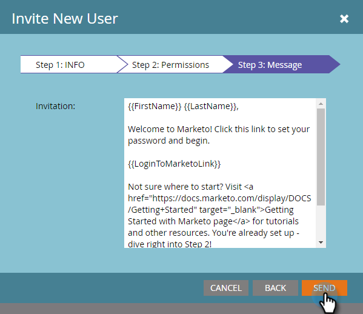

# Installationssteg {#setup-steps}

**Välkommen till Marketo!**

Innan du börjar använda Marketo behöver du utföra några steg.

De här stegen omfattar:

* vissa grundläggande kontoinställningar
* ange era landningssidans URL:er och e-postlänkar för att förbättra förtroendet och leveransmöjligheterna
* synka CRM
* lägga till spårningskod på företagets webbplats

>[!NOTE]
>
>Du behöver bara göra de här stegen om ditt företag är **nytt för Marketo**. Om så inte är fallet kan installationen redan vara klar.

Vissa steg kräver hjälp från IT-avdelningen.

>[!TIP]
>
>Om du [skriver ut den här checklistan](/help/marketo/getting-started/setup-steps/setup-checklist.md) kan du checka av objekt när du slutför dem.

1. Logga in och skapa ytterligare marknadsföringsanvändare

1. Logga in på Marketo [här](https://app.marketo.com/) med de inloggningsuppgifter du fått via e-post.

   

Grattis! Nu är ni i Marketo och kan börja utforska. Du kanske vill bjuda in dina kollegor i marknadsföringsteamet till dig. Du kan göra detta genom att lägga till nya användare.

Gå till området **Admin**.

>[!TIP]
>
>När du är här kan du klicka på **Mitt konto** för att ändra dina konto- och platsinställningar, samt ange ett nytt prenumerationsnamn.

>[!NOTE]
>
>**Administratörsbehörigheter krävs**

Klicka på **Användare och roller**.

Klicka på **Bjud in ny användare**.

Fyll i kollegans e-postadress, förnamn och efternamn.

Du kan också ange en orsak till inbjudan och ett förfallodatum för åtkomst med hjälp av kalenderväljaren. Klicka på **OK**.

Klicka på **Nästa**.

>[!TIP]
>
>Ett förfallodatum passar bra för kortsiktiga externa intressenter eller konsulter som bara behöver Marketto för en kort tid.

>[!NOTE]
>
>När förfallodatumet inkommer får användaren ett meddelande om förfallodatum och kontot är låst.

Välj en roll och klicka på **Nästa**. Standardanvändare har tillgång till alla områden utom Admin.

>[!NOTE]
>
>Förutom de fem inbyggda rollerna kan du även skapa anpassade roller. Läs mer om [Hantera användarroller och behörigheter](/help/marketo/product-docs/administration/users-and-roles/managing-user-roles-and-permissions.md).

Du kan redigera texten i inbjudan. Klicka på **Skicka**.

Den nya användaren visas nu på fliken Användare och bör få ett e-postmeddelande med en länk för att skapa ett lösenord och en inloggning. Nästa steg!

1. Konfigurera dina auktoriserade supportkontakter

   Du kan ha fått ett e-postmeddelande från Marketo Support om att du är Marketo kundsupportadministratör för ditt företag. I så fall kan du konfigurera **auktoriserade supportkontakter** för ditt team. Endast behöriga supportkontakter kan kontakta Marketo Customer Support direkt via [Marketo Support Portal](https://support.marketo.com).

   >[!NOTE]
   >
   >Antalet supportkontakter som du kan skapa beror på vilket paket du har köpt. Den här gränsen anges i ditt e-postmeddelande från Marketo Support.

   Authorized Support Contact docs has move to the Marketo Community. Se [den här artikeln](https://nation.marketo.com/t5/Knowledgebase/Managing-Authorized-Support-Contacts/ta-p/254341).

   >[!NOTE]
   >
   >Endast personer som har loggat in på Marketo Community visas i listan. Om du inte kan hitta personen måste du först logga in på Community.

1. Anpassa URL:er för landningssidor med en CNAME

   >[!NOTE]
   >
   >Är du kund i Launch Pack? Du kan hoppa över det här steget. Din konsult kommer att ge dig ett dokument med instruktioner för IT-konfiguration under samtalet.

   >[!NOTE]
   >
   >**Administratörsbehörigheter krävs**

   Välj en CNAME för dina landningssidor. Några exempel:

   * **gå**.[CompanyDomain].com
   * **www2**.[CompanyDomain].com
   * **lp**.[CompanyDomain].com

   >[!TIP]
   >
   >Håll det kort! Kortare URL:er är enklare att komma ihåg. Vi föreslår &quot;gå&quot; som domän.

   Den första delen (i fet stil) är `[LandingPageCNAME]`. Du behöver den i steg 5.

   Om du vill hämta kontosträngen som du ska ersätta med landningssidan CNAME går du till området Admin.

   

   Klicka på **Startsidor**.

   

   Kopiera kontosträngen från inställningarna för landningssidan.

   

   Det här är `[AccountString]`. Spara den. Du måste ge den till IT i steg 5.

Konfigurera domäninställningarna så att landningssidorna använder företagets domän i stället för Marketos (där de finns).

1. Säkerställ e-postleverans

   >[!NOTE]
   >
   >Är du kund i Launch Pack? Du kan hoppa över det här steget. Din konsult kommer att ge dig ett dokument med instruktioner för IT-konfiguration under samtalet.

   Du kan vidta flera åtgärder för att se till att e-postmeddelandena når så många av dina medarbetare som möjligt.

   1. **Lägg in spårningslänkarna**. Du kan välja en CNAME att använda din egen domän (i stället för Marketos) i de länkar som du inkluderar i e-postmeddelanden från Marketo. Detta stärker er domänprofilering och ökar förtroendet och leveransförmågan hos era mottagare.
   1. **Lägg till Marketo i företagets e-post tillåtelselista.** Det är en vanlig god praxis att skicka testmeddelanden till testkonton innan e-post skickas till verkliga personer. Genom att tillåtslista Marketo kan du förhindra att testmeddelanden blockeras eller flaggas som skräppost.
   1. **Konfigurera SPF och DKIM.** Dessa tekniker garanterar mottagarna att era Marketo-e-postmeddelanden inte är skräppost. Följ de här stegen för att [konfigurera en SPF och DKIM för din e-postleverans](/help/marketo/product-docs/email-marketing/deliverability/set-up-spf-and-dkim-for-your-email-deliverability.md) för att förhindra att mottagarnas skräppostfilter avvisar dina Marketo-e-postmeddelanden.
   1. **Konfigurera en MX-post för din domän.** Med en MX-post kan du ta emot e-post till domänen som du skickar e-post från för att bearbeta svar och automatiska svar. Om du skickar från din företagsdomän har du förmodligen redan detta konfigurerat. Annars kan du vanligtvis konfigurera så att den mappar till företagets domäns MX-post.
   1. **Rekommenderade inställningar för Från-adressen.** Du måste använda en giltig, befintlig och fungerande e-postdomän i Från adress i alla e-postkampanjer. Det kan vara bra att konfigurera en underdomän till din företagsdomän i stället för att skicka från din företagsdomän. Detta säkerställer att problem från företagets e-postström inte påverkar Marketo-e-postströmmen och vice versa. Om du skickar e-post från something@nonexistentdomain.com kommer e-postmeddelandet att filtreras eller blockeras. Alla domäner som används i avsändarens Från-adress måste ha ett giltigt och fungerande postmaster@- och missbruk@-konto.
Om du använder Google Apps som värd för din företagsmejl kan du inte skapa missbruk@- eller postmaster@-e-post under din domän. För att komma runt detta måste du skapa grupper som heter &quot;missbruk&quot; och &quot;postmaster&quot;. Användare som är medlemmar i dessa grupper får e-postmeddelanden som skickas till dessa adresser (t.ex. postmaster@domain.com). Detaljerade instruktioner om hur du skapar grupper finns [här](https://support.google.com/a/answer/33343#adminconsole).

   Välj en CNAME för e-postspårningslänkar (välj en som är _annorlunda_ från landningssidan CNAME som du valde i steg 3). Några exempel:

   * go2.[CompanyDomain].com
   * Jag.[CompanyDomain].com
   * wow.[CompanyDomain].com

   Den första delen är e-postspårningen CNAME, `[EmailTrackingCNAME]`. Du måste ge den till IT i steg 5.

   >[!CAUTION]
   >
   >CNAME-filer för e-post och landningssida måste vara olika. Undvik också CNAME som&quot;track&quot; eller&quot;link&quot;. Den flaggas ofta som skräppost

   Gå till området **Admin** om du vill hitta länken för spårning av din Marketo.

   

   Klicka på **E-post**.

   

   Kopiera spårningslänken från e-postinställningarna.

   Spårningslänken har följande format: `mkto-[a-z][4 digits].com`.

   

   Detta är din `[MktoTrackingLink]`. Spara den. Du måste ge den till IT i steg 5.

   Samla in Från-domäner. Gör en lista över alla Från-domäner (som i `[Sender]@[FromDomain].com`) som du tänker använda för att skicka e-post från Marketo. För de flesta finns det bara en.

   Till exempel &#39;marketo.com,&#39; &#39;info.marketo.com,&#39;. Dessa är `[FromDomain1]`,`[FromDomain2]` osv. Spara dem. Du måste ge dem till IT i steg 5.

   Nu har du all information du behöver för att skicka din förfrågan till IT!

1. Be IT att konfigurera protokoll

   >[!NOTE]
   >
   >Är du kund i Launch Pack? Du kan hoppa över det här steget. Din konsult kommer att ge dig ett dokument med instruktioner för IT-konfiguration under samtalet.

   När du har samlat in all nödvändig information är du redo att skicka en förfrågan till IT. Du kan använda texten nedan som mall och ersätta den feta texten med din egen information.

   [Ta med en länk till den här artikeln](/help/marketo/getting-started/setup-steps/configure-protocols-for-marketo.md).

   Klistra in den här texten i e-postmeddelandet och ersätt platshållarna med formatinformation:

   >[!NOTE]
   >
   >Se steg 3 och 4 ovan för att bestämma vilken text som ska ersätta platshållarna. Kom ihåg att `[LandingPageCNAME]` och `[EmailTrackingCNAME]` måste vara olika.

`---------------------------------------------`

Bästa IT-administratör!

Vårt marknadsföringsteam använder nu Marketo-plattformen för att kommunicera med våra medarbetare. För att e-postleveransen ska bli så bra som möjligt måste vi göra följande ändringar:

`1)` För våra landningssidor lägger du till en DNS-post (CNAME) för  **[LandingPageCNAME]**.**[CompanyDomain]**.com som pekar på  **[AccountString]**.mktoweb.com.

`2)` Lägg till en DNS-post (CNAME) för  **[EmailTrackingCNAME]** för våra spårningslänkar i e-post.**[CompanyDomain]**.com som pekar på  **[MktoTrackingLink]**.

`3)` Tillåtslista Marketo.

    * Om vi använder IP-adresser i e-postTillåtelselista lägger du till IP-adresserna som listas nedan:
    199.15.212.0/22
    
    192.28.144.0/20
    
    192.28.160.0/19
    
    185.28.196.0/22
    
    130.248.172.0/24
    
    130.248.173.0/24
    
    103.237.104.0/22
    
    94.236.119.0/26

OBS! Kontakta Marketo Support om du vill ha en förkortad lista över IP-adresser som kan tillåtslista i just din miljö.

    * Om vårt antispam-system använder Från domäner lägger du till följande:

**`[FromDomain1]`**
**`[FromDomain2]`**

`4)` Vi måste konfigurera SPF och DKIM så Marketo har behörighet att skicka signerade e-postmeddelanden för vår räkning.

`a.` Om du vill konfigurera SPF lägger du till följande rad i våra DNS-poster:

IN TXT **[From Domain]**:  v=spf1 mx ip4:**[Företags-IP]**
 inkludera: mktomail.com ~alla

Om det redan finns en SPF-post i vår DNS-post lägger du bara till följande:

include:mktomail.com

`[`Ersätt  **från** domän med din e-post från domän (t.ex.: company.com) och  **** CorpIP med IP-adressen för företagets e-postserver (t.ex.: 255.255.255.255).  Om du ska skicka e-post från flera domäner via Marketo bör din IT-personal lägga till den här raden för varje domän (på en rad).`]`

`b.` För DKIM skapar du DNS-resursposter för varje domän som vi vill konfigurera. Nedan visas värdposter och TXT-värden för varje domän som vi ska signera för:

**`[DKIMDomain1]`**: Värdposten är  **`[HostRecord1]`** och TXT-värdet är  **[TXTValue1]**.

**`[DKIMDomain2]`**: Värdposten är  **`[HostRecord2]`** och TXT-värdet är  **`[TXTValue2]`**.

`[`Kopiera  **** HostRecordand  **** TXTValueför varje  **** DKIMDomaindu har konfigurerat efter att ha  [instruktionerna här](/help/marketo/product-docs/email-marketing/deliverability/set-up-a-custom-dkim-signature.md). Glöm inte att verifiera varje domän i **Admin > E-post > DKIM** när IT-personalen har slutfört det här steget.`]`

`5)` Vi måste se till att det finns en giltig MX-post för våra FROM-domäner  **[FromDomain1]**,  **[FromDomain2]** osv. Kan du bekräfta? Om inte, konfigurera så att du mappar till företagets domänpost för MX. Detta säkerställer att vi kan bearbeta svar/autosvarare till våra Marketo-utskick.

Meddela mig när du har slutfört dessa steg så att jag kan slutföra installationsprocessen med Marketo.

Tack! Du är bäst!

Kärlek,

**`[Your Name]`**

`---------------------------------------------`

Skicka e-postmeddelandet till IT. Vi förstår att det kan ta lite tid för IT-avdelningen att utföra dessa uppgifter. Du kan fortsätta till steg 7, men kom ihåg att du måste gå tillbaka till steg 6 för att slutföra konfigurationen av Marketo.

1. Slutför installationen av din marknadsföring när IT-avdelningen är klar

   När IT-avdelningen har slutfört sina uppgifter följer du de här stegen för att lägga till landningssidan och e-posta CNAME:er samt för att aktivera DKIM-signering.

   Gå till området **Admin** och lägg till CNAME för landningssidan

   

   Välj Landningssidor och klicka på **Redigera** i området Inställningar.

   

   Ange ditt nya domännamn i fältet Domännamn för landningssidor. Den ska ha följande format:

   `[LandingPageCNAME].[CompanyDomain].com`

   

   Ange den URL som du vill att personer ska gå till i fältet Sidåterställning om det inte finns någon startsida. Du kan använda företagets hemsida om du inte har någon reservsida. Ange din företagswebbplats i fältet Hemsida.

   

   I området Admin väljer du E-post för att lägga till din e-post-CNAME

   

   Bläddra nedåt och klicka på **Redigera**.

   

   Ange din e-postspårningsdomän i fältet Domän. Den ska ha följande format:

   `[EmailTrackingCNAME].[CompanyDomain].com`. Klicka på **Spara**.

   

1. Skicka en URL för landningssida och e-postmallar

   Våra designers kan förse dig med anpassade mallar för e-post och landningssidor som gör det snabbt och enkelt att starta marknadsföringsprogram. Du måste förse dem med viss information så att de kan matcha mallarna mot företagets webbplats och logotyp.

   >[!NOTE]
   >
   >Dessa anpassade mallar är endast tillgängliga för kunder som har Launch Pack.

   Gå till formuläret [Marketo Template Design and Build](http://pages2.marketo.com/CESubmit-URL-ForTemplates.html). Fyll i företagsinformation.

   

   Ange ett exempel-URL för din landningssida från företagets webbplats som visar företagets färger, logotyp och stil. De flesta kunder använder en kontaktsida som innehåller ett formulär.

   

   För CNAME anger du landningssidan CNAME som du valde i steg 3 (`[LandingPageCNAME]`). Skicka din begäran.

   

   >[!NOTE]
   >
   >Mallarna kan inte slutföras förrän IT-avdelningen skapar en DNS-post för landningssidan CNAME.

   Nu räcker det! Du bör se dina nya mallar i Marketo Design Studio på 3-5 arbetsdagar.

1. Integrera CRM

   Detta är förmodligen det mest spännande steget i er konfiguration - det är dags att fylla i Marketo med alla leads och kontakter som ni har lagrat i CRM!

   Välj något av följande, beroende på vilken CRM ditt företag använder.

   * [Integrera Marketo med Salesforce.com](/help/marketo/product-docs/crm-sync/salesforce-sync/understanding-the-salesforce-sync.md)
   * [Integrera Marketo med Microsoft Dynamics](/help/marketo/product-docs/crm-sync/microsoft-dynamics-sync/understanding-the-microsoft-dynamics-sync.md)

   >[!NOTE]
   >
   >Du behöver hjälp av företagets CRM-administratör för att kunna utföra dessa steg.

## 9. Lägg till spårningskod på din webbplats {#add-tracking-code-to-your-website}

>[!NOTE]
>
>Är du kund i Launch Pack? Du kan hoppa över det här steget. Din konsult kommer att ge dig instruktioner om Munchkins kod i ditt dokument med IT-konfigurationsinstruktioner.

Marketo har en anpassad spårning av JavaScript (kallas Munchkin) som du kan använda för att spåra personaktiviteter på alla webbsidor. Munchkin krävs för att integrera er webbplats i Marketo. Följ de här stegen för att [lägga till Munchkin-spårningskod på din webbplats](/help/marketo/product-docs/administration/additional-integrations/add-munchkin-tracking-code-to-your-website.md).

>[!NOTE]
>
>Upplevelse med HTML krävs för att lägga till spårningskoden.

Alla installationssteg är klara. Det enda som återstår är att dyka in och använda Marketo!
