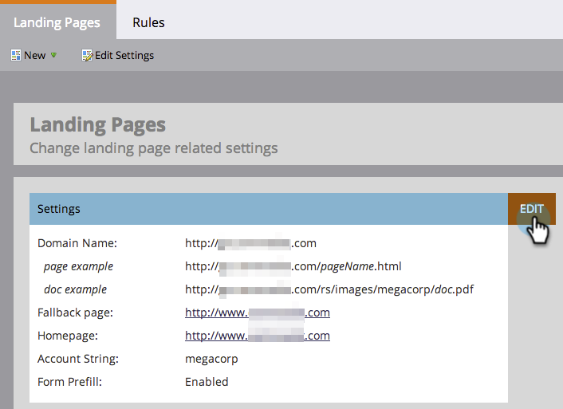

# Installationssteg {#setup-steps}

**Välkommen till Marketo Engage!**

Innan du börjar använda Marketo behöver du utföra några steg.

De här stegen omfattar:

* Vissa grundläggande kontoinställningar
* Varumärkning av landningssidans URL:er och e-postlänkar för att förbättra tillförlitligheten och leveransmöjligheterna
* Synkroniserar CRM
* Lägga till spårningskod på företagets webbplats

>[!NOTE]
>
>Du behöver bara göra de här stegen om ditt företag är **nya i Marketo**. Om så inte är fallet kan installationen redan vara klar.

Vissa steg kräver hjälp från IT-avdelningen.

>[!TIP]
>
>Om du [skriv ut den här checklistan](/help/marketo/getting-started/setup-steps/setup-checklist.md){target=&quot;_blank&quot;} kan du avmarkera objekt när du slutför dem.

## Logga in och skapa fler Marketo-användare {#log-in-and-create-additional-marketo-users}

1. Logga in på Marketo [här](https://app.marketo.com/){target=&quot;_blank&quot;} med de inloggningsuppgifter som du fick via e-post.

   

Grattis! Nu är du i Marketo och kan börja utforska. Du kanske vill bjuda in dina kollegor i marknadsföringsteamet till dig. Du kan göra detta genom att lägga till nya användare.

Gå till **Administratör** område.

>[!TIP]
>
>Medan du är här kan du klicka **Mitt konto** om du vill ändra konto- och platsinställningar samt ange ett nytt prenumerationsnamn.

>[!NOTE]
>
>**Administratörsbehörigheter krävs**

Klicka **Användare och roller**.

Klicka **Bjud in ny användare**.

Fyll i kollegans e-postadress, förnamn och efternamn. _Det är valfritt att ange ett förfallodatum för åtkomst_. Klicka **Nästa**.

>[!TIP]
>
>Ett förfallodatum passar bra för kortsiktiga externa intressenter eller konsulter som bara behöver tillgång till Marketo under en kort period.

>[!NOTE]
>
>När förfallodatumet inkommer får användaren ett meddelande om förfallodatum och kontot är låst.

Välj en roll och klicka på **Nästa**. Standardanvändare har tillgång till alla områden utom Admin.

>[!NOTE]
>
>Förutom de fem inbyggda rollerna kan du även skapa anpassade roller. Läs mer om [Hantera användarroller och behörigheter](/help/marketo/product-docs/administration/users-and-roles/managing-user-roles-and-permissions.md){target=&quot;_blank&quot;}.

Du kan redigera texten i inbjudan. Klicka **Skicka**.

Den nya användaren visas nu på fliken Användare och bör få ett e-postmeddelande med en länk för att skapa ett lösenord och en inloggning. Nästa steg!

## Konfigurera dina auktoriserade supportkontakter {#set-up-your-authorized-support-contacts}

Du kan ha fått ett e-postmeddelande från Marketo Support om att du är Marketo kundsupportadministratör för ditt företag. I så fall kan du konfigurera **behöriga supportkontakter** för ert team. Endast behöriga supportkontakter kan kontakta Marketo kundsupport direkt via [Marketo supportportal](https://support.marketo.com){target=&quot;_blank&quot;}.

>[!NOTE]
>
>Antalet supportkontakter som du kan skapa beror på vilket paket du har köpt. Den här gränsen anges i ditt e-postmeddelande från Marketo Support.

Authorized Support Contact docs has move to the Marketo Community. Se [den här artikeln](https://nation.marketo.com/t5/Knowledgebase/Managing-Authorized-Support-Contacts/ta-p/254341){target=&quot;_blank&quot;}.

>[!NOTE]
>
>Endast personer som har loggat in på Marketo Community visas i listan. Om du inte kan hitta personen måste du först logga in på Community.

## Anpassa URL:er för landningssidor med en CNAME {#customize-your-landing-page-urls-with-a-cname}

>[!NOTE]
>
>Är du kund i Launch Pack? Du kan hoppa över det här steget. Din konsult kommer att ge dig ett dokument med instruktioner för IT-konfiguration under samtalet.

>[!NOTE]
>
>**Administratörsbehörigheter krävs**

Välj en CNAME för dina landningssidor. Några exempel:

    * **go**.[CompanyDomain].com
    * **www2**.[CompanyDomain].com
    * **lp**.[CompanyDomain].com

>[!TIP]
>
>Håll det kort! Kortare URL:er är enklare att komma ihåg. Vi föreslår &quot;gå&quot; som domän.

Den första delen (i fet stil) är den `[LandingPageCNAME]`. Du behöver det i steg 5.

Om du vill hämta kontosträngen som du ska ersätta med landningssidan CNAME går du till området Admin.

Klicka **Landningssidor**.

Kopiera kontosträngen från inställningarna för landningssidan.

Det här är `[AccountString]`. Spara den. Du måste ge den till IT i steg 5.

Konfigurera domäninställningarna så att landningssidorna använder företagets domän i stället för Marketo (där de finns).

## Säkerställ e-postleverans {#ensure-email-deliverability}

>[!NOTE]
>
>Är du kund i Launch Pack? Du kan hoppa över det här steget. Din konsult kommer att ge dig ett dokument med instruktioner för IT-konfiguration under samtalet.

Du kan vidta flera åtgärder för att se till att e-postmeddelandena når så många av dina medarbetare som möjligt.

* **Lägg till spårningslänkar**. Du kan välja en CNAME att använda din egen domän (i stället för Marketo) i de länkar som du inkluderar i e-postmeddelanden från Marketo. Detta stärker er domänprofilering och ökar förtroendet och leveransförmågan hos era mottagare.
* **Lägg till Marketo i företagets e-post tillåtelselista.** Det är en vanlig god praxis att skicka testmeddelanden till testkonton innan e-post skickas till verkliga personer. Genom att tillåtslista Marketo kan du förhindra att testmeddelanden blockeras eller flaggas som skräppost.
* **Konfigurera SPF och DKIM.** Dessa tekniker säkerställer att dina e-postmeddelanden från Marketo inte är skräppost. Följ de här stegen för att förhindra att mottagare stöter bort skräppostfilter från Marketo e-postmeddelanden: [Konfigurera en SPF och DKIM för din e-postleverans](/help/marketo/product-docs/email-marketing/deliverability/set-up-spf-and-dkim-for-your-email-deliverability.md).
* **Konfigurera en MX-post för din domän.** Med en MX-post kan du ta emot e-post till domänen som du skickar e-post från för att bearbeta svar och automatiska svar. Om du skickar från din företagsdomän har du förmodligen redan detta konfigurerat. Annars kan du vanligtvis konfigurera så att den mappar till företagets domäns MX-post.
* **Rekommenderade inställningar för Från-adressen.** Du måste använda en giltig, befintlig och fungerande e-postdomän i Från adress i alla e-postkampanjer. Det kan vara bra att konfigurera en underdomän till din företagsdomän i stället för att skicka från din företagsdomän. Detta säkerställer att problem från företagets e-postström inte påverkar Marketo mailstream och vice versa. Dessutom skickar du e-post från `something@nonexistentdomain.com` gör att e-post filtreras eller blockeras. Alla domäner som används i avsändarens Från-adress måste ha ett giltigt och fungerande postmaster@- och missbruk@-konto.

Om du använder Google Apps som värd för din företagsinformation kan du inte skapa missbruk@- eller postmaster@-e-post under din domän. För att komma runt detta måste du skapa grupper som heter &quot;missbruk&quot; och &quot;postmaster&quot;. Användare som är medlemmar i dessa grupper får e-postmeddelanden som skickas till dessa adresser (t.ex. postmaster@domain.com). Detaljerade instruktioner för hur du skapar grupper finns [här](https://support.google.com/a/answer/33343#adminconsole){target=&quot;_blank&quot;}.

Välj en CNAME för länkar för e-postspårning (välj en som är _olika_ från landningssidan (CNAME du valde i steg 3). Några exempel:

* go2.[CompanyDomain].com
* Jag.[CompanyDomain].com
* wow.[CompanyDomain].com

Den första delen är e-postspårningen CNAME, `[EmailTrackingCNAME]`. Du måste ge den till IT i steg 5.

>[!CAUTION]
>
>CNAME-filer för e-post och landningssida måste vara olika. Undvik också CNAME som&quot;track&quot; eller&quot;link&quot;. Den flaggas ofta som skräppost

Om du vill hitta spårningslänken för Marketo går du till **Administratör** område.

Klicka **E-post**.

Kopiera spårningslänken från e-postinställningarna.

Spårningslänken har följande format: `mkto-[a-z][4 digits].com`.

Det här är din `[MktoTrackingLink]`. Spara den. Du måste ge den till IT i steg 5.

Samla in Från-domäner. Gör en lista över alla Från-domäner (som i, `[Sender]@[FromDomain].com`) som du tänker använda för att skicka e-post från Marketo. För de flesta finns det bara en.

Till exempel &#39;marketo.com,&#39; &#39;info.marketo.com,&#39;. Dessa är `[FromDomain1]`,`[FromDomain2]`, osv. Spara dem. Du måste ge dem till IT i steg 5.

Nu har du all information du behöver för att skicka din förfrågan till IT!

## Be IT att konfigurera protokoll {#ask-it-to-configure-protocols}

>[!NOTE]
>
>Är du kund i Launch Pack? Du kan hoppa över det här steget. Din konsult kommer att ge dig ett dokument med instruktioner för IT-konfiguration under samtalet.

När du har samlat in all nödvändig information är du redo att skicka en förfrågan till IT. Du kan använda texten nedan som mall och ersätta den feta texten med din egen information.

[Inkludera en länk till den här artikeln](/help/marketo/getting-started/setup/configure-protocols-for-marketo.md).

Klistra in den här texten i e-postmeddelandet och ersätt platshållarna med formatinformation:

>[!NOTE]
>
>Se steg 3 och 4 ovan för att bestämma vilken text som ska ersätta platshållarna. Kom ihåg att `[LandingPageCNAME]` och `[EmailTrackingCNAME]` måste vara annorlunda.

`---------------------------------------------`

Bästa IT-administratör!

Vårt marknadsföringsteam använder nu Marketo-plattformen för att kommunicera med våra medarbetare. För att e-postleveransen ska bli så bra som möjligt måste vi göra följande ändringar:

`1)` Lägg till en DNS-post (CNAME) för våra landningssidor **[LandingPageCNAME]**.**[CompanyDomain]**.com, peka på **[AccountString]**.mktoweb.com.

`2)` Lägg till en DNS-post (CNAME) för våra spårningslänkar i e-post **[EmailTrackingCNAME]**.**[CompanyDomain]**.com, peka på **[MktoTrackingLink]**.

`3)` Tillåtslista Marketo.

    * Om vi använder IP-adresser i e-postadressen Tillåtelselista lägger du till IP-adresserna som listas nedan:
    199.15.212.0/22
    
    192.28.144.0/20
    
    192.28.160.0/19
    
    185.28.196.0/22
    
    130.248.172.0/24
    
    130.248.173.0/24
    
    103.237.104.0/22
    
    94.236.119.0/26

>[!NOTE]
>
>Kontakta Marketo Support om du vill ha en lista över IP-adresser som kan tillåtslista specifikt för just din miljö.

    * Om vårt antispam-system använder Från domäner lägger du till följande:

**`[FromDomain1]`**
**`[FromDomain2]`**

`4)` Vi måste konfigurera SPF och DKIM så att Marketo har rätt att skicka signerade e-postmeddelanden för vår räkning.

`a.` Om du vill konfigurera SPF lägger du till följande rad i våra DNS-poster:

IN TXT **[Från domän]**: v=spf1 mx ip4:**[Företags-IP]**
 inkludera: mktomail.com ~alla

Om det redan finns en SPF-post i vår DNS-post lägger du bara till följande:

include:mktomail.com

`[`Ersätt **Från domän** med din e-post från domän (t.ex.: company.com) och **CorpIP** med IP-adressen till företagets e-postserver (t.ex.: 255.255.255.255).  Om du ska skicka e-post från flera domäner via Marketo bör din IT-personal lägga till den här raden för varje domän (på en rad).`]`

`b.` För DKIM skapar du DNS-resursposter för varje domän som vi vill konfigurera. Nedan visas värdposter och TXT-värden för varje domän som vi ska signera för:

**`[DKIMDomain1]`**: Värdposten är **`[HostRecord1]`** och TXT-värdet är **[TXTValue1]**.

**`[DKIMDomain2]`**: Värdposten är **`[HostRecord2]`** och TXT-värdet är **`[TXTValue2]`**.

`[`Kopiera **HostRecord** och **TXTValue** för varje **DKIMDomain** du har ställt in efter att ha följt [anvisningar](/help/marketo/product-docs/email-marketing/deliverability/set-up-a-custom-dkim-signature.md). Glöm inte att verifiera varje domän i **Admin > E-post > DKIM** när IT-personalen har slutfört det här steget.`]`

`5)` Vi måste se till att det finns en giltig MX-post för våra FROM-domäner **[FrånDomän1]**, **[FrånDomän2]**, osv. Kan du bekräfta? Om inte, konfigurera så att du mappar till företagets domänpost för MX. Detta säkerställer att vi kan behandla svar/autosvarare på våra Marketo-utskick.

Meddela mig när du har utfört dessa steg så att jag kan slutföra installationsprocessen med Marketo.

Tack! Du är bäst!

Kärlek,

**`[Your Name]`**

`---------------------------------------------`

Skicka e-postmeddelandet till IT. Vi förstår att det kan ta lite tid för IT-avdelningen att utföra dessa uppgifter. Du kan fortsätta till steg 7, men kom ihåg att du måste gå tillbaka till steg 6 för att slutföra installationen av Marketo.

## Slutför Marketo-installationen när IT-avdelningen är klar {#complete-your-marketo-setup-after-it-finishes}

När IT-avdelningen har slutfört sina uppgifter följer du de här stegen för att lägga till landningssidan och e-posta CNAME:er samt för att aktivera DKIM-signering.

Gå till **Administratör** området för att lägga till landningssidan CNAME

Välj landningssidor och klicka på **Redigera** i området Inställningar.

Ange ditt nya domännamn i fältet Domännamn för landningssidor. Den ska ha följande format:

`[LandingPageCNAME].[CompanyDomain].com`

Ange den URL som du vill att personer ska gå till i fältet Sidåterställning om det inte finns någon startsida. Du kan använda företagets hemsida om du inte har någon reservsida. Ange din företagswebbplats i fältet Hemsida.

I området Admin väljer du E-post för att lägga till din e-post-CNAME

Bläddra ned till Varumärkesdomäner. Välj din domän och klicka på **Redigera**.

Ange din e-postspårningsdomän i fältet Domän. Den ska ha följande format:

`[EmailTrackingCNAME].[CompanyDomain].com`. Klicka **Spara**.

## Integrera CRM {#integrate-your-crm}

Det här är antagligen det mest spännande steget i din konfiguration - det är dags att fylla i Marketo med alla leads och kontakter som du har sparat i CRM!

Välj något av följande, beroende på vilken CRM ditt företag använder.

    * [Integrera Marketo med Salesforce.com](/help/marketo/product-docs/crm-sync/salesforce-sync/understanding-the-salesforce-sync.md)
    * [Integrera Marketo med Microsoft Dynamics](/help/marketo/product-docs/crm-sync/microsoft-dynamics-sync/understanding-the-microsoft-dynamics-sync.md)

>[!NOTE]
>
>Du behöver hjälp av företagets CRM-administratör för att kunna utföra dessa steg.

## Lägg till spårningskod på din webbplats {#add-tracking-code-to-your-website}

>[!NOTE]
>
>Är du kund i Launch Pack? Du kan hoppa över det här steget. Din konsult kommer att ge dig instruktioner om Munchkins kod i ditt dokument med IT-konfigurationsinstruktioner.

Marketo har anpassad spårning av JavaScript (kallas Munchkin) som du kan använda för att spåra personaktiviteter på alla webbsidor. Munchkin krävs för att du ska kunna integrera din webbplats i Marketo. Följ de här stegen för att [Lägg till Munchkin-spårningskod på din webbplats](/help/marketo/product-docs/administration/additional-integrations/add-munchkin-tracking-code-to-your-website.md){target=&quot;_blank&quot;}.

>[!NOTE]
>
>Upplevelse med HTML krävs för att lägga till spårningskoden.

Alla installationssteg är klara. Det enda som återstår är att dyka in och använda Marketo!
