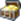
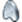

# Klassisk ikon - ordlista {#classic-icon-glossary}

Nedan visas de gamla ikonerna från gränssnittet Marketo Classic. Den aktuella ikonordlistan [finns här](/help/marketo/getting-started/things-to-know/icon-glossary.md){target="_blank"}.

**Allmänna ikoner**

<table>
 <tbody>
  <tr>
   <th style="width:15%">Ikon</th>
   <th style="width:85%">Namn</th>
  </tr>
  <tr>
   <td></td>
   <td>Mapp</td>
  </tr>
  <tr>
   <td>
     </td>
   <td>Skapa ny mapp</td>
  </tr>
  <tr>
   <td>
    </td>
   <td>Ta bort mapp</td>
  </tr>
  <tr>
   <td>
    </td>
   <td>Redigera/byt namn på mapp</td>
  </tr>
  <tr>
   <td>
    </td>
   <td>Källmappen som du delade med en annan arbetsyta</td>
  </tr>
  <tr>
   <td>
    </td>
   <td>Målmappen som delades från en annan arbetsyta   (hänglåset anger att det inte går att redigera)</td>
  </tr>
  <tr>
   <td>
    </td>
   <td>Arkivmapp eller Konvertera till arkivmapp (kan visas för alla mappar och arkiverade program)</td>
  </tr>
  <tr>
   <td>
    </td>
   <td>Klart! (Visas ofta som slutfört program, slutförd körning eller aktiv)</td>
  </tr>
  <tr>
   <td>
    </td>
   <td>Filter, Visa, Visa alla</td>
  </tr>
  <tr>
   <td>
    </td>
   <td>Utlösare</td>
  </tr>
  <tr>
   <td>
    </td>
   <td>Community</td>
  </tr>
  <tr>
   <td>
    </td>
   <td>Historik</td>
  </tr>
  <tr>
   <td>
    </td>
   <td>Hjälp</td>
  </tr>
  <tr>
   <td>
    </td>
   <td>Prenumerationsinformation</td>
  </tr>
  <tr>
   <td>
    </td>
   <td>Kundsupport</td>
  </tr>
  <tr>
   <td>
    </td>
   <td>Om Marketo</td>
  </tr>
 </tbody>
</table>

## Administrationsikoner {#admin-icons}

<table>
 <tbody>
  <tr>
   <th style="width:15%">Ikon</th>
   <th style="width:85%">Namn</th>
  </tr>
  <tr>
   <td>
    </td>
   <td>Arbetsytor och partitioner</td>
  </tr>
  <tr>
   <td>
    </td>
   <td>Mitt konto</td>
  </tr>
  <tr>
   <td>
    </td>
   <td>Säkerhet/utloggning</td>
  </tr>
  <tr>
   <td>
    </td>
   <td>Användare och roller</td>
  </tr>
  <tr>
   <td>
    </td>
   <td>Inloggningsinställningar</td>
  </tr>
  <tr>
   <td>
    </td>
   <td>Plats</td>
  </tr>
  <tr>
   <td>
    </td>
   <td>Smart Campaign</td>
  </tr>
  <tr>
   <td>
    </td>
   <td>E-post</td>
  </tr>
  <tr>
   <td>
    </td>
   <td>Kommunikationsbegränsningar</td>
  </tr>
  <tr>
   <td>
    </td>
   <td>Fälthantering</td>
  </tr>
  <tr>
   <td>
    </td>
   <td>Integrering</td>
  </tr>
  <tr>
   <td>
    </td>
   <td>Salesforce (SFDC)</td>
  </tr>
  <tr>
   <td>
    </td>
   <td>Försäljningsinsikter</td>
  </tr>
  <tr>
   <td>
    </td>
   <td>Landningssidor</td>
  </tr>
  <tr>
   <td>
    </td>
   <td>Munchkin</td>
  </tr>
  <tr>
   <td>
    </td>
   <td>Webbtjänster</td>
  </tr>
  <tr>
   <td>
    </td>
   <td>LaunchPoint</td>
  </tr>
  <tr>
   <td>
    </td>
   <td>Webhooks</td>
  </tr>
  <tr>
   <td>
    </td>
   <td>Taggar - programattribut</td>
  </tr>
  <tr>
   <td>
    </td>
   <td>Intäktscykelanalys</td>
  </tr>
  <tr>
   <td>
    </td>
   <td>Treasure Chest</td>
  </tr>
  <tr>
   <td>
    </td>
   <td>Administratör</td>
  </tr>
  <tr>
   <td>
    </td>
   <td>Meddelanden - viktiga systemomfattande aviseringar</td>
  </tr>
 </tbody>
</table>

### Ikoner för marknadsföringsaktiviteter {#marketing-activities-icons}

<table>
 <tbody>
  <tr>
   <th style="width:15%">Ikon</th>
   <th style="width:85%">Namn</th>
  </tr>
  <tr>
   <td>
    </td>
   <td>Event Program</td>
  </tr>
  <tr>
   <td>
    </td>
   <td>Program - standardtyp</td>
  </tr>
  <tr>
   <td>
    </td>
   <td>Importprogram</td>
  </tr>
  <tr>
   <td>
    </td>
   <td>Engagement Nurture</td>
  </tr>
  <tr>
   <td>
    </td>
   <td>Lägg till i engagemangsprogram</td>
  </tr>
  <tr>
   <td>
    </td>
   <td>Ändra aktivitetsavslutning (pausad,normal)</td>
  </tr>
  <tr>
   <td>
    </td>
   <td>Ändra engagemangsström</td>
  </tr>
  <tr>
   <td>
    </td>
   <td>Smart Campaign - aktiv och utlöst</td>
  </tr>
  <tr>
   <td>
    </td>
   <td>Smart Campaign som begärs (av Sales Insight eller Marketo Flow Action)</td>
  </tr>
  <tr>
   <td>
    </td>
   <td>Smart Campaign - batch(har körts tidigare)</td>
  </tr>
  <tr>
   <td>
    </td>
   <td>Smart Campaign - Inaktiv eller aldrig genomförd</td>
  </tr>
  <tr>
   <td>
    </td>
   <td>Ogiltiga kampanjer</td>
  </tr>
  <tr>
   <td>
    </td>
   <td>E-postprogram  (röd flagga ned = e-post har inte skickats än)</td>
  </tr>
  <tr>
   <td>
    </td>
   <td>E-postprogram schemalagt med huvudstart</td>
  </tr>
  <tr>
   <td>
    </td>
   <td>Smart Campaign - schemalagd batch (bockmarkeringen anger att den har körts tidigare)</td>
  </tr>
  <tr>
   <td>
    </td>
   <td>Schemalagda batchkampanjer</td>
  </tr>
  <tr>
   <td>
    </td>
   <td>Flödesåtgärd</td>
  </tr>
  <tr>
   <td>
    </td>
   <td>Redigera inställningar</td>
  </tr>
  <tr>
   <td>
    </td>
   <td>Formulär</td>
  </tr>
  <tr>
   <td>
    </td>
   <td>Klona formulär</td>
  </tr>
  <tr>
   <td>
    </td>
   <td>Redigera formulär</td>
  </tr>
  <tr>
   <td>
    </td>
   <td>Formuläret har godkänts</td>
  </tr>
  <tr>
   <td>
    </td>
   <td>Social</td>
  </tr>
  <tr>
   <td>
    </td>
   <td>Funktioner för sociala knappar</td>
  </tr>
  <tr>
   <td>
    </td>
   <td>Redigera utkast</td>
  </tr>
  <tr>
   <td>
    </td>
   <td>Förhandsgranska</td>
  </tr>
  <tr>
   <td>
    </td>
   <td>Klona</td>
  </tr>
  <tr>
   <td>
    </td>
   <td>Ta bort</td>
  </tr>
  <tr>
   <td>
    </td>
   <td>Bädda in kod</td>
  </tr>
  <tr>
   <td>
    </td>
   <td>Videofunktioner på YouTube</td>
  </tr>
  <tr>
   <td>
    </td>
   <td>Redigera utkast</td>
  </tr>
  <tr>
   <td>
    </td>
   <td>Förhandsgranska</td>
  </tr>
  <tr>
   <td>
    </td>
   <td>Godkänn</td>
  </tr>
  <tr>
   <td>
    </td>
   <td>Klona</td>
  </tr>
  <tr>
   <td>
    </td>
   <td>Ta bort</td>
  </tr>
  <tr>
   <td>
    </td>
   <td>Lotteriåtgärder</td>
  </tr>
  <tr>
   <td>
    </td>
   <td>Redigera utkast</td>
  </tr>
  <tr>
   <td>
    </td>
   <td>Förhandsgranska</td>
  </tr>
  <tr>
   <td>
    </td>
   <td>Godkänn</td>
  </tr>
  <tr>
   <td>
    </td>
   <td>Klona</td>
  </tr>
  <tr>
   <td>
    </td>
   <td>Ta bort</td>
  </tr>
  <tr>
   <td>
    </td>
   <td>Plockningsvinnare</td>
  </tr>
  <tr>
   <td>
    </td>
   <td>Ladda ned HTML</td>
  </tr>
  <tr>
   <td>
    </td>
   <td>Flytta</td>
  </tr>
  <tr>
   <td>
    </td>
   <td>Ta bort</td>
  </tr>
  <tr>
   <td>
    </td>
   <td>Klona</td>
  </tr>
  <tr>
   <td>
    </td>
   <td>Ogodkänd</td>
  </tr>
  <tr>
   <td>
    </td>
   <td>Skicka exempel</td>
  </tr>
  <tr>
   <td>
    </td>
   <td>Förhandsgranska</td>
  </tr>
  <tr>
   <td>
    </td>
   <td>Nytt test</td>
  </tr>
  <tr>
   <td>
    </td>
   <td>Leveransverktyg</td>
  </tr>
 </tbody>
</table>

### Design Studio-ikoner {#design-studio-icons}

<table>
 <tbody>
  <tr>
   <th style="width:15%">Ikon</th>
   <th style="width:85%">Namn</th>
  </tr>
  <tr>
   <td>
    </td>
   <td>Landningssida. Åtgärder för landningssida</td>
  </tr>
  <tr>
   <td>
    </td>
   <td>Redigera utkast</td>
  </tr>
  <tr>
   <td>
    </td>
   <td>Förhandsgranska</td>
  </tr>
  <tr>
   <td>
    </td>
   <td>Ogodkänd</td>
  </tr>
  <tr>
   <td>
    </td>
   <td>Publicera på Facebook</td>
  </tr>
  <tr>
   <td>
    </td>
   <td>Konvertera till testgrupp</td>
  </tr>
  <tr>
   <td>
    </td>
   <td>Clone Landing Page</td>
  </tr>
  <tr>
   <td>
    </td>
   <td>Ta bort landningssida</td>
  </tr>
  <tr>
   <td>
    </td>
   <td>URL Tools/URL Builder</td>
  </tr>
  <tr>
   <td>
    </td>
   <td>Flytta program</td>
  </tr>
  <tr>
   <td>
    </td>
   <td>Aktivera anpassade URL:er</td>
  </tr>
  <tr>
   <td>
    </td>
   <td>Landningssida - godkänd</td>
  </tr>
  <tr>
   <td>
    </td>
   <td>Landningssida/e-postmall - ej godkänd</td>
  </tr>
  <tr>
   <td>
    </td>
   <td>Landningssida/e-postmall - godkänd</td>
  </tr>
  <tr>
   <td>
    </td>
   <td>E-post - ej godkänt eller utkast</td>
  </tr>
  <tr>
   <td>
    </td>
   <td>E-post godkänd</td>
  </tr>
  <tr>
   <td>
    </td>
   <td>Forms - ej godkänt</td>
  </tr>
  <tr>
   <td>
    </td>
   <td>Mall - godkänd med utkast</td>
  </tr>
  <tr>
   <td>
    </td>
   <td>Utkast till en godkänd resurs (inte direkt förrän utkast har godkänts)</td>
  </tr>
  <tr>
   <td>
    </td>
   <td>Bilder och filer</td>
  </tr>
  <tr>
   <td>
    </td>
   <td>Fragment - ej godkänt eller utkast</td>
  </tr>
  <tr>
   <td>
    </td>
   <td>Fragment - Godkänt</td>
  </tr>
  <tr>
   <td>
    </td>
   <td>Nyhet</td>
  </tr>
  <tr>
   <td>
    </td>
   <td>Hämta bilder från webben</td>
  </tr>
  <tr>
   <td>
    </td>
   <td>Överför bild eller fil</td>
  </tr>
 </tbody>
</table>

### Analysikoner {#analytics-icons}

<table>
 <tbody>
  <tr>
   <th style="width:15%">Ikon</th>
   <th style="width:85%">Namn</th>
  </tr>
  <tr>
   <td>
    </td>
   <td>Modell för intäktscykel</td>
  </tr>
  <tr>
   <td>
    </td>
   <td>RCM (Revenue Cycle Model) - ej godkänd</td>
  </tr>
  <tr>
   <td>
    </td>
   <td>Intäktscykelmodell - godkänd</td>
  </tr>
  <tr>
   <td>
    </td>
   <td>Intäktscykelmodell - godkänd med utkast</td>
  </tr>
  <tr>
   <td>
    </td>
   <td>Rapportåtgärder</td>
  </tr>
  <tr>
   <td>
    </td>
   <td>Rapport</td>
  </tr>
  <tr>
   <td>
    </td>
   <td>Ny rapportprenumeration</td>
  </tr>
  <tr>
   <td>
    </td>
   <td>Ta bort rapport</td>
  </tr>
  <tr>
   <td>
    </td>
   <td>Visa kvalificerad lead</td>
  </tr>
  <tr>
   <td>
    </td>
   <td>Översikt över intressanta stunder</td>
  </tr>
  <tr>
   <td>
    </td>
   <td>Expandera alla</td>
  </tr>
  <tr>
   <td>
    </td>
   <td>Komprimera alla</td>
  </tr>
  <tr>
   <td>
    </td>
   <td>Gruppera leads efter</td>
  </tr>
  <tr>
   <td>
    </td>
   <td>Egna kolumner</td>
  </tr>
 </tbody>
</table>

### Mina tokenikoner {#my-tokens-icons}

<table>
 <tbody>
  <tr>
   <th style="width:15%">Ikon</th>
   <th style="width:85%">Namn</th>
  </tr>
  <tr>
   <td>
    </td>
   <td>Kalender-ICS - iCalendars, (inbyggda kalendrar)</td>
  </tr>
  <tr>
   <td>
    </td>
   <td>RTF (not a Landing Page)</td>
  </tr>
  <tr>
   <td>
    </td>
   <td>Nummer</td>
  </tr>
  <tr>
   <td>
    </td>
   <td>Salesforce (även för alla SFDC-relaterade objekt)</td>
  </tr>
  <tr>
   <td>
    </td>
   <td>Schemalägg den smarta kampanjen så att den körs en gång</td>
  </tr>
  <tr>
   <td>
    </td>
   <td>Redigera inställningar</td>
  </tr>
  <tr>
   <td>
    </td>
   <td>Uppdatera (vanligtvis Antal, Rapport, Smart List)</td>
  </tr>
  <tr>
   <td>
    </td>
   <td>Visa smarta medlemmar (tidigare kvalificerade och aktuella)</td>
  </tr>
 </tbody>
</table>

### Kampanjmenyer {#campaign-menus}

<table>
 <tbody>
  <tr>
   <th style="width:15%">Ikon</th>
   <th style="width:85%">Namn</th>
  </tr>
  <tr>
   <td>
    </td>
   <td>Schemalägg återkommande kampanj (flera körningar)</td>
  </tr>
  <tr>
   <td>
    </td>
   <td>Avbryt körning, åtgärd eller borttagning</td>
  </tr>
  <tr>
   <td>
    </td>
   <td>Redigera kvalificeringsregler</td>
  </tr>
  <tr>
   <td>
    </td>
   <td>Salesforce (även för alla SFDC-relaterade objekt)</td>
  </tr>
  <tr>
   <td>
    </td>
   <td>Endast text</td>
  </tr>
  <tr>
   <td>
    </td>
   <td>Relativ bakgrundsmusik (visas även för alla åtgärder för poängsättningsflödet)</td>
  </tr>
  <tr>
   <td>
    </td>
   <td>Relativ brådskande situation</td>
  </tr>
  <tr>
   <td>
    </td>
   <td>E-postskript (endast för snabbhet)</td>
  </tr>
  <tr>
   <td>
    </td>
   <td>Datum - formaterat som MM-DD-ÅÅÅ</td>
  </tr>
 </tbody>
</table>

### Databasikoner {#database-icons}

<table>
 <tbody>
  <tr>
   <th style="width:15%">Ikon</th>
   <th style="width:85%">Namn</th>
  </tr>
  <tr>
   <td>
    </td>
   <td>Smart List</td>
  </tr>
  <tr>
   <td>
    </td>
   <td>Smart List - cachelagrad</td>
  </tr>
  <tr>
   <td>
    </td>
   <td>Segmentering eller segment - ej godkänt</td>
  </tr>
  <tr>
   <td>
    </td>
   <td>Segmentering eller segment - godkänt eller utkast</td>
  </tr>
  <tr>
   <td>
    </td>
   <td>Segmentering eller segment - godkänt</td>
  </tr>
  <tr>
   <td>
    </td>
   <td>Fältorganisatör</td>
  </tr>
  <tr>
   <td>
    </td>
   <td>E-postskript (endast för snabbhet)</td>
  </tr>
  <tr>
   <td>
    </td>
   <td>Statisk lista</td>
  </tr>
  <tr>
   <td>
    </td>
   <td>Nyhet</td>
  </tr>
  <tr>
   <td>
    </td>
   <td>Ny segmentering</td>
  </tr>
  <tr>
   <td>
    </td>
   <td>Import</td>
  </tr>
 </tbody>
</table>
 
