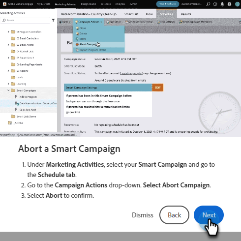

# Hjälpcenter {#help-center}

Hjälpcentret i Adobe Marketo Engage är en central plats där du kan få hjälp. Förutom att länka ut till olika resurser (t.ex. [produktdokumentation](/help/marketo/home.md){target="_blank"}, [versionsinformation](/help/marketo/release-notes/current.md){target="_blank"}, [Marketing Nation Community](https://nation.marketo.com/){target="_blank"}) kan du få tillgång till användbara genomgångar i produkter ordnade efter erfarenhetsnivå.

## Åtkomst {#how-to-access}

Det finns två olika upplevelser beroende på om din prenumeration har migrerats till Adobe Identity Management System (IMS) än.

### Migrering före Adobe IMS {#pre-adobe-ims-integration}

De här stegen gäller för Marketo Engage-användare som _inte_ har migrerats till [Adobe IMS](/help/marketo/product-docs/administration/marketo-with-adobe-identity/adobe-identity-management-overview.md) än.

[Logga in](http://login.marketo.com/) i Marketo Engage och klicka på hjälpikonen.

#### Användarhandböcker {#guides}

Guiderna fungerar som snabbgenomgångar för populära funktioner.

1. Klicka på den stödlinje du vill visa.

   

1. Klicka på **Kom igång**.

   

1. Klicka på **Nästa** för att fortsätta.

   

1. Klicka på **Klar** för att avsluta genomgången.

   

   >[!TIP]
   >
   >Stäng guiden när som helst genom att klicka på **Stäng**.

#### Nyheter {#whats-new}

Fliken Nyheter innehåller alla detaljer om den senaste versionen av Marketo Engage.

>[!TIP]
>
>Klicka på pilikonen längst ned för att visa sidan i Experience League.

#### Resurser {#resources}

På fliken Resurser får du snabb och direkt åtkomst till olika sätt att få ytterligare hjälp med instansen Marketo Engage.

### Migrering efter Adobe IMS {#post-adobe-ims-integration}

De här stegen gäller för Marketo Engage-användare som redan har migrerats till [Adobe IMS](/help/marketo/product-docs/administration/marketo-with-adobe-identity/adobe-identity-management-overview.md).

[Logga in](https://experience.adobe.com/) i Marketo Engage och klicka på hjälpikonen.

text

