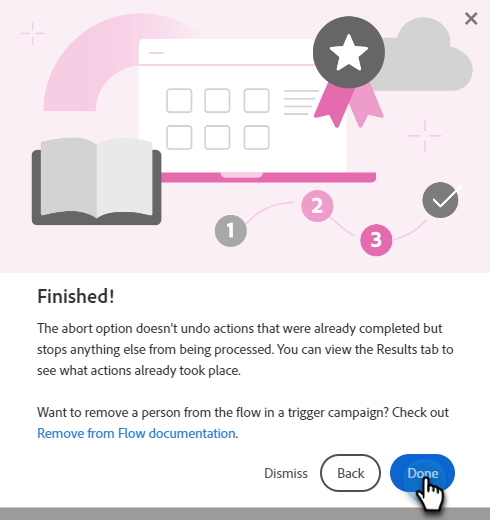

# Help Center {#help-center}

Hjälpcentret i Adobe Marketo Engage är en central plats där du kan få hjälp. Förutom att länka ut till olika resurser (t.ex. [produktdokumentation](/help/marketo/home.md){target="_blank"}, [versionsinformation](/help/marketo/release-notes/current.md){target="_blank"}, [Marketing Nation Community](https://nation.marketo.com/){target="_blank"}) får du tillgång till praktiska produktgenomgångar ordnade efter upplevelsenivå.

## Åtkomst {#how-to-access}

När du har loggat in i Marketo Engage klickar du på hjälpikonen.

### Stödlinjer {#guides}

Guiderna fungerar som snabbgenomgångar för populära funktioner.

1. Klicka på den stödlinje du vill visa.

   

1. Klicka **Kom igång**.

   

1. Klicka **Nästa** för att fortsätta.

   

1. Klicka **Klar** för att avsluta genomgången.

   

   >[!TIP]
   >
   >Avsluta stödlinjen när som helst genom att klicka **Avvisa**.

### Nyheter {#whats-new}

Fliken Nyheter innehåller alla detaljer om den senaste versionen av Marketo Engage.

>[!TIP]
>
>Klicka på pilikonen längst ned för att visa sidan i Experience League.

### Resurs {#resources}

På fliken Resurser får du snabb och direkt åtkomst till olika sätt att få ytterligare hjälp med instansen Marketo Engage.

