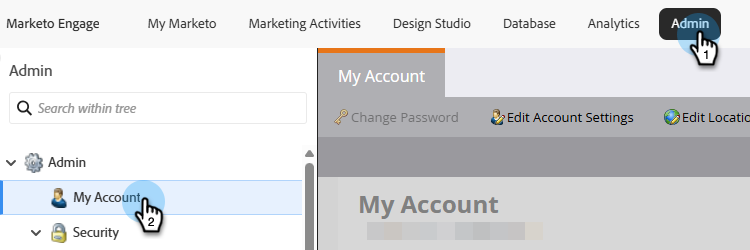
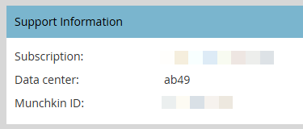
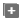
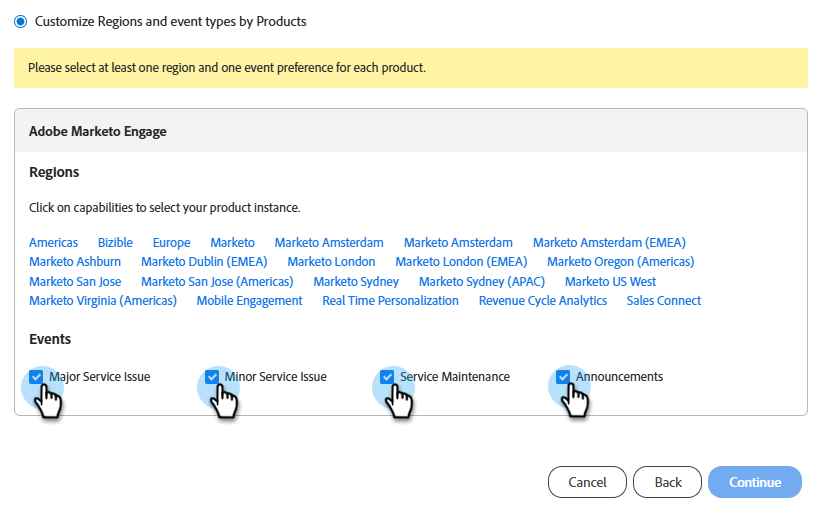
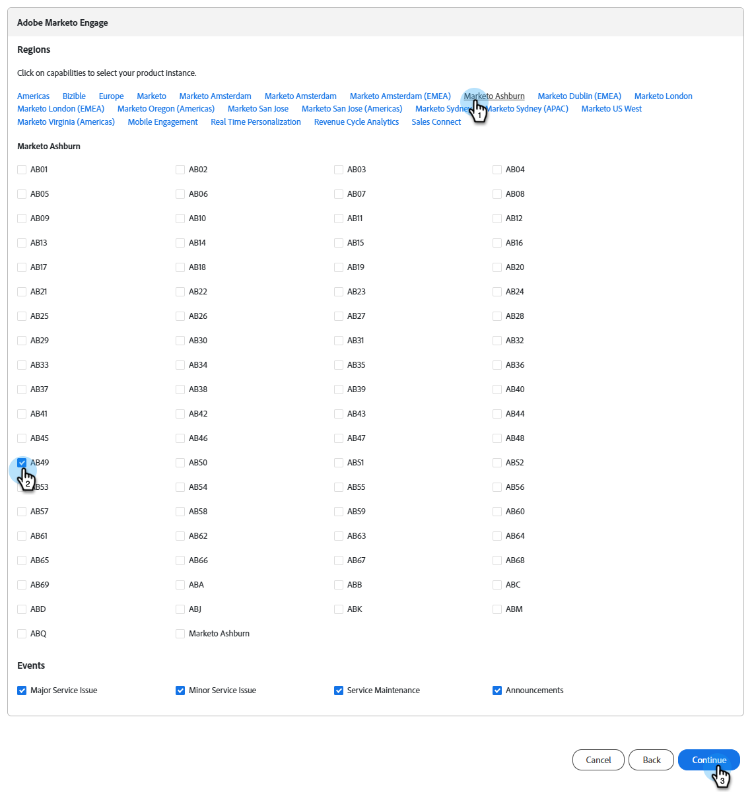
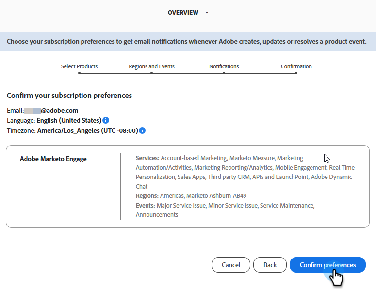

# Prenumerera på meddelanden om systemstatus {#subscribe-to-system-status-notifications}

Lär dig hur du prenumererar på olika statusmeddelanden för att hålla dig uppdaterad om aktuella problem.

>[!PREREQUISITES]
>
>Innan du kan skapa en prenumeration måste du först identifiera vilket datacenter och vilken pod/server din prenumeration finns i.

## Identifiera ditt datacenter {#identify}

1. Klicka på **Mitt konto** i avsnittet **Admin** i Marketo Engage.

   

1. Bläddra ned till _supportinformation_.

   

I fältet _Datacenter_ är bokstäverna datacenter och siffrorna pod. I exemplet ovan är användaren i vårt Ashburn-datacenter på punkt 49.

I steg 7 i [avsnittet nedan](#create-a-subscription) skulle användaren välja den regionala platsen **Marketo Ashburn** och pod **ab49**.

**Förkortningar för datacenter**

* ab: Ashburn
* sj: San Jose
* sn: Sydney
* go: London
* nld: Amsterdam

>[!TIP]
>
>Den här metoden kan också användas för att identifiera vilken Real Time Personalization (RTP)-pod/server som din prenumeration finns på.

## Skapa en prenumeration {#create-a-subscription}

När du har [identifierat ditt datacenter och din pod/server](#identify) följer du stegen nedan för att skapa en prenumeration.

1. På [status.adobe.com](https://status.adobe.com) klickar du på **Hantera prenumerationer**.

   

1. Logga in (om du inte redan är det) med dina Adobe-inloggningsuppgifter eller klicka på **Skapa ett konto** om du inte redan har ett.

   

1. Stanna på fliken _Produktbeskrivningar_ och klicka på **Skapa prenumerationer**.

   

1. Klicka på ikonen  bredvid _Experience Cloud_ för att expandera menyn. Gör samma sak för _Adobe Marketo Engage_.

   {width="800"}

1. Markera de produkterbjudanden/tjänster som du vill få meddelanden om och klicka på **Fortsätt**.

   >[!TIP]
   >
   >Markera _Adobe Marketo Engage_ om du vill markera alla.

   {width="800"}

1. Välj önskade händelsetyper.

   

   <table style="width:500px;">
   <tr>
   <td style="width:35%;"><b>Problem med huvudservice</b></td>
   <td>Otillgängliga tjänster eller allvarliga prestandaförsämringar för flera användare på produktionssystem.</td>
   </tr>
   <tr>
   <td style="width:35%;"><b>Problem med deltjänst</b></td>
   <td>Otillgänglig delvis tjänst eller måttlig prestandaförsämring för flera användare på produktionssystem.</td>
   </tr>
   <tr>
   <td style="width:35%;"><b>Serviceunderhåll</b></td>
   <td>Schemalagda fönster för att utföra produktunderhåll som kan påverka produktens tillgänglighet eller prestanda.</td>
   </tr>
   <tr>
   <td style="width:35%;"><b>Meddelanden</b></td>
   <td>Global, produktfamilj eller produktrelaterade budskap som har stor effekt.</td>
   </tr>
   </table>

1. Välj den regionala platsen och miljön. Klicka på **Fortsätt**.

   {width="900"}

   >[!NOTE]
   >
   >Om du missade att hitta detta kan du läsa [Identifiera ditt datacenter](#identify).

1. Välj din prenumerationsinställning, **E-post** eller **Slack**, och klicka på **Fortsätt**.

   

1. Granska dina val och klicka på **Bekräfta inställningar**.

   
