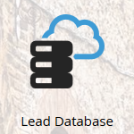

# Uppdateringar av Marketets terminologi {#updates-to-marketo-terminology}

Vi gör några ändringar i vår plattform, vilket kommer att påverka vad vissa saker kallas. Om du har en ny Marketo-instans från mars 2016, eller om ditt företag förnyades efter juli 2016, kanske du ser den nya terminologin nu.

Även om du kanske ser olika terminologi i Marketo-dokumentationen, kan du vara säker på att alla artiklar snart uppdateras för att återspegla dessa ändringar. Alla instruktioner är desamma.

Så vad har ändrats?

## Lead is Now Person {#lead-is-now-person}

Den största förändringen är namnbytet av lead/leads till person/personer.

<table> 
 <colgroup> 
  <col> 
  <col> 
 </colgroup> 
 <tbody> 
  <tr> 
   <td><strong>Gammal</strong></td> 
   <td><strong>Nytt</strong></td> 
  </tr> 
  <tr> 
   <td> 
    
 
      
    
</td> 
   <td> 
    
 
      
    
</td> 
  </tr> 
 </tbody> 
</table>

I vissa fall tas ordet&quot;Lead&quot; helt enkelt bort.

<table> 
 <colgroup> 
  <col> 
  <col> 
 </colgroup> 
 <tbody> 
  <tr> 
   <td><strong>Gammal</strong></td> 
   <td><strong>Nytt</strong></td> 
  </tr> 
  <tr> 
   <td> 
    
 
      
    
</td> 
   <td> 
    
 
     

 
    
</td> 
  </tr> 
 </tbody> 
</table>

Lead och Person **är samma sak**.

## Tokens {#tokens}

Tokens med ordet lead i dem **förändras** inte. Vi ber om ursäkt för all förvirring. Om alla variabler ändras så att de matchar den nya terminologin bryts dock en hel del variabler som för närvarande används. Så du kommer fortfarande att se variabler som &quot;`{{lead.First Name}}`&quot;. Det finns inga personspecifika tokens.

>[!NOTE]
>
>Det *finns* en token som heter &quot;Person Notes&quot;, men den variabeln fanns alltid där. Det används vanligtvis för ett beskrivningsfält i CRM, om det är något.

## Fälthantering {#field-management}

Fält som innehåller termen Lead har ersatts med Person eller ordet Lead har tagits bort. Ett anmärkningsvärt undantag är dock fältet&quot;Leadägare&quot;. Det kallas nu&quot;försäljningsägare&quot;.

<table> 
 <colgroup> 
  <col> 
  <col> 
 </colgroup> 
 <tbody> 
  <tr> 
   <td><strong>Gammal</strong></td> 
   <td><strong>Nytt</strong></td> 
  </tr> 
  <tr> 
   <td> 
    
 
      
    
</td> 
   <td> 
    
 
      
    
</td> 
  </tr> 
 </tbody> 
</table>

>[!NOTE]
>
>En fullständig lista över fältnamn som påverkas finns i den här [supportartikeln](https://nation.marketo.com/docs/DOC-4218#jive_content_id_Field_Names_and_Tokens).

## Realtidspersonalisering (RTP) är nu webbpersonalisering {#real-time-personalization-rtp-is-now-web-personalization}

<table> 
 <colgroup> 
  <col> 
  <col> 
 </colgroup> 
 <tbody> 
  <tr> 
   <td><strong>Gammal</strong></td> 
   <td><strong>Nytt</strong></td> 
  </tr> 
  <tr> 
   <td> 
    
 
      
    
</td> 
   <td> 
    
 
      
    
</td> 
  </tr> 
 </tbody> 
</table>

Förutom namnändringen består den nu av fyra separata program:

| ** [Webbanpassning](http://docs.marketo.com/display/DOCS/Web+Personalization+-+RTP)** | Har egen panel på hemskärmen |
|---|---|
| ** [Kontobaserad webbmarknadsföring](http://docs.marketo.com/display/DOCS/Account-Based+Web+Marketing)** | Tillgängligt via webbanpassningsbrickan |
| ** [Personlig återmarknadsföring](http://docs.marketo.com/display/DOCS/Website+Retargeting)** | Tillgängligt via webbanpassningsbrickan |
| ** [Prediktivt innehåll](http://docs.marketo.com/display/DOCS/Predictive+Content)** | Har egen panel på hemskärmen |

>[!NOTE]
>
>De rutor som visas på startskärmen motsvarar de moduler som köpts.

Tack för ditt tålamod under den här uppdateringen.

