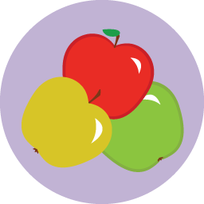

# Produktdokument {#product-docs}

Det finns några viktiga saker att lära sig Marketo. Lär dig dessa så kommer du att lära dig Marketo på halva vägen.
** ConceptsCore Concepts** [Core Concepts Lär dig dessa och du kommer att behärska Marketo halvvägs.](product-docs/core-marketo-concepts.md)     ** MobileEmail &amp; Mobile** [Email &amp; Mobile Marketo har massor av fantastiska verktyg för smidig kommunikation med er målgrupp.](https://docs.marketo.com/pages/viewpage.action?pageId=557076)     ** GenerationDemand Generation** [Demand Generation Make landing pages with custom forms &amp; social widgets.](product-docs/demand-generation.md)     ** PersonaliseringPersonalisering** [Personalisering Ju mer individanpassad marknadsföring är, desto större chans att de kommer att svara.](product-docs/personalization.md)     ** ReportingReporting** [Rapporterar användbara insikter. Du kan till och med få artiklar levererade direkt till din inkorg.](product-docs/reporting.md)     ** Administration** [Administration Om du är i Admin Club finns det allt du behöver veta.](https://docs.marketo.com/display/DOCS/Administration)     ** apparYtterligare program** [Ytterligare hantering av appar är inte det enda vi är bra på.](product-docs/additional-apps.md)     ** SyncCRM Sync** [CRM Sync Det här är magin.](product-docs/crm-sync.md)