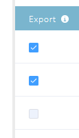

# Rankning och justering för kontoprofilering {#account-profiling-ranking-and-tuning}

Kontoprofilering identifierar din Ideal Customer Profile (ICP), rangordnar företag i din databas baserat på ICP och lägger till ICP Indicator-data till konton som befordrats som namngivna konton.

## Modellresultat {#model-results}

Resultaten visar alla dina kända konton uppdelade efter grad. A är av högsta klass, D är den lägsta.

Även om det är valfritt rekommenderar vi att du markerar kryssrutan Automatiskt befordra eftersom du då sparar mycket tid. Men om du vill gå igenom varje konto och [lägga till dem manuellt](http://docs.marketo.com/display/DOCS/Discover+Accounts#DiscoverAccounts-DiscoverCRMAccounts) lämnar du bara rutan avmarkerad.

<table> 
 <tbody> 
  <tr> 
   <td><strong>Rankning</strong></td> 
   <td> 
    

      Kontorangordningen baseras på kundprofilen Ideal. A är bäst, D är minst lämpligt. 
    
</td> 
  </tr> 
  <tr> 
   <td><strong>Propensitet</strong></td> 
   <td> 
    

      Uppskattad ökning av konverteringsgraden jämfört med ett icke-ICP-baserat urval av konton. 
    
</td> 
  </tr> 
  <tr> 
   <td><strong>Konton (%)</strong></td> 
   <td> 
    

      Procentandel konton i modellindata som har den här rangordningen. 
    
</td> 
  </tr> 
  <tr> 
   <td><strong>% av modellbasen</strong></td> 
   <td> 
    

      Procent av konton i modellbasen som har den här rangordningen. 
    
</td> 
  </tr> 
 </tbody> 
</table>

## Modelljustering {#model-tuning}

Klicka på knappen Justera modell på fliken Modell.

Det finns flera flikar att välja mellan, vilket möjliggör en djupgående anpassning.

Indikatorkategorier

| **Regelefterlevnad** | Certifieringar, regelefterlevnadsrelaterade positioner/anställning. |
|---|---|
| **Operationer** | Driftsrelaterade positioner/anställning. |
| **HR** | HR- eller löneprogramvara, HR-relaterade befattningar/anställning. |
| **Teknik** | Teknik, ramverk, ingenjörsrelaterade positioner/anställning. |
| **Försäljning** | Lösningar och programvara för försäljning, försäljningsrelaterade positioner/anställning. |
| **Återgivning** | Avfallsindikatorer. |
| **IT** | Maskinvaru- och programvarulösningar, tekniker, IT-relaterade befattningar/anställning. |
| **Ekonomi** | Ekonomisk programvara, finansiella tjänster/anställning. |
| **Marknadsföring** | Marknadsföringsteknologier och programvara, marknadsrelaterade befattningar/anställning. |
| **Företag** | Forbes eller Inc listings eller Business Partnership. |
| **Kundupplevelser och relationer** | Kundframgångar och kundrelationer befattningar/anställning. |

Håll pekaren över verktygstipsen om du vill se en beskrivning av varje kolumn.

Klicka på listrutan Lägg till ICP-indikator för att infoga ytterligare indikatorer i modellen.

Om du markerar rutan Exportera kan du se ICP-indikatorn på sidan med namngivna kontouppgifter, och du kan använda den valda ICP-indikatorn som begränsningar i [filter för namngivna konton](http://docs.marketo.com/display/DOCS/Account+Filters).

>[!NOTE]
>
>ICP-indikatorer inkluderas som begränsningar i **Medlem i namngivet konto** Filter och utlösare.

Indikatorns viktning styr den prioritetsnivå som varje indikator får i din modell.

Klicka på Uppdatera modell för att ändringarna ska börja gälla.

När du är klar med att justera modellen (efter att du har uppdaterat den) går du tillbaka till fliken Modellresultat och klickar på **Spara och använd rangordning**.

