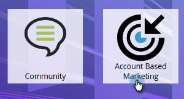

# Ny kontoidentifiering {#new-account-discovery}

Ny kontoidentifiering kan hjälpa dig att hitta nya konton att rikta in dig på genom att använda AI-baserade rekommendationer från din idealiska kundprofil.

>[!NOTE]
>
>**Förutsättningar**
>
>[Ställ in kontoprofilering](http://docs.marketo.com/x/FgAKAQ)

>[!TIP]
>
>Vi rekommenderar att du trycker på knappen **Uppdatera befintliga konton** innan du gör en ny kontosökning för att försäkra dig om att du tittar på de senaste data. Uppdateringen kan ta upp till 24 timmar.

1. Klicka på **ABM** på My Marketo.

   

1. Klicka på fliken **Kontoprofilering** .

   

1. Klicka på fliken **Nya konton** .

   

   >[!NOTE]
   >
   >Nya konton visar en lista över konton som ännu inte är dina i ABM. De är konton som kan vara nya för dig baserat på de filter du väljer.

1. Välj alla tillämpliga filter (den här delen är mycket anpassningsbar, följande är bara ett exempel för att demonstrera filtrering).

   

1. Klicka på **Spara alla och skapa lista** längst ned till höger på sidan.

   

   >[!NOTE]
   >
   >Om du bara ser ett fåtal konton kan du välja att klicka på enskilda konton och klicka på **Spara valda konton** när du är klar.

1. Du kan göra din lista till en ny kontolista eller lägga till den i en befintlig. I det här exemplet skapar vi en ny.

   

   >[!NOTE]
   >
   >Om du vill spara det i en befintlig kontolista markerar du det alternativet, klickar på listrutan och väljer önskad kontolista och klickar sedan på **Nästa**.

1. Klicka på **Spara**.

   

   >[!NOTE]
   >
   >Du kan bara spara upp till 5 000 konton åt gången. Om sökningen ger 10 000 resultat måste du spara de första 5 000, sedan återställa filtren och spara de följande 5 000. Den **totala** kontogränsen är en miljon.

1. Klicka på **OK**.

   

   >[!TIP]
   >
   >När dina konton har sparats kan du använda en [matchande målgrupp på LinkedIn](http://docs.marketo.com/x/rYGZAQ) för att rikta in dem.

