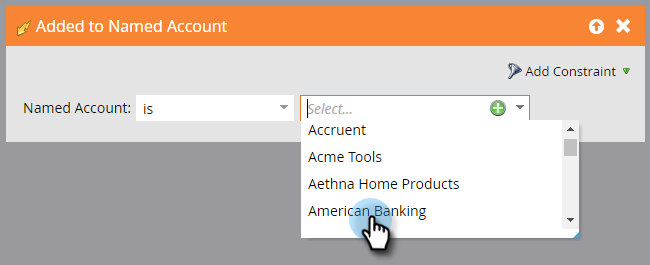

# Kontoutlösare {#account-triggers}

Lyssna på och agera utifrån viktiga beteendeaktiviteter på kontonivå i olika kanaler (t.ex. e-post, webben, annonser) med hjälp av utlösare på kontonivå.

Välj en smart kampanj och klicka på Smart List.

Ange &quot;Namngivet konto&quot; i sökrutan för att hitta båda utlösarna för namngivet konto.

Dra utlösaren till arbetsytan. I det här exemplet använder vi *Added to Named Account*.

Välj en kvalificerare.

\
Klicka på listrutan med namngivna konton...

...och välj ett eller flera namngivna konton.

Så ja! När du är klar med resten av din smarta kampanj måste du aktivera den.

>[!NOTE]
>
>**Relaterade artiklar**
>
>* [Kontofilter](account-filters.md)

>

