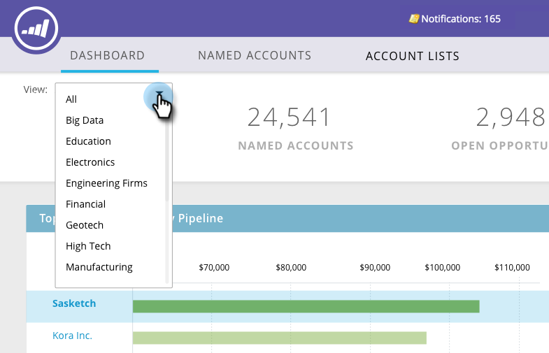

# ABM Main Dashboard {#abm-main-dashboard}

Huvudinstrumentpanelen ger en sammanfattning av dina kontobaserade marknadsföringssatsningar. Du kan se målkontona eller kontolistorna som är framgångsrika och de som behöver mer uppmärksamhet.

Om du vill filtrera efter kontolista klickar du på listrutan Visa...

...och gör en markering. I det här exemplet väljer vi vår kontolista&quot;High Tech&quot;.

Om du vill visa kontrollpanelen [Kontolista](/help/marketo/product-docs/account-based-marketing/measure/account-list-insights.md#account-list-dashboard) klickar du på namnet på den kontolista du har valt..

...och kontrollpanelen läses in.

Om du inte vill visa kontrollpanelen för kontolistan utan vill gå ned i ett namngivet konto klickar du på **Mer information** under namnet..

...och visa det namngivna kontots [insikter](/help/marketo/product-docs/account-based-marketing/measure/named-account-insights.md).

