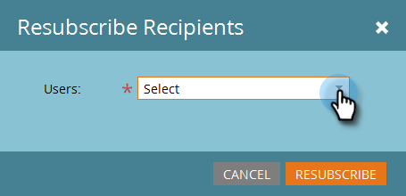

# Rapportinställningar för ABM {#abm-report-setup}

ABM:s försäljningsrapport är ett personligt e-postmeddelande som skickas till kontoteamet varje vecka.

## Rapportinställningar {#report-setup}

1. Klicka på **Admin**.

   

1. Klicka på **ABM**.

   

1. Klicka på **Redigera** under Veckorapport.

   

1. Klicka på listrutan **Dag** och välj den veckodag du vill att mottagarna ska ta emot e-postmeddelandet.

   

1. Om du vill fastställa layouten för e-postmeddelandet klickar du på listrutan **Sortera efter** och gör ett val.

   

1. Markera kryssrutan **Användare**, klicka sedan på listrutan och välj vem du vill få e-postmeddelandet.

   

   >[!NOTE]
   >
   >Meddelanden skickas endast till kontoägare eller teammedlemmar.

1. Klicka på **Spara**.

   

Och det är allt!

## Så här säger du upp prenumerationen {#how-to-unsubscribe}

Varje rapport har möjligheten att avanmäla sig. Det gör du genom att klicka på **Avbeställ** längst ned i e-postmeddelandet.

## Så här prenumererar du om {#how-to-resubscribe}

1. Klicka på **Admin**.

   

1. Klicka på **ABM**.

   

1. Under Veckorapport klickar du på numret som visas som Avbeställ.

   

1. Klicka på listrutan Användare.

   

1. Välj den användare som du vill ta emot e-postmeddelanden till igen och klicka på **Prenumerera**.

   

