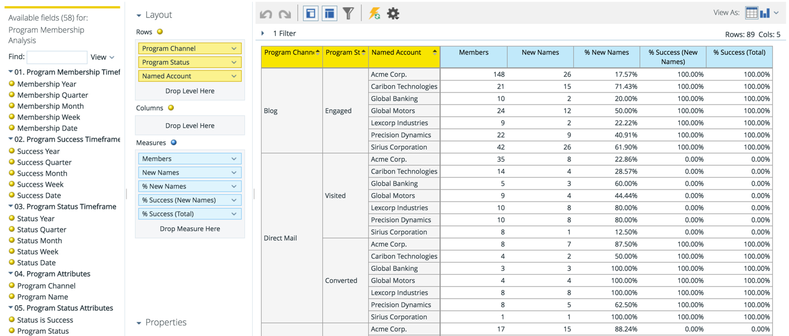

# Dimension för namngivet konto i RCA {#named-account-dimension-in-rca}

Skapa intäktsbaserade rapporter med hjälp av den ABM-specifika dimensionen Named Account i Revenue Cycle Analytics.

>[!NOTE]
>
>**Definition**
>
>**Dimensioner **- attribut (anges med gula punkter) som ger olika syn på måtten.

>[!NOTE]
>
>Dimensionen Namngivet konto i RCA kan användas för att mäta effekten av målkonton (t.ex. intäkt, genererad pipeline eller snabbare försäljningscykel). Denna dimension kan också användas för att identifiera vilka program som fungerade och inte fungerade bra mot namngivna konton.

Följande rapporter har åtkomst till dimensionen Namngivet konto:

* E-postanalys
* Leadanalys
* Affärsmöjlighetsanalys
* Analys av programmedlemskap

>[!NOTE]
>
>**Exempel**
>
>Nedan finns några exempel på Marketo ABM i Revenue Cycle Analytics.

Pipeline-acceleration inom namngivna konton

Kanaleffektivitet och framgång för namngivna konton

Programmets effektivitet och påverkan på slutresultatet

Täckning av leads och engagemang inom namngivna konton

>[!MORELIKETHIS]
>
>* [Analys av intäktscykler](http://docs.marketo.com/display/docs/revenue+cycle+analytics)

>

