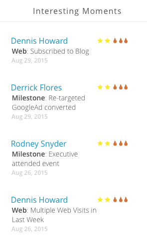

# Insikter om namngivna konton {#named-account-insights}

På instrumentpanelen Namngivet konto visas ett målkonto i 360 grader.

## Kontrollpanel {#dashboard}

Instrumentpanelen samlar viktiga insikter på kontonivå från alla personer på ett namngivet konto och undviker därmed behovet av att gå till varje person för att utvärdera deras framsteg. Du kan fördjupa dig i e-postaktiviteten med [e-postinsikter](http://docs.marketo.com/display/DOCS/Filtering+in+Email+Insights#FilteringinEmailInsights-AccountBasedMarketing).

>[!NOTE]
>
>Diagram visar insikter från de senaste 90 dagarna.

**Kontoengagemang över** tidKlicka på listrutan  **** Vy till höger för att ändra det du tittar på. Förutom Kontopoäng kan du visa efter Total Intäkter...

...eller Pipeline.

<table> 
 <tbody> 
  <tr> 
   <td><strong>Kontopoäng</strong></td> 
   <td>
Se interaktion mellan veckor baserat på alla kontopoäng du har skapat i Admin. Du kan jämföra dessa kontopoäng sida vid sida. För att fastställa ett veckoengagemang tar vi det största engagemanget från vilken veckodag som helst.
</td> 
  </tr> 
  <tr> 
   <td><strong>Pipeline</strong></td> 
   <td>Se rörledningen över tiden. För att bestämma rörledningen över tid i vecka tar vi rörledningen på sista dagen.</td> 
  </tr> 
  <tr> 
   <td><strong>Intäkter</strong></td> 
   <td>Se intäkterna över tid. För att fastställa intäkter över tid och vecka tar vi summan av alla intäkter som vunnits den veckan.</td> 
  </tr> 
 </tbody> 
</table>

**Intressanta ögonblick**

Tillgängligt för användare av [Marketo Sales Insight](http://docs.marketo.com/display/DOCS/Marketo+Sales+Insight), se de intressanta stunderna på kontonivå.

**De vanligaste personerna**

Dessa personer beräknas baserat på prioriteringar som baseras på senaste eller brådskande händelser som visas av personer med namngivna konton (samma som [Bästa val](http://docs.marketo.com/display/DOCS/Priority,+Urgency,+Relative+Score,+and+Best+Bets) i Sales Insight), eller resultat som definieras av användaren. **Prioritet** är endast tillgängligt för användare av Marketo Sales Insight.

**Inkluderar underordnade**

Klicka på **Inkluderar underordnade** för att visa och välja de underordnade kontona för det valda namngivna kontot och visa deras aggregerade analyser.

>[!NOTE]
>
>När du väljer konton kan du antingen välja alla eller välja upp till 100 separat.

## Hierarki {#hierarchy}

Se var det valda namngivna kontot finns i relation till hierarkin.

## Möjligheter {#opportunities}

En samlad vy över alla öppna möjligheter på kontonivå, vilket hjälper marknadsföringsteamen att fokusera på att stänga specifika möjligheter.

## Potentiella personer {#potential-people}

Matchning från lead till konto använder otydlig logik för att hitta svaga matchningar som kan lösas på fliken Potentiella personer.

>[!NOTE]
>
>Om du vill lägga till någon av personerna i listan markerar du dem och klickar på **Lägg till personer**.

## Används av {#used-by}

På den här fliken visas vilka smarta kampanjer, webbkampanjer, smarta listor eller rapporter som för närvarande refererar till specifika namngivna konton eller kontolistor.

## Kontoteam {#account-team}

Visa teammedlemmar, lägg till/ta bort medlemmar, och tilldela även en kontoägare på den här fliken.

>[!NOTE]
>
>Klicka på listrutan **Åtgärder för kontoteam** om du vill lägga till/ta bort kontomedlemmar eller tilldela en kontoägare.

## ICP-indikatorer {#icp-indicators}

Visa de ICP-indikatorer som du valde att exportera när du [justerade modellen](http://docs.marketo.com/display/DOCS/Account+AI+Overview#AccountAIOverview-ModelTuning).

