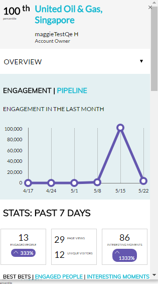

# Översikt över plugin-programmet Account Insight {#account-insight-plug-in-overview}

Account Insight är en Chrome-plugin som ger er åtgärdbara ABM-resurser och kontoinsikter till era säljteam, vilket gör att de kan skapa mer effektiva konton.

>[!NOTE]
>
>**Tillgänglighet**
>
>Account Insight ingår för alla kunder som har både ABM och Marketo Sales Insight. För kunder som bara har ABM är Account Insight tillgängligt som ett köpt tillägg. Varje kund är begränsad till 250 licenser för kontoinsikt. Kontakta din säljare för mer information. Det är inte tillgängligt för kunder som inte har ABM.

>[!CAUTION]
>
>Plugin-programmet Account Insight fungerar inte i prenumerationer som bara har [SSO](http://docs.marketo.com/display/DOCS/Restrict+User+Login+to+SSO+Only) (enkel inloggning) aktiverat.
>
>CRM-kontext fungerar för Salesforce när plugin-programmet startas från ett konto, en lead eller en kontakt. CRM-kontext fungerar inte för Dynamics när plugin-programmet startas från ett konto, en lead eller en kontakt. För Dynamics-användare rekommenderar vi att du använder plugin-programmet Account Insight.

## Namngivna konton {#named-accounts}

Se namngivna konton efter deras inbördes rangordning. Den här listan är endast tillgänglig för kontoägare. Support för kontoteam kommer snart.

Om du vill visa information om ett namngivet konto klickar du på namnet..

...och översikten visas.

Se intressanta ögonblick i listrutan.

Bläddra nedåt för att se bästa val. Intressanta ögonblick är också här, tillsammans med engagerade människor.

Klicka på en persons namn..

...och se vad de gör.

Du kan också växla från vyn Inkludering till Pipeline.

Om du vill avsluta det namngivna kontot klickar du på X:et uppe till höger.

## Aktivitetsfeed {#activity-feed}

Aktivitetsflödet visar senaste aktivitet och går tillbaka sju dagar.

Klicka på listrutan **Filter** om du vill filtrera efter olika aktivitetstyper.\

Det går att klicka på flera objekt. Klicka på det namngivna kontot för att se information om det. Klicka på användarens namn för att se deras aktivitet. Klicka på Fler aktiviteter för att se fler aktiviteter.

Snygga grejer!

>[!MORELIKETHIS]
>
>* [Ställ in kontoinsikter](set-up-account-insight.md)

>

