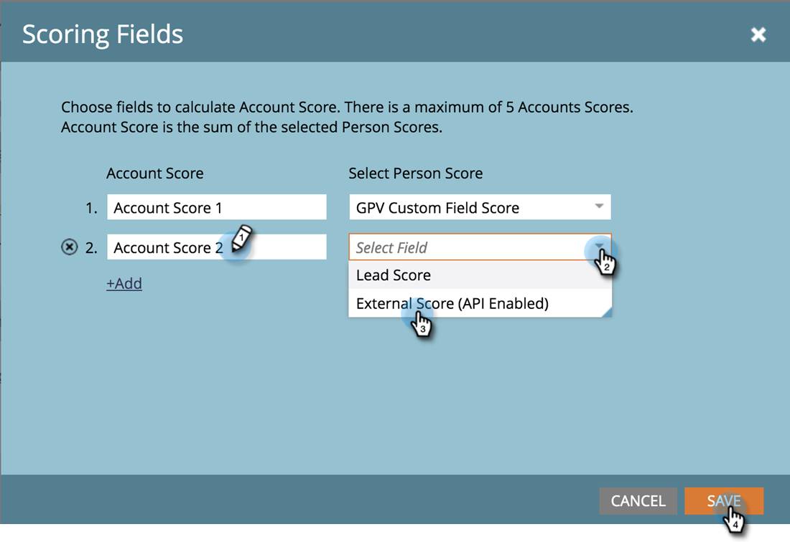

# Kontopoäng {#account-score}

Kontobedömning är en viktig del av kontobaserad marknadsföring. Det hjälper er att fastställa nivån på engagemanget i era konton.

## Vad är kontobedömning? {#what-is-account-scoring}

Det är en systematisk strategi som är utformad för att hjälpa säljare och marknadsföringsteam att identifiera och prioritera de företag (inklusive potentiella kunder) som mest sannolikt gör ett köp.

I B2B-inköpsprocessernas komplexa värld är det sällan en enskild person fattar ett inköpsbeslut. Det finns ofta olika roller som är involverade, var och en med egna behov. Kontobaserad poängsättning tar hänsyn till detta genom att slå samman poängen från flera leads och tillhandahålla en poäng på kontonivå.

## Vanliga exempel {#common-examples}

| **Resultat för kontoengagemang** | Djup på engagemanget baserat på beteendeaktiviteter som spåras i olika kanaler (t.ex. e-post, webben och annonser) från personer i specifika målkonton. |
|---|---|
| **Räntepoäng för kontoprodukt** | Personer från målkonton som visar intresse för innehållet från en viss produkt (t.ex. nedladdning av ett faktablad). |
| **Resultat för webbengagemang för konto** | Personer från målkonton som besöker webbkanalen. Samma poäng kan skapas för att mäta kanalengagemang från e-post, annonser eller andra kanaler. |

## Konfigurera kontopoäng {#how-to-configure-account-score}

>[!NOTE]
>
>Om du vill beräkna kontopoäng måste du först skapa poängpoäng. Marketo ABM samlar automatiskt in poängpoäng från leads till resultaträkningar. Vi tar till exempel två av de ovanstående exemplen (_Intressepoäng för kontoprodukt_ och _Resultat för webbengagemang_).
>
>Skapa först fält för lead-poäng som hämtar relevant information från varje lead i ett målkonto.\
>Tilldela sedan dessa lead scores till respektive kontopoäng:\
>Räntepoäng för kontoprodukt = SUM (Lead Product Interest Score)\
>Konto Web Engagement Score = SUM (Lead Web Engagement Score)

>[!NOTE]
>
>Användare kan skapa flera poäng för kontointeraktion och tilldela olika personpoäng till olika poäng.

När du har konfigurerat lead-poängen fortsätter du genom att följa stegen nedan.

1. Klicka på **Admin**.

   

1. Klicka på **ABM**.

   

1. Klicka på **Redigera** i bedömningsfält.

   

   >[!NOTE]
   >
   >Du kan välja upp till **fem** fält för att beräkna kontouppsättningen.

1. Ange namnet på kontouppsättningen, klicka på listrutan **Välj personpoäng** och välj motsvarande poäng.

   

1. Klicka på **+Lägg till** om du vill lägga till fler bakgrundsmusik.

   

1. Lägg till alla önskade bakgrundsmusik. Klicka på **Spara** när du är klar.

   
