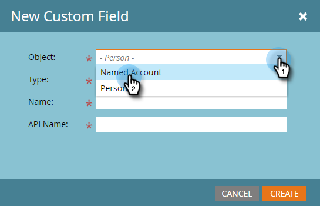
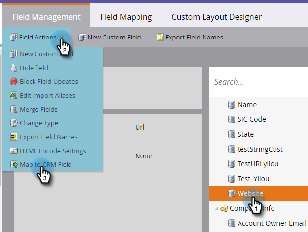

# Skapa ett anpassat fält för CRM-identifiering {#create-a-custom-field-for-crm-discovery}

Lägg till anpassade fält till konton, mappa dem till CRM och använd dem för CRM-kontoidentifiering i Marketo.

1. Klicka på **Admin**.

   

1. Klicka på **Fälthantering** och sedan **Nytt anpassat fält**.

   

1. Klicka på listrutan **Objekt** och välj **Namngivet konto**.

   

1. Klicka på listrutan **Typ** och välj en typ.

   

1. Ange ett **namn** (API-namnet fylls i automatiskt) och klicka på **Skapa**.

   

1. När fältet har skapats markerar du det i trädet till höger. Klicka på listrutan **Fältåtgärder** och välj **Mappa till CRM-fält**.

   

1. Markera det CRM-kontofält som du vill mappa till och klicka på **Spara**.

   

   När du har synkroniserat visas det nya fältet längst till höger i Discover CRM-rutnätet.

   

