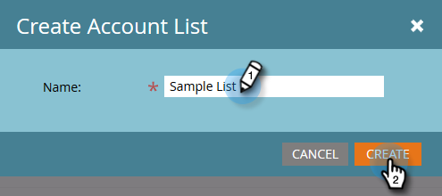

# Kontolistor {#account-lists}

En kontolista är en samling namngivna konton som kan användas tillsammans. Med kontolistor kan du rikta in namngivna konton efter bransch, plats eller storlek för företaget.

Förutom kontolistor kan du även skapa dynamiska kontolistor som genereras från offentliga CRM-kontovyer. En CRM-kontovy är en uppsättning regler som fungerar som ett filter när konton visas. Du kan till exempel använda den för att hitta konton där Branschen är Sjukvård *och* där Intäkterna är över 100 miljoner dollar.

>[!NOTE]
>
>Kontolistor som skapas i Marketo Account Based Marketing är automatiskt tillgängliga när du skapar smarta listor och webbkampanjer i [Webbpersonalisering](http://docs.marketo.com/display/DOCS/RTP+Segments).

## Skapa en ny kontolista {#create-a-new-account-list}

1. Klicka på listrutan **Nytt** och välj **Skapa ny kontolista**.

   

1. Ge listan ett namn och klicka på **Skapa**.

   

1. När du har skapat din kontolista kan du komma igång med att [lägga till namngivna konton i den](http://docs.marketo.com/display/DOCS/Add+an+Existing+Named+Account+to+an+Account+List)!

   >[!NOTE]
   >
   >Marketo visar endast insikter för kontolistor med 2 000 eller färre namngivna konton.

## Skapa en ny dynamisk kontolista {#create-a-new-dynamic-account-list}

1. Klicka på listrutan **Ny** och välj **Skapa ny dynamisk lista**.

   

1. I dialogrutan väljer du en **CRM-kontovy** i listrutan eller skriver namnet som du vill söka efter.

   

1. Klicka på **Skapa**.

   

   >[!NOTE]
   >
   >I Salesforce måste du se till att du anger behörigheter för listvisningsobjekt till synkroniseringsanvändaren.

## Byta namn på en kontolista {#rename-an-account-list}

>[!NOTE]
>
>De här stegen gäller endast för kontolistor. *I dynamiska* kontolistor används namnet på deras associerade CRM-kontovyer.

1. Välj det konto du vill byta namn på, klicka på listrutan Åtgärder för **kontolista** och välj **Byt namn på kontolista**.

   

1. Ange det nya namnet och klicka på **Byt namn**.

   

   >[!NOTE]
   >
   >CRM-kontovyn synkroniseras med den dynamiska kontolistan var 8:e timme. Om de inte har synkroniserats än synkroniseras de i Marketo under nästa cykel.

## Ta bort en kontolista {#delete-an-account-list}

>[!NOTE]
>
>De här stegen är desamma för både kontolistor och dynamiska kontolistor.

1. Markera det konto du vill ta bort, klicka på listrutan **Kontoliståtgärder** och välj **Ta bort kontolista**.

   

1. Klicka på **Ta bort**.

   

>[!MORELIKETHIS]
>
>* [Lägg till ett befintligt namngivet konto i en kontolista](named-accounts/add-an-existing-named-account-to-an-account-list.md)
>* [Kontolisteinsikter](../../../product-docs/account-based-marketing/measure/account-list-insights.md)

>

