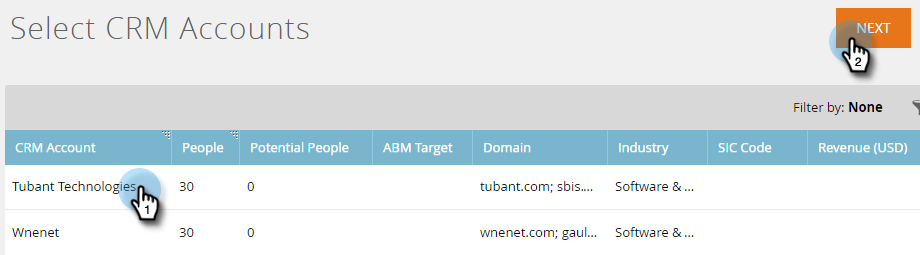

# Identifiera konton {#discover-accounts}

Använd alternativet Discover för att identifiera potentiella målkonton.

## Identifiera CRM-konton {#discover-crm-accounts}

Identifiera potentiella målkonton från CRM.

>[!NOTE]
>
>När du har anslutit CRM till Marketo ABM visar **Discover CRM-konton** alla CRM-konton och relevant information som hjälper dig att välja rätt namngivna konton. Marketo lägger till ytterligare information utöver vad som tas emot från CRM.

**Personer** (i Identifiera CRM-konton och Identifiera Marketo-företag): Innehåller både kontakter och leads. Leads kan identifieras med hjälp av Marketos [lead-to-account-matchning](http://docs.marketo.com/display/DOCS/Lead+to+Account+Matching). **Potentiella personer** (i Discover CRM Accounts &amp; Discover Marketo Companies): Visar hur många leads Marketo som kan tillhöra ett CRM-konto.

**Anpassat CRM-fält** (endast i Identifiera CRM-konton): Detta hjälper er att anpassa sälj- och marknadsföringsorganisationen för att välja rätt målkonton. När du har [mappat det anpassade CRM-fältet](http://docs.marketo.com/x/1wnG) med Marketo ABM visar vi mappade data som hjälper dig att identifiera målkonton.

1. Klicka på listrutan **Nytt** i Namngivna konton och välj **Identifiera CRM-konton**.

   

1. Ett nytt fönster/en ny flik öppnas. Markera det eller de CRM-konton som du vill lägga till i dina namngivna konton och klicka på **Nästa**.

   

1. Förhandsgranskningsskärmen bekräftar hur många markeringar du har gjort. Klicka på **Skapa**.

   

   Det är allt som finns till det!

   

## Upptäck Marketo Companies {#discover-marketo-companies}

Identifiera rätt företag för målinriktning.

>[!NOTE]
>
>I Discover Marketo Companies ser du Marketo-företag som inte kommer från din CRM.

1. I Namngivna konton klickar du på listrutan **Nytt** och väljer **Identifiera marknadsföringsföretag**.

   

1. Ett nytt fönster/en ny flik öppnas. Välj de företag som du vill lägga till i dina namngivna konton och klicka på **Nästa**.

   

   >[!NOTE]
   >
   >I Discover Marketo Companies och Discover CRM:
   >
   > * Söker efter personer från din Marketo-databas som har det företaget angivet i sin post. Om du ser flera värden för vissa av attributen (t.ex. Bransch) beror det på att Marketo hittade olika värden för de enskilda personerna. Attributet med flest träffar
   >
   >I **Upptäck endast CRM** :
   >
   > * Synkroniserar och associerar CRM-kontakter med det namngivna kontot
   >
   >I **Discover Marketo Companies** only:
   >
   > * Filtrerar ut de flesta Internetleverantörer och offentliga domäner (t.ex. [Yahoo.com](https://yahoo.com), [Gmail.com](https://gmail.com)) som företagsnamn
      >
      > 
   * Tar bort CRM-konton. Om du har &quot;Acme&quot; i en post och &quot;Acme Inc&quot; (eller något av följande suffix: Co, Corp, Corporation, GmbH, Inc, Incorporated, LLC, LLP, LP, Ltd, PA, PC, PLC, PLLC), vi kommer att sammanfoga dem i ABM som&quot;Acme&quot;
   >
   >Om du vill att Marketo ska ta bort konton efter CRM-ID eller kontoägare i stället för efter företagsnamn kontaktar du [Marketo Support](https://nation.marketo.com/t5/Support/ct-p/Support).

1. Klicka på nedåtpilen under kolumnen Namngivet konto för att visa listrutan.

   

   >[!CAUTION]
   >
   >Framöver kommer alla nya personer från dessa utvalda företag automatiskt att tilldelas sina respektive namngivna konton. Kontrollera dessa företag och se till att de har tilldelats rätt namngivet konto.

1. Om du vill välja ett befintligt konto klickar du på listrutan **Namngivet konto** , väljer önskat konto och klickar sedan på **Nästa**.

   

   Du kan också skapa ett nytt namngivet konto genom att skriva det önskade namnet direkt i listrutan. Klicka utanför rutan när du är klar..

   

   ...så ser du ditt nya namngivna konto. Då klickar du bara på **Nästa** , som i steg 4.

   

1. Klicka på **Skapa**.

   

   Snyggt jobbat!

   

>[!NOTE]
>
>Om det finns en felmatchning mellan de CRM-konton du har valt och det som finns i Identifiera CRM-stödraster beror det troligen på ett eller flera av följande:
>
>* Har olika CRM-konton med liknande namn som har tagits bort
>* Nästa schemalagda synkronisering har inte utförts än

>[!MORELIKETHIS]
>
>* [Lead till kontomatchning](/help/marketo/product-docs/account-based-marketing/target/named-accounts/lead-to-account-matching.md)

