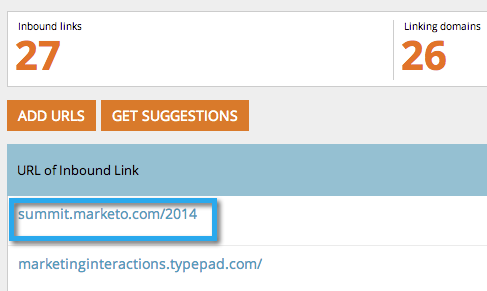

# SEO - Lägg till en URL för inkommande länk manuellt {#seo-add-an-inbound-link-url-manually}

Du kan lägga till inkommande länkar manuellt. Så här:

1. Gå till avsnittet **Inkommande länkar** .

   

1. Klicka på **LÄGG TILL URL**.

   

1. Skriv in URL-adressen. Klicka på **LÄGG TILL**.

   

   >[!TIP]
   >
   >Visste du att du kan [lägga till din inkommande länk i en ny eller befintlig lista](../../../../product-docs/additional-apps/seo/understanding-seo/seo-managing-lists.md)? Kolla in den!

   

Kom igen! Nu bör du se din nya URL-adress som lagts till i listan. Det kan ta en stund att samla in alla data. Tålmodighet är en dygd.