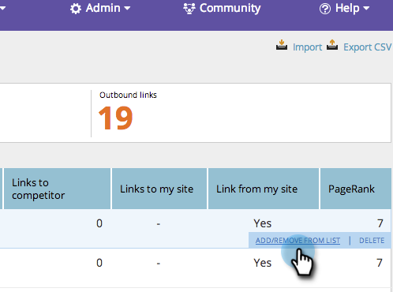

# SEO - Lägg till/ta bort en URL för inkommande länk från en lista {#seo-add-remove-an-inbound-link-url-from-a-list}

Du kan ordna dina URL:er för inkommande länkar till ditt hjärtas innehåll.
>[!IMPORTANT]
>
>Den 31 mars 2026 kommer Marketo Engage att ersätta sökmotoroptimeringsfunktionen. Exportera alla relevanta uppgifter den 30 mars eller före den 30 mars. [Läs mer](https://nation.marketo.com/t5/product-blogs/marketo-engage-seo-feature-deprecation/ba-p/359060){target="_blank"}.
>
>* [Exportproblem](https://experienceleague.adobe.com/en/docs/marketo/using/product-docs/additional-apps/seo/pages/seo-export-issues-to-csv){target="_blank"}
>* [Exportera nyckelordsresultat](https://experienceleague.adobe.com/en/docs/marketo/using/product-docs/additional-apps/seo/keywords/seo-exporting-keyword-results){target="_blank"}
>* [Exportera nyckelordstrender](https://experienceleague.adobe.com/en/docs/marketo/using/product-docs/additional-apps/seo/reports/seo-use-the-keyword-trends-report#exporting-data){target="_blank"}
>* [Exportera nyckelordstrender för konkurrent](https://experienceleague.adobe.com/en/docs/marketo/using/product-docs/additional-apps/seo/reports/seo-use-the-competitor-kw-trends-report#exporting-data){target="_blank"}

## Lägg till en URL för inkommande länk i en lista {#add-an-inbound-link-url-to-a-list}

1. Gå till avsnittet **[!UICONTROL Inbound Links]**.

   

1. Håll muspekaren över den URL för inkommande länk som du vill kategorisera. Klicka på **[!UICONTROL Add/Remove From List]**.

   

1. Klicka på den lista som du vill att din URL för inkommande länk ska gå till.

   

>[!TIP]
>
>Du kan också skapa en ny lista där nyckelordet ska placeras. Skriv bara ditt namn i [!UICONTROL Create a new list].

## Ta bort en URL för inkommande länk från en lista {#remove-an-inbound-link-url-from-a-list}

Ibland kanske du vill ta bort en URL för inkommande länkar från en lista.

1. Klicka på **[!UICONTROL Inbound Links]**.

   

1. Klicka på listrutan **[!UICONTROL Filter by list]**. Klicka på listan som du vill rensa.

   

1. Håll muspekaren över den URL för inkommande länk som du vill ta bort. Klicka på **[!UICONTROL Add/Remove From List]**.

   

1. Listan som du vill ordna markeras. Klicka på listnamnet för att ta bort URL:en för inkommande länk från den här listan.

   

Du lyckades! Uppdatera sidan för att uppdatera visningen.
