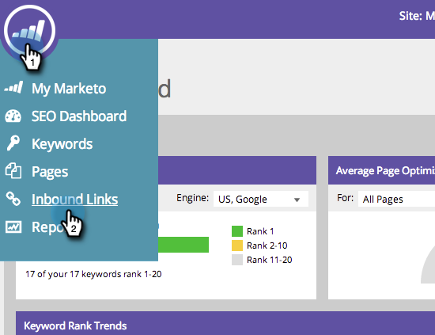
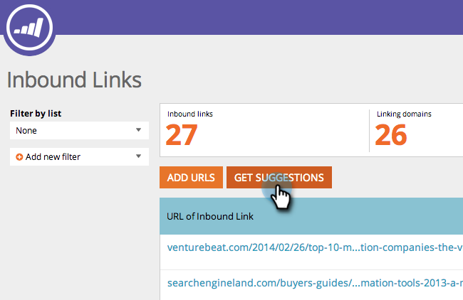
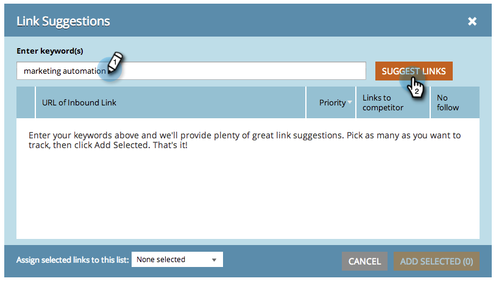
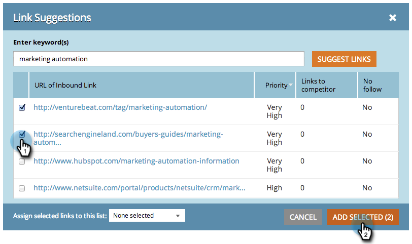

# SEO - Hämta förslag på inkommande länk {#seo-get-inbound-link-suggestions}

Marketo kan föreslå vilka inkommande länkar som är värdefulla för din [off-page-optimering](/help/marketo/product-docs/additional-apps/seo/understanding-seo/understanding-search-engine-optimization.md).

>[!IMPORTANT]
>
>Den 31 mars 2026 kommer Marketo Engage att ersätta sökmotoroptimeringsfunktionen. Exportera alla relevanta uppgifter den 30 mars eller före den 30 mars. [Läs mer](https://nation.marketo.com/t5/product-blogs/marketo-engage-seo-feature-deprecation/ba-p/359060){target="_blank"}.
>
>* [Exportproblem](https://experienceleague.adobe.com/en/docs/marketo/using/product-docs/additional-apps/seo/pages/seo-export-issues-to-csv){target="_blank"}
>* [Exportera nyckelordsresultat](https://experienceleague.adobe.com/en/docs/marketo/using/product-docs/additional-apps/seo/keywords/seo-exporting-keyword-results){target="_blank"}
>* [Exportera nyckelordstrender](https://experienceleague.adobe.com/en/docs/marketo/using/product-docs/additional-apps/seo/reports/seo-use-the-keyword-trends-report#exporting-data){target="_blank"}
>* [Exportera nyckelordstrender för konkurrent](https://experienceleague.adobe.com/en/docs/marketo/using/product-docs/additional-apps/seo/reports/seo-use-the-competitor-kw-trends-report#exporting-data){target="_blank"}

1. Gå till avsnittet **[!UICONTROL Inbound Links]**.

   

1. Klicka på **[!UICONTROL Get Suggestions]**.

   

1. Ange ett nyckelord. Klicka på **[!UICONTROL Suggest Links]**.

   

1. Markera länkarna. Klicka på **[!UICONTROL Add Selected]**.

   

   >[!TIP]
   >
   >Visste du att du kan [lägga till din länk i en ny eller befintlig lista](/help/marketo/product-docs/additional-apps/seo/inbound-links/seo-add-remove-an-inbound-link-url-from-a-list.md)? Kolla in den!

Häftig! Dessa nya länkar kommer nu att spåras.

>[!NOTE]
>
>[Förstå inkommande länkar](/help/marketo/product-docs/additional-apps/seo/inbound-links/seo-understanding-inbound-links.md)
