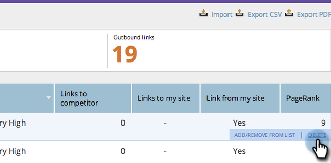

# SEO - Ta bort/ta bort en URL för inkommande länk {#seo-remove-delete-an-inbound-link-url}

Ibland vill du ta bort inkommande länkar. Så här gör du.

>[!IMPORTANT]
>
>Den 31 mars 2026 kommer Marketo Engage att ersätta sökmotoroptimeringsfunktionen. Exportera alla relevanta uppgifter den 30 mars eller före den 30 mars. [Läs mer](https://nation.marketo.com/t5/product-blogs/marketo-engage-seo-feature-deprecation/ba-p/359060){target="_blank"}.
>
>* [Exportproblem](https://experienceleague.adobe.com/sv/docs/marketo/using/product-docs/additional-apps/seo/pages/seo-export-issues-to-csv){target="_blank"}
>* [Exportera nyckelordsresultat](https://experienceleague.adobe.com/sv/docs/marketo/using/product-docs/additional-apps/seo/keywords/seo-exporting-keyword-results){target="_blank"}
>* [Exportera nyckelordstrender](https://experienceleague.adobe.com/sv/docs/marketo/using/product-docs/additional-apps/seo/reports/seo-use-the-keyword-trends-report#exporting-data){target="_blank"}
>* [Exportera nyckelordstrender för konkurrent](https://experienceleague.adobe.com/sv/docs/marketo/using/product-docs/additional-apps/seo/reports/seo-use-the-competitor-kw-trends-report#exporting-data){target="_blank"}

1. Gå till avsnittet **[!UICONTROL Inbound Links]**.

   

1. Håll muspekaren över den URL för inkommande länk som du vill ta bort.

   

1. Klicka på **[!UICONTROL Remove]**.

   

Du har nu tagit bort den här inkommande länken.
