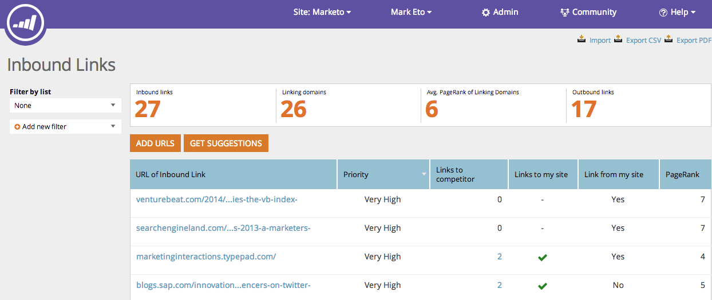

# SEO - Förstå inkommande länkar {#seo-understanding-inbound-links}

Inkommande länkar anger för sökmotorer att din webbplats är värd att referera till. Det är bra!

## Kolumndefinition {#definition-of-columns}

| Kolumnrubrik | Beskrivning |
|---|---|
| URL för inkommande länk | Webbsidan i fråga. |
| Prioritet | Hur värdefull denna möjlighet är för er sidrankning. |
| Länkar till konkurrent | Anger om en konkurrent är länkad till i den URL:en. |
| Länkar till min webbplats | Om webbplatsen är länkad till den URL:en. |
| Länkar från min webbplats | Anger om din webbplats länkar till den URL:en. |
| PageRank | Identifierar att URL-adresser rangordnas i sökningar (1 - 10) |

Söt! Nu när du förstår inkommande länkar kan vi föreslå fler möjligheter till inkommande länkar för din webbplats.

>[!NOTE]
>
>**Relaterade artiklar**
>
>* [Hämta förslag på inkommande länkar](seo-get-inbound-link-suggestions.md)

>

