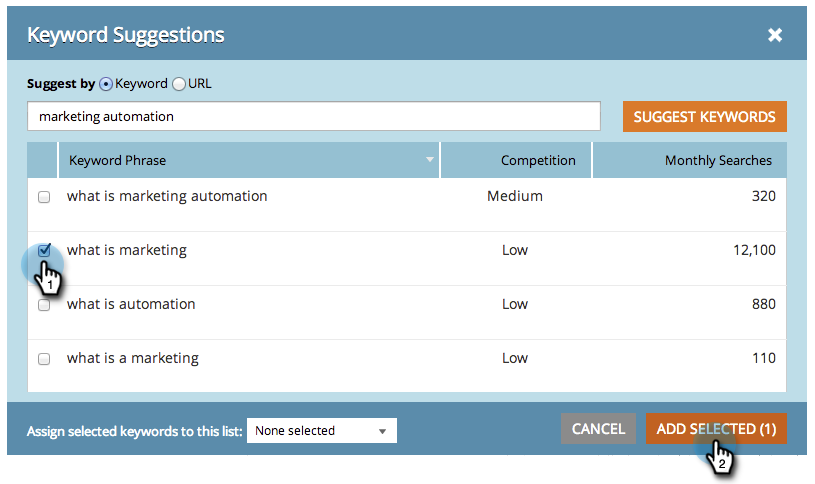
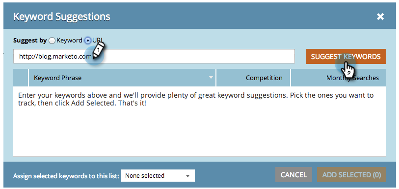

# SEO - Hämta föreslagna nyckelord {#seo-get-suggested-keywords}

Marketo SEO kan föreslå vilka nyckelord du ska spåra. Vi kan ge förslag baserat på ett nyckelord eller en webbplats URL. Ge den ett försök!

## Hämta nyckelordsförslag med ett nyckelord {#get-keyword-suggestions-using-a-keyword}

1. Gå till avsnittet **Nyckelord**.

   

1. Klicka på **GET-FÖRSLAG**.

   

1. Ange ett **nyckelord**. Klicka på **FÖRESLÅ NYCKELORD**.

   

   >[!TIP]
   >
   >Visste du att du kan [lägga till nyckelordet i en ny eller befintlig lista](../../../../product-docs/additional-apps/seo/understanding-seo/seo-managing-lists.md) här?

1. Välj föreslagna nyckelord. Klicka på **LÄGG TILL MARKERAD**.

   

   Bra! Ditt nyckelord har lagts till.

   

   Ja! Nu när du vet hur du får nyckelordsförslag baserade på ett nyckelord kan du försöka få förslag baserat på en URL.

## Hämta nyckelordsförslag från en URL {#get-keyword-suggestions-from-a-url}

1. Gå till avsnittet **Nyckelord**.

   

1. Klicka på **GET-FÖRSLAG**.

   

1. Ange **Föreslå av** till **URL**.

   

1. Ange en **URL** och klicka på **FÖRESLÅ NYCKELORD**.

   

   >[!TIP]
   >
   >Visste du att du kan [lägga till nyckelordet i en ny eller befintlig lista](../../../../product-docs/additional-apps/seo/understanding-seo/seo-managing-lists.md) här?

1. Välj föreslagna nyckelord. Klicka på **LÄGG TILL MARKERAD**.

   

1. Bra! Ditt nyckelord har lagts till.

   

   Okej, du skjuter i den här saken. Fortsätt!

   >[!NOTE]
   >
   >**Relaterade artiklar**
   >
   >    
   >    
   >    * [Förstå nyckelord (sammanfattningsvy)](seo-understanding-keywords.md)
   >    * [Lägg till/ta bort nyckelord från en lista](seo-add-remove-keywords-from-a-list.md)

