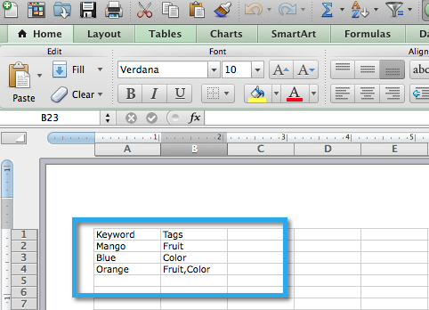

# SEO - Importera nyckelord med en CSV {#seo-importing-keywords-with-a-csv}

1. Du kan [lägga till nyckelord](seo-add-keywords.md) manuellt, [hämta nyckelordsförslag](seo-get-suggested-keywords.md) och även importera nyckelord från en CSV-fil. Så här gör du importen.
1. Gå till avsnittet **Nyckelord**.

   

1. Klicka på **Importera**.

   

1. Välj en Excel-fil att importera.

   

1. Klicka på **Välj Arkiv**.

   

   >[!NOTE]
   >
   >Importgränserna varierar beroende på din prenumeration. Kontakta din säljare om du vill ha mer information.

1. Klicka på **IMPORTERA**.

   

   De nya nyckelorden ska visas i alfabetisk ordning i din nyckelordslista.

   

   Det kan ta några minuter att läsa in alla data som är associerade med varje nyckelord. Meditera om meningen med livet.

   >[!NOTE]
   >
   >**Relaterade artiklar**
   >
   >    
   >    
   >    * [Förstå nyckelord (sammanfattningsvy)](seo-understanding-keywords.md)
   >    * [Lägg till/ta bort nyckelord från en lista](seo-add-remove-keywords-from-a-list.md)

